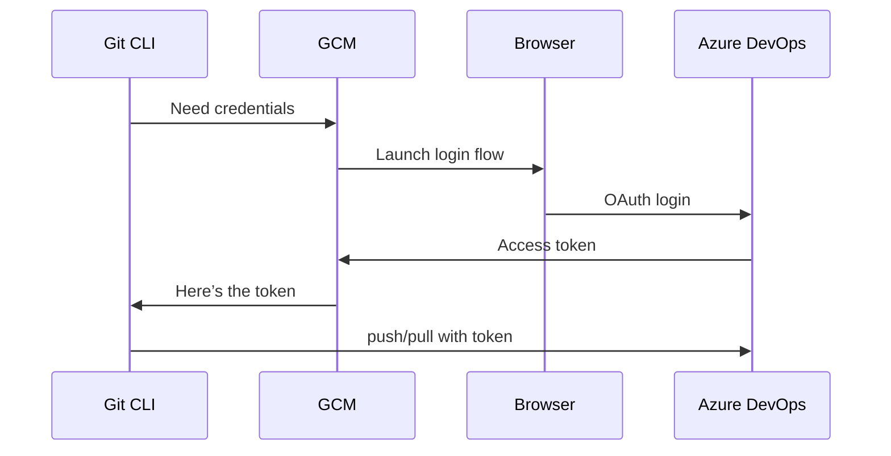

# 🔐 Git Credential Manager (GCM)

> Securely authenticate Git to Azure Repos (and others) without retyping passwords or PATs every day.

---

## 📌 What is Git Credential Manager?

**Git Credential Manager (GCM)** is a **modern, secure, and cross-platform tool** that manages Git authentication **for HTTPS connections**.

✅ GCM:

- Caches your credentials securely (OAuth or PAT)
- Supports Azure Repos, GitHub, GitLab, Bitbucket
- Integrates with Microsoft Entra ID (formerly Azure AD)
- **No more typing passwords/PATs repeatedly**

---

## ⚙️ Correct Command (Updated)

As of 2025:

```bash
git credential-manager-core --version
```

> ✅ `credential-manager-core` is the **correct and current subcommand**  
> ❌ `credential-manager` is outdated and unsupported

If installed correctly, you should see:

```ini
Git Credential Manager version 2.x.x
```

---

## 🧠 Why Use It?

| Problem Without GCM                    | Solution With GCM                                               |
| -------------------------------------- | --------------------------------------------------------------- |
| Prompted for credentials on every push | 🔐 Auto-cached after first login                                |
| PATs expire in 30-90 days              | 🔄 GCM refreshes OAuth tokens silently                          |
| Multi-factor authentication is painful | ✅ GCM supports full Microsoft login flow                       |
| CI/CD scripting is insecure            | 🤖 GCM bypassed for automation — use PATs or service principals |

---

## ✅ Installing Git Credential Manager

### 🪟 Windows (🆓 Built-in with Git for Windows 2.29+)

Just install Git from:
👉 [https://git-scm.com/download/win](https://git-scm.com/download/win)

Verify:

```bash
git credential-manager-core --version
```

If missing:

```bash
winget install --id Git.CredentialManager
```

---

### 🍎 macOS

Install via Homebrew:

```bash
brew tap microsoft/git
brew install --cask git-credential-manager-core
```

Verify:

```bash
git credential-manager-core --version
```

---

### 🐧 Linux

```bash
wget https://aka.ms/gcm/linux-install-source.sh
bash linux-install-source.sh
```

Or using `.deb`/`.rpm` packages:
👉 [https://aka.ms/gcm/linux](https://aka.ms/gcm/linux)

Then verify:

```bash
git credential-manager-core --version
```

---

## 🧪 Setup GCM in Git

Once installed, tell Git to use it globally:

```bash
git config --global credential.helper manager-core
```

> This means Git will call `git credential-manager-core` whenever it needs credentials.

---

## 🔐 Using GCM with Azure Repos

### 1️⃣ Clone Your Repo with HTTPS

```bash
git clone https://dev.azure.com/ORG/PROJECT/_git/REPO
```

### 2️⃣ First-Time Flow

- GCM will open a **secure browser popup**
- You'll log in using **Microsoft Entra ID (formerly Azure AD)**
- GCM will:

  - Get an OAuth token
  - Save it securely in Windows Credential Vault / macOS Keychain / GNOME Keyring

### 3️⃣ Subsequent Git Pushes/Pulls = No Prompts 🚀

---

## 💻 Where Are Credentials Stored?

| OS      | Storage Location                                                              |
| ------- | ----------------------------------------------------------------------------- |
| Windows | Windows Credential Manager                                                    |
| macOS   | Keychain Access                                                               |
| Linux   | `libsecret` / `gnome-keyring` (or fallback plaintext if nothing is available) |

---

## 🧹 Clear Cached Credentials

Want to re-authenticate or switch accounts?

```bash
git credential-manager-core clear
```

> Next time you push, GCM will trigger a login again.

---

## 🔄 How GCM Works (Updated Flow)



---

## 🧠 Tips for Beginners

| Scenario                           | What To Do                                    |
| ---------------------------------- | --------------------------------------------- |
| Using GitHub, Azure Repos, GitLab? | GCM supports all of them                      |
| You have multiple Azure accounts?  | Use `credential-manager-core clear` to reset  |
| You're scripting (CI/CD)?          | Use a PAT or Service Principal instead of GCM |
| Using VS Code or Visual Studio?    | GCM works seamlessly with Git GUIs too        |

---

## ✅ Summary: GCM in 2025

| 🔍 Feature                            | ✅ Git Credential Manager |
| ------------------------------------- | ------------------------- |
| Secure vault-based storage            | ✅                        |
| Auto login with Microsoft accounts    | ✅                        |
| Supports OAuth / MFA                  | ✅                        |
| Multi-platform (Win/macOS/Linux)      | ✅                        |
| Cross-service (Azure, GitHub, GitLab) | ✅                        |
| Git command-line compatible           | ✅                        |
| Easy to reset or refresh              | ✅                        |

---

## 📦 Final Setup Checklist

```bash
# ✅ Install GCM
git credential-manager-core --version

# ✅ Set Git to use it
git config --global credential.helper manager-core

# ✅ Clone using HTTPS (not SSH)
git clone https://dev.azure.com/org/project/_git/repo

# ✅ First login opens browser
# ✅ Future pushes are silent and secure
```
