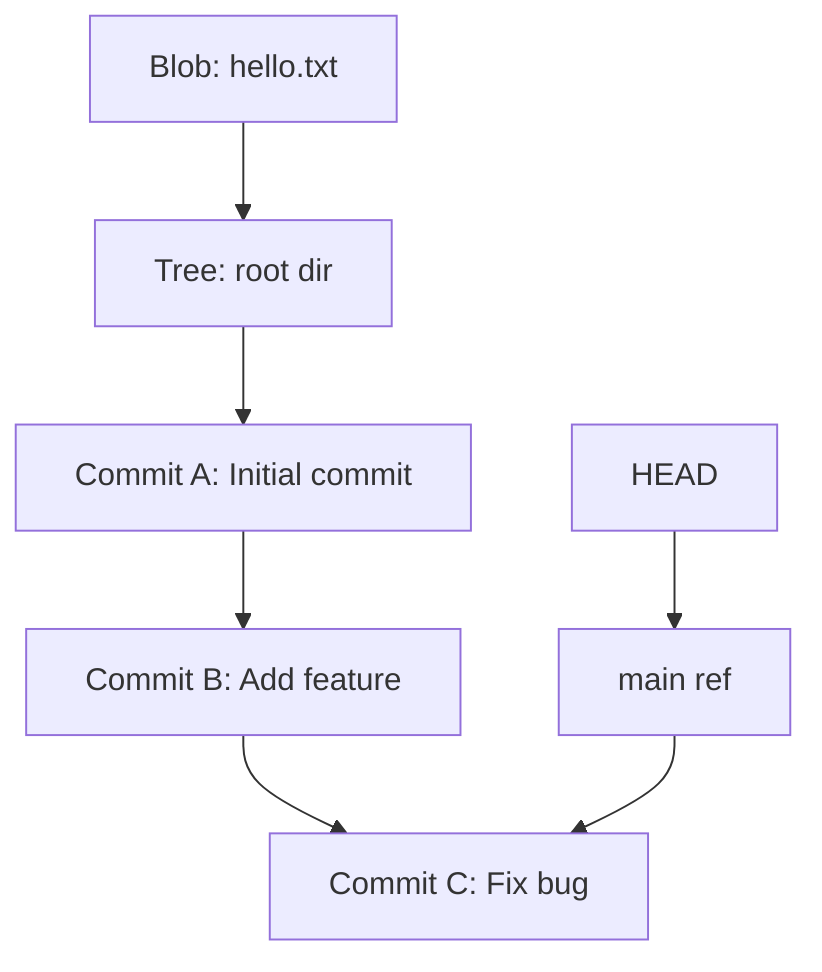
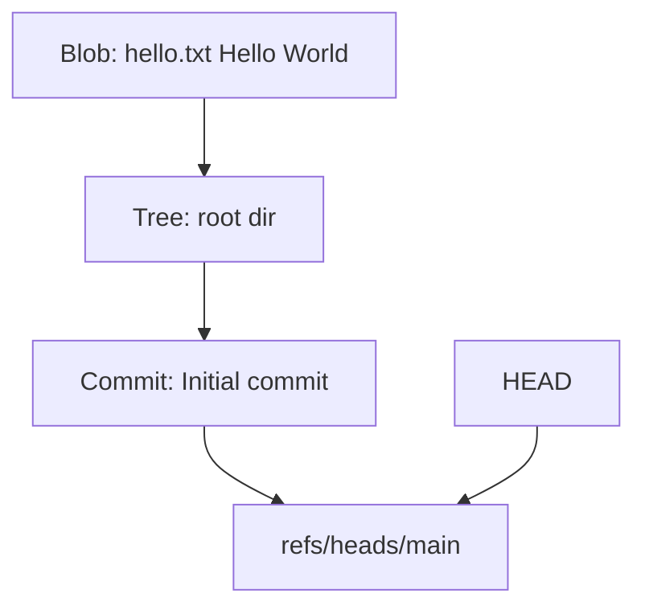

# 🌱 **Git Internals**

## 📌 **1. What is Git Really?**

- Git is a **distributed version control system (DVCS)**.
- It’s not just a code hosting tool → it’s a **content-addressable filesystem with a fancy CLI**.
- Under the hood:

  - Every commit, tree, and blob is just a **file object identified by a SHA-1/SHA-256 hash**.
  - Git is like a **key-value database** where:

    - Key = hash (commit ID)
    - Value = object (file, directory tree, or commit metadata).

💡 Think of Git as **a mini database optimized for code history**.

---

## 📌 **2. Core Building Blocks**

### 🔹 **Objects (inside `.git/objects`)**

There are 4 fundamental Git object types:

1. **Blob** → file contents (just raw bytes of a file).
2. **Tree** → directory structure (list of file names + blobs/trees).
3. **Commit** → snapshot of a tree + metadata (author, timestamp, parent commit hash).
4. **Tag** → pointer to a commit with a human-friendly label.

---

### 🔹 **References (inside `.git/refs`)**

- Refs are **pointers** to commits (e.g., `refs/heads/main`).
- `HEAD` is a special ref that tells Git “where you are right now.”

---

### 🔹 **Index (Staging Area)**

- A binary file (`.git/index`) that stores a snapshot of what’s staged for commit.
- Think of it as the “shopping cart” before checkout.

---

### 🔹 **Packfiles**

- To save space, Git compresses objects into `.pack` files.
- Helps when repos get huge (millions of objects).

---

## 📌 **3. How Git Records History**

Git doesn’t store **diffs** (like SVN or Perforce). Instead:

- Every commit = a **snapshot of the whole project tree**.
- But thanks to object deduplication, unchanged files don’t get copied → Git just reuses the same blob hash.

💡 This makes Git **fast to branch and merge**, because commits are just pointers to snapshots.

---

## 📌 **4. Example: Creating a Commit Internally**

Let’s say you add a file `hello.txt` with `"Hello World"`:

1. `git add hello.txt`

   - Git creates a **blob object** for file contents.
   - Updates `.git/index` to stage that blob.

2. `git commit -m "Add hello.txt"`

   - Git creates a **tree object** that lists `hello.txt → blob_hash`.
   - Creates a **commit object** that points to that tree (and previous commit if any).
   - Stores commit in `.git/objects/<hash>`.
   - Updates `refs/heads/main` to point to the new commit.

---

## 📌 **5. Branching & Merging Internals**

- **Branch = just a ref (pointer) to a commit.**
- Creating a branch is literally writing a new text file under `.git/refs/heads/feature-x` with a commit hash.
- **Merging** means Git finds the **lowest common ancestor commit** and applies a **three-way merge**.
- **Rebasing** is replaying commits one by one onto another branch by creating new commit objects.

---

## 📌 **6. Distributed Nature**

Every developer’s `.git` folder is a **full copy of the database** (all commits, all branches).

- `git push` → moves refs & objects to remote.
- `git fetch/pull` → retrieves refs & objects from remote.
- Remote repos (like GitHub/Azure Repos) are just **bare repos** (no working directory, only `.git` data).

---

## 📌 **7. Investigating Internals**

Try these commands in any repo:

```bash
# Show commit object contents
git cat-file -p <commit_hash>

# Show tree contents
git ls-tree <commit_hash>

# Show low-level history graph
git log --graph --oneline --decorate
```

---

## 📌 **8. Diagram – Git Objects**



---

## 📌 **9. Why Engineers Love Git**

- ⚡ **Fast** → local history = no server trips.
- 🔀 **Branching/merging is cheap** → just pointer manipulation.
- 🛡️ **Integrity** → every object is hashed, so corruption is detected.
- 🌍 **Distributed** → no single point of failure.
- 📚 **History is immutable** → you can add commits, but existing commits never change (unless you rewrite history).

---

## 🔬 **Inside Git: Commit Lifecycle Walkthrough**

### 📌 **1. Init a Repo**

```bash
mkdir git-internals-demo
cd git-internals-demo
git init
```

👉 Creates `.git/` folder — Git’s **database + config**.

```bash
ls .git
# HEAD  config  description  hooks/  info/  objects/  refs/
```

---

### 📌 **2. Add a File**

```bash
echo "Hello World" > hello.txt
git add hello.txt
```

What happened internally?

- Git created a **blob object** for `hello.txt` contents.
- Blob = compressed file contents + header.
- Stored in `.git/objects/<2-char-prefix>/<rest-of-hash>`.

Check it:

```bash
git hash-object hello.txt
# e.g. aef3b2c8d7...
```

```bash
ls .git/objects/aef3b2
# contains file named "c8d7..."
```

👉 That’s the **blob**.

---

### 📌 **3. Make the Commit**

```bash
git commit -m "Initial commit"
```

Now Git creates:

1. **Tree object** → describes directory layout (file name → blob hash).
2. **Commit object** → points to the tree + metadata (author, date, message).
3. Updates `refs/heads/main` to point to this commit.

Inspect commit:

```bash
git log --oneline
# a1b2c3d Initial commit
```

Inspect commit object:

```bash
git cat-file -p a1b2c3d
```

Output looks like:

```ini
tree 4e935df2...
author Alice <alice@example.com>  1724948160 +0200
committer Alice <alice@example.com>  1724948160 +0200

Initial commit
```

👉 Commit points to a **tree**.

---

### 📌 **4. Inspect Tree**

```bash
git cat-file -p 4e935df2...
```

Example output:

```ini
100644 blob aef3b2c8d7...    hello.txt
```

👉 This tree maps:

- `hello.txt` → blob (`Hello World`).

---

### 📌 **5. Verify Blob**

```bash
git cat-file -p aef3b2c8d7...
```

Output:

```ini
Hello World
```

👉 That’s your file content.

---

### 📌 **6. Branch and HEAD**

- `refs/heads/main` → contains commit hash.
- `HEAD` → points to current branch.

```bash
cat .git/refs/heads/main
# a1b2c3d...
```

```bash
cat .git/HEAD
# ref: refs/heads/main
```

So:

```ini
HEAD → refs/heads/main → commit → tree → blob
```

---

### 📌 **7. Diagram of What We Just Did**



---

### 📌 **8. Key Takeaways**

- **Blob** = file contents.
- **Tree** = directory structure.
- **Commit** = snapshot + metadata + parent pointer(s).
- **Refs** = named pointers (branches, tags).
- **HEAD** = where you are.

---

## 🏁 **TL;DR**

- Git = a **content-addressable database** with blobs (files), trees (dirs), commits (snapshots), and refs (pointers).
- A commit = snapshot + pointer to parent commits.
- Branch = pointer to a commit.
- Merge = three-way reconciliation of snapshots.
- Every `.git` is a full repo copy.
- That’s why Git is **fast, reliable, and distributed**.
