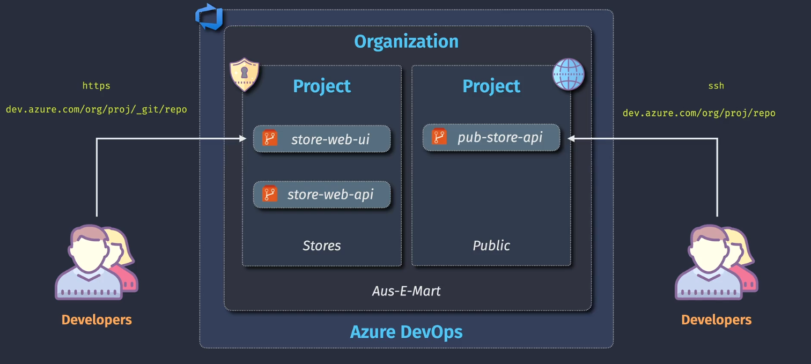

# 📁 Azure Repos – Complete Overview

> Version control system in Azure DevOps (ADO) supporting both Git and TFVC — choose your style, your speed.

---

## 🧭 What is Azure Repos?

**Azure Repos** is the **source code management system** in **Azure DevOps Services (ADO)**.

✅ It lets teams:

- Track code changes
- Collaborate through branching and pull requests
- Manage CI/CD triggers
- Control access and history

It supports **two version control types**:

| Type     | Description                              |
| -------- | ---------------------------------------- |
| **Git**  | Distributed VCS (modern, popular)        |
| **TFVC** | Centralized VCS (older, Microsoft-style) |

---

## ⚔️ Git vs TFVC (Team Foundation Version Control)

| Feature               | **Git (Distributed)**           | **TFVC (Centralized)**            |
| --------------------- | ------------------------------- | --------------------------------- |
| 🗃️ History            | Stored locally + remotely       | Only on server                    |
| 📦 Branching          | Lightweight, fast               | Heavy, slower                     |
| 🧪 Offline work       | Yes (full repo)                 | No (requires server)              |
| 🧠 Commit granularity | Multiple small commits          | Usually 1 big change per check-in |
| ⛓️ Merge model        | Merge → Pull Request            | Check-in with locks               |
| 🔥 Popularity         | Widely used (GitHub, Bitbucket) | Legacy, internal MS use           |

✅ **Recommendation**: Always use **Git** unless you’re maintaining old code in TFVC.

---

## ✅ 1. Features of Azure Repos

Here's what makes Azure Repos powerful for modern software teams:


---

### ✨ 1.1 Started with Enterprise

- Built natively into Azure DevOps (ADO) for **large orgs and regulated teams**
- Enterprise-grade security, compliance, and audit logging out-of-the-box

### 🌐 1.2 Git and TFVC Source Control

- Supports both:

  - 🧠 **Git**: distributed version control (recommended)
  - 🏢 **TFVC**: Team Foundation Version Control (centralized, legacy)

### 🔗 1.3 Integrated with Azure DevOps Services

- Full integration with:

  - ✅ Boards (work items, linking PRs to tasks)
  - ✅ Pipelines (CI/CD triggers)
  - ✅ Artifacts (dependencies)
  - ✅ Test Plans and Dashboards

### 🤝 1.4 Collaborative Source Control

- Advanced code collaboration:

  - Pull Requests with required reviewers
  - Built-in policies and auto-merge
  - Threaded comments, code suggestions
  - Merge conflict resolution in-browser

### 💾 1.5 Supports Large Files (Git LFS)

- Integrates with **Git LFS** for tracking large binaries (media, datasets, CAD files)

### 📂 1.6 Project-Scoped Repos

- Every **project** in Azure DevOps can have **multiple Git repos**
- Easy to separate services (e.g., `store-ui`, `store-api`) within one project

## 🏗️ 2. Azure Repos Architecture

Azure Repos is part of the Azure DevOps hierarchy:

```ini
Azure DevOps
└── Organization: Aus-E-Mart
    ├── Project: Stores
    │   ├── Repo: store-web-ui
    │   └── Repo: store-web-api
    └── Project: Public
        └── Repo: pub-store-api
```

---



---

### 🏢 2.1 Organization

- Top-level container
- Managed under **Microsoft Entra ID (Azure AD)** for identity
- Controls **billing, users, licensing**

Example: `https://dev.azure.com/aus-e-mart`

---

### 📂 2.2 Project

Each **Organization** can contain multiple **Projects**.

- Represents a software system or business unit
- Has:

  - Azure Repos
  - Boards
  - Pipelines
  - Artifacts

Project examples: `Stores`, `Public`

---

### 📁 2.3 Repository (Repo)

Inside a project, you can have one or more **Git repositories**:

- Each repo:

  - Has branches, history, commits, tags
  - Supports pull requests and Git LFS

- You clone/push via HTTPS or SSH:

```ini
HTTPS: https://dev.azure.com/org/project/_git/repo
SSH:   git@ssh.dev.azure.com:v3/org/project/repo
```

🔧 You choose the protocol that fits your auth setup.

---

### ⚙️ 2.4 Git Protocols in Azure Repos

| Protocol  | URL Example                                | Auth Supported  |
| --------- | ------------------------------------------ | --------------- |
| **HTTPS** | `https://dev.azure.com/org/proj/_git/repo` | PAT, OAuth, GCM |
| **SSH**   | `git@ssh.dev.azure.com:v3/org/proj/repo`   | SSH Keys        |

---

## 🔐 3. Access Control in Azure Repos

Azure DevOps uses **RBAC (Role-Based Access Control)** + **Microsoft Entra ID (Azure AD)** identities.

---


---

### 👥 3.1 Identity Sources

- **Microsoft Entra ID (Azure AD)**:

  - Users (Rick, Summer)
  - Groups (Developers, Admins)

- **Access Tokens** (for automation)

---

### 🔐 3.2 Authentication Methods

| Method                             | Use Case                             | Login Style            |
| ---------------------------------- | ------------------------------------ | ---------------------- |
| **🔒 OAuth**                       | Devs with Microsoft login (SSO, MFA) | Browser + GCM          |
| **🧾 PAT (Personal Access Token)** | CLI, automation                      | Token used as password |
| **🔑 SSH Key**                     | Secure Git access via SSH            | No password prompts    |
| **🤖 Service Principals**          | App-to-repo automation               | Used in Pipelines      |

---

### 🔑 3.3 Permissions Model

| Scope            | Description                                              |
| ---------------- | -------------------------------------------------------- |
| **Organization** | Admins can control users, billing, policies              |
| **Project**      | Control contributor access, boards, pipelines            |
| **Repo**         | Grant granular Git rights (read, contribute, force-push) |

---

### 🛂 3.4 Repo-Level Permissions

| Permission             | Purpose                        |
| ---------------------- | ------------------------------ |
| **Read**               | View code, branches            |
| **Contribute**         | Push commits                   |
| **Force Push**         | Overwrite history              |
| **Create Branch/Tag**  | Add refs                       |
| **Manage Permissions** | Set others’ access             |
| **Bypass PR policies** | Merge without PRs (dangerous!) |

---

### 🧰 3.5 Assigning Permissions

- Go to: `Project Settings → Repos → Security`
- Assign users or groups to roles like:

  - **Project Administrators**
  - **Contributors**
  - **Readers**
  - Or create custom security roles

---

### 🧠 Visual Recap: Access Flow

📸 From your diagram:

```text
Azure AD Users:
- Rick → SSH Auth
- Summer → PAT Auth
↓
Permissions via Project Security Group
↓
Access Git Repos (store-web-ui, store-web-api)
```

---

## ✅ Summary

| Layer                | Key Points                                             |
| -------------------- | ------------------------------------------------------ |
| **Azure Repos**      | Git-based source control inside Azure DevOps           |
| **Features**         | Git+TFVC, PRs, Git LFS, enterprise-grade integration   |
| **Architecture**     | Org → Project → Repos, scoped and manageable           |
| **Access Control**   | RBAC with Entra ID, PATs, OAuth, SSH, service accounts |
| **Protocol Support** | HTTPS (GCM, PAT), SSH (SSH Keys)                       |
