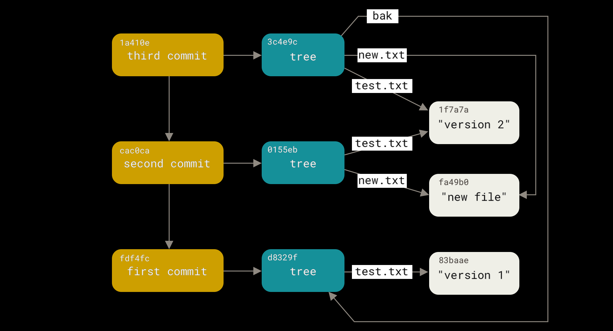

```mermaid
---
config:
  layout: elk
  elk:
    mergeEdges: false
    nodePlacementStrategy: LINEAR_SEGMENTS
---
graph TD
  subgraph Commit History
    A[Commit: 1a410e<br><b>Third Commit</b>] --> A1[Parent: cac0ca<br><b>Second Commit</b>]
    A1 --> A2[Parent: fdf4fc<br><b>First Commit</b>]
  end

  subgraph Trees and Objects
    A --> B[Tree: 3c4e9c<br><i>Snapshot of third commit</i>]
    B --> B1[test.txt<br><code>→ blob 1f7a7a</code>]
    B --> B2[new.txt<br><code>→ blob fa49b0</code>]
    B --> B3[bak/<br><code>→ tree d8329f</code>]
    B3 --> B4[test.txt<br><code>→ blob 83baae</code>]

    A1 --> C[Tree: 0155eb<br><i>Snapshot of second commit</i>]
    C --> C1[test.txt<br><code>→ blob 1f7a7a</code>]
    C --> C2[new.txt<br><code>→ blob fa49b0</code>]

    A2 --> D[Tree: d8329f<br><i>Snapshot of first commit</i>]
    D --> D1[test.txt<br><code>→ blob 83baae</code>]
  end
```

# ✍🏻 Example 2 : The Lifecycle of a Commit (Step by Step)

Let’s recreate the diagram from the bottom up 🧗

---

<div align="center">
  
</div>

---

## ✅ First Commit (`fdf4fc`)

```ini
📂 Working Directory:
  test.txt = "version 1"

🧪 Command:
  git add test.txt
  git commit -m "first commit"
```

🔧 Internally:

- Git creates:

  - 🧱 Blob (`83baae`) for `test.txt`
  - 🌳 Tree (`d8329f`) linking `test.txt` to blob
  - 🧾 Commit (`fdf4fc`) pointing to the tree

💬 Summary:

> Git stores test.txt's content as a blob and builds a snapshot tree of the repo.

---

## ✅ Second Commit (`cac0ca`)

```ini
📂 Working Directory:
  test.txt = "version 2"   (edited)
  new.txt  = "new file"    (added)

🧪 Command:
  git add .
  git commit -m "second commit"
```

🔧 Internally:

- Git creates:

  - 🧱 New blob `1f7a7a` for `test.txt` ("version 2")
  - 🧱 New blob `fa49b0` for `new.txt`
  - 🌳 New tree `0155eb` linking:

    - `test.txt → 1f7a7a`
    - `new.txt → fa49b0`

  - 🧾 Commit `cac0ca` pointing to this tree, with parent = `fdf4fc`

💬 Summary:

> Git stores the new version of `test.txt` as a new blob, reuses nothing from previous commit.

---

## ✅ Third Commit (`1a410e`)

```ini
📂 Working Directory:
  mkdir bak
  cp test.txt bak/

🧪 Command:
  git add .
  git commit -m "third commit"
```

🔧 Internally:

- Git creates:

  - 🌳 A tree `3c4e9c` for the root folder:

    - `test.txt → 1f7a7a` (same as before)
    - `new.txt → fa49b0` (same as before)
    - `bak/` → nested tree:

      - `test.txt → 83baae` ✅ reused from first commit!

  - 🧾 Commit `1a410e` with:

    - parent = `cac0ca`
    - tree = `3c4e9c`

💬 Summary:

> Git reuses old blobs when content is identical, even if in a different folder.

---

## 🧬 Visualization of Commit Internals

```text
🟡 Commit 1 (fdf4fc)
 └── tree: d8329f
     └── test.txt → blob "version 1"

🟡 Commit 2 (cac0ca)
 └── tree: 0155eb
     ├── test.txt → blob "version 2"
     └── new.txt  → blob "new file"

🟡 Commit 3 (1a410e)
 └── tree: 3c4e9c
     ├── test.txt → blob "version 2"
     ├── new.txt  → blob "new file"
     └── bak/
         └── test.txt → blob "version 1"
```


