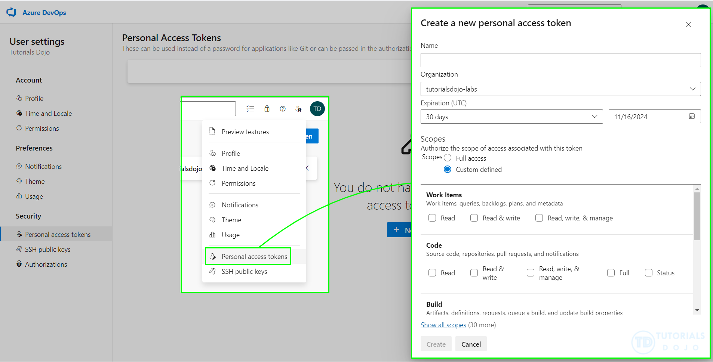
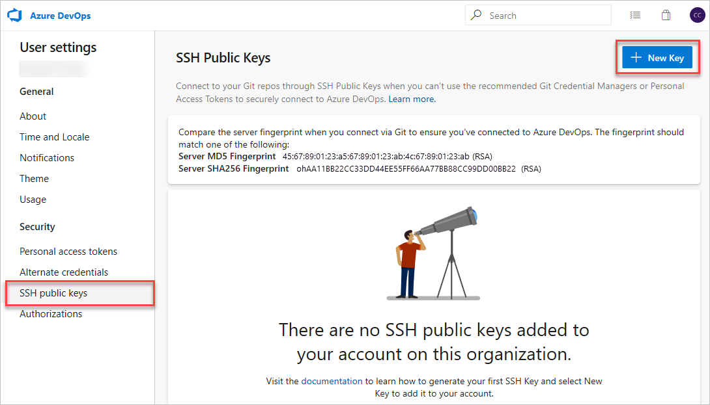

# 🔐 ADO Repo Access Control

Azure Repos (Git) uses **Role-Based Access Control (RBAC)** to manage _what_ users can do and **Authentication Methods** to manage _who_ they are.

---

## 🎯 Access Control = 🔓 Authentication + 🛂 Authorization

| Type               | Purpose                  | Examples                     |
| ------------------ | ------------------------ | ---------------------------- |
| **Authentication** | Verify _who_ you are     | SSH, PAT, OAuth              |
| **Authorization**  | Define _what_ you can do | Read, Contribute, Manage PRs |

---

## 🧾 Azure Repo Authentication Methods

Here are the 4 primary ways to authenticate with Azure Git Repos:

---

### 1️⃣ 🧾 Personal Access Token (PAT)

> A secure token you generate from Azure DevOps to use in place of a password.

<div align="center">
  
</div>

---

#### ✅ Steps:

1. Go to **User Settings → Personal Access Tokens**
2. Create new PAT with scope like **Code (Read/Write)**
3. Use HTTPS URL and authenticate with:

   - Username = anything (`<yourname>`)
   - Password = **your PAT**

```bash
git clone https://dev.azure.com/Org/Project/_git/Repo
# When prompted:
# Username: anything
# Password: <your-PAT>
```

#### 📌 Pros:

- Works with any Git client
- Easy to use in CI/CD and scripts

#### ⚠️ Cons:

- Tokens expire (30/90/180 days)
- Store them safely (use a secrets vault)

---

### 2️⃣ 🔑 SSH Key Authentication

<div align="center">
  
</div>

---

#### ✅ Steps:

1. Generate SSH key:

   ```bash
   ssh-keygen -t ed25519 -C "you@example.com"
   ```

2. Add public key to Azure DevOps:

   - Go to `https://dev.azure.com/<org>/_usersSettings/keys`

3. Use SSH URL when cloning:

   ```bash
   git clone git@ssh.dev.azure.com:v3/OrgName/ProjectName/RepoName
   ```

#### 📌 Pros:

- Long-lived and secure
- No need to re-authenticate often

#### ⚠️ Cons:

- SSH setup can confuse beginners
- SSH key must be added manually per user

---

### 3️⃣ 🔒 OAuth with Microsoft Entra ID

> Authenticate via browser-based Microsoft account login (used in Visual Studio, VS Code, Azure CLI)

#### ✅ Used In:

- Azure CLI
- VS Code Git integration
- Visual Studio

#### 📌 Pros:

- Seamless for Microsoft/Azure-authenticated users
- Multi-factor auth supported

#### ⚠️ Cons:

- Not usable directly in CLI scripts
- Requires GUI or login flow

---

### 4️⃣ 🤖 Git Credential Manager (GCM)

> A cross-platform credential helper that supports **OAuth**, **PAT**, and **Microsoft Entra ID**.

- Automatically handles credentials for:

  - VS Code
  - Git CLI
  - Git Bash

#### ✅ Setup:

```bash
git config --global credential.helper manager-core
```

When you `git clone` or `git push`, it pops up Microsoft login and caches credentials securely.

---

## 📊 Auth Method Comparison Table

| Method      | CLI-Friendly          | Secure | Token Expiry     | GUI Needed         |
| ----------- | --------------------- | ------ | ---------------- | ------------------ |
| **SSH Key** | ✅ Yes                | ✅ Yes | ❌ No expiry     | ❌ No              |
| **PAT**     | ✅ Yes                | ✅ Yes | ✅ Yes           | ❌ No              |
| **OAuth**   | ❌ No (browser-based) | ✅ Yes | 🔄 Session-based | ✅ Yes             |
| **GCM**     | ✅ Yes                | ✅ Yes | 🔄 Refreshable   | ✅ Yes (for login) |

---

## 🔐 SSH Keys vs PATs in Azure DevOps

| Feature            | **SSH Keys**                       | **Personal Access Tokens (PATs)**         |
| ------------------ | ---------------------------------- | ----------------------------------------- |
| Scope granularity  | ❌ Not configurable                | ✅ Fully configurable (read/write/manage) |
| Expiration control | ❌ No native expiry                | ✅ Expiry dates enforced                  |
| Revocation         | ✅ Manual removal only             | ✅ Manual + automatic (e.g. leaked token) |
| Auditability       | ❌ Limited                         | ✅ Logged and monitored                   |
| Use cases          | Git operations (clone, push, pull) | REST APIs, pipelines, Git, etc.           |
| Policy enforcement | ❌ No Entra ID policy support      | ✅ Entra ID policies for scope, lifespan  |

---

### 🧭 What You _Can_ Do with SSH Keys

- **Limit access by repository**: You can control which repos a user can access by assigning them to specific projects or teams.
- **Use Git over HTTPS with PATs**: If you need scoped access, switch to HTTPS + PAT or OAuth.
- **Monitor usage**: While SSH key usage isn’t scoped, you can audit Git activity via logs and alerts.

---

### 🛡️ Best Practice for Secure Git Access

For enterprise-grade control (which you clearly care about), Microsoft recommends using:

- **Microsoft Entra ID + OAuth for Git**: Secure, token-based, and policy-enforced.
- **PATs with scoped permissions**: Ideal for automation and CI/CD.
- **Disabling SSH entirely**: If you want to enforce scoped access only.

---

## 🛂 Azure Repos Authorization (Permission Control)

Once authenticated, Azure DevOps applies **repo permissions** to decide _what_ you're allowed to do.

| Permission           | Meaning                                                |
| -------------------- | ------------------------------------------------------ |
| `Read`               | View code, history, branches                           |
| `Contribute`         | Push to branches                                       |
| `Create branch/tag`  | Add new refs                                           |
| `Manage permissions` | Modify others’ access                                  |
| `Bypass policies`    | Force push or merge without approvals (admin use only) |

---

## ✅ Best Practices

| Use Case           | Recommended Auth                            |
| ------------------ | ------------------------------------------- |
| Daily development  | **SSH** or **GCM**                          |
| Automation/scripts | **PAT** stored in secrets                   |
| Git GUI tools      | **GCM** or **OAuth**                        |
| CI/CD pipelines    | **PAT** or **Service Principal with token** |
