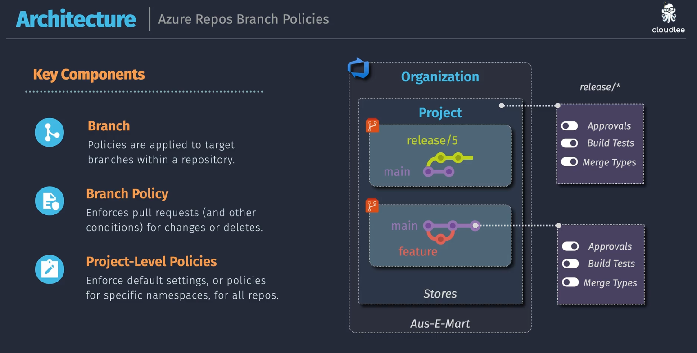
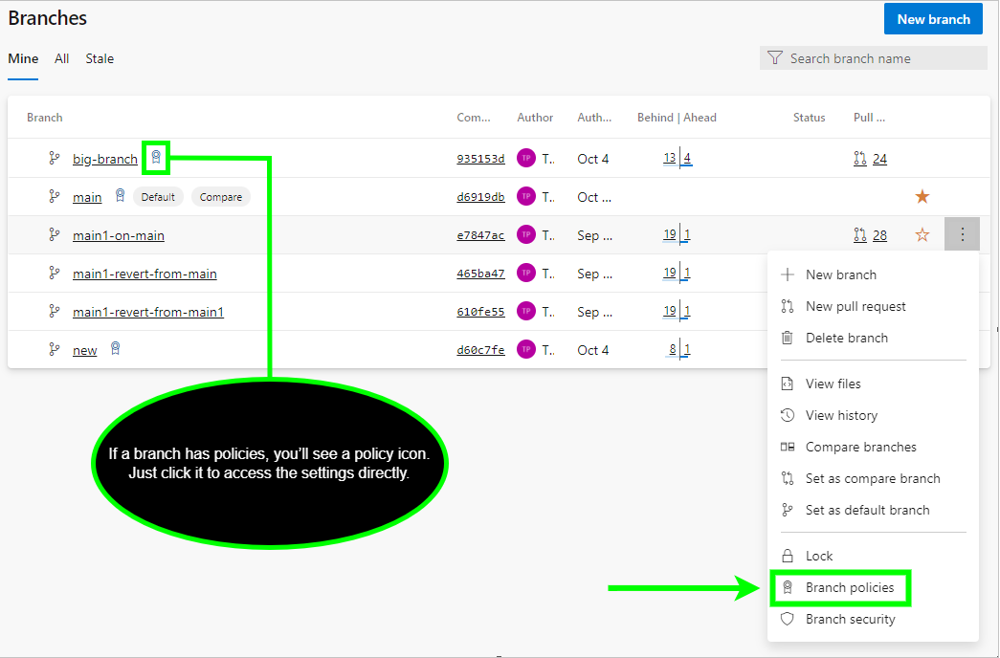
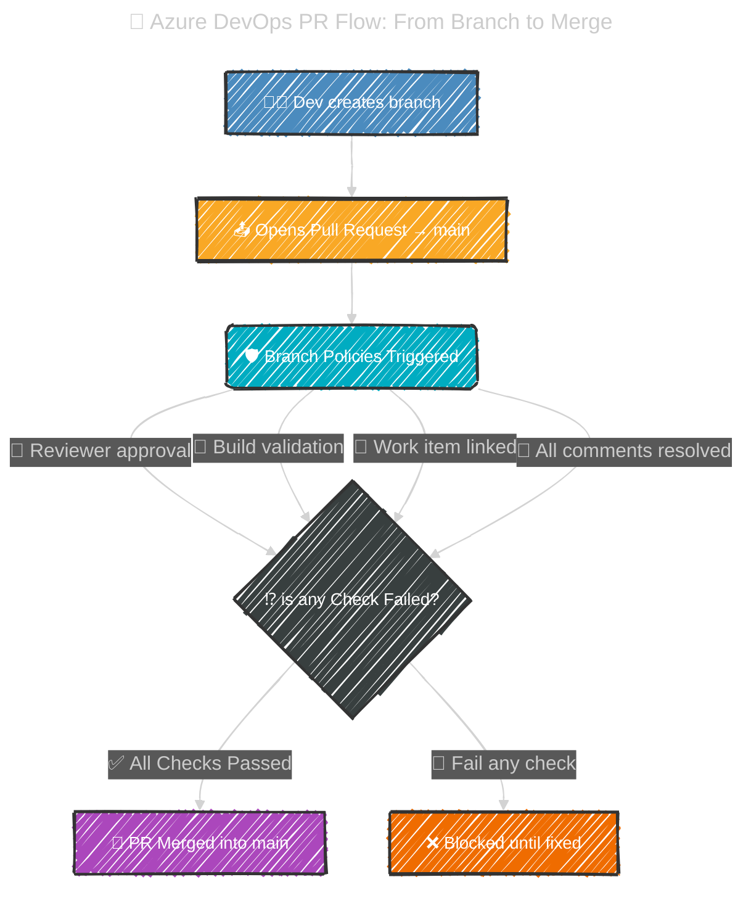

# 🌳 **Azure Repos Branch Policies**

## 📖 **What Are Branch Policies?**

Branch Policies in **Azure Repos Git** are **rules** you attach to branches (usually `main` or `release`) to **protect code quality and enforce governance** before code merges.

👉 Think of them as **guard rails** for your team’s Git workflow.
They ensure:

- Only high-quality code reaches critical branches.
- The team follows consistent review and testing practices.
- Automated checks prevent “oops, I broke production” commits.

---

  

---

  

---

## 🤔 **Why Use Them?**

Without policies, anyone could just `git push` directly into `main` → chaos.
With policies:

- Code must go through **Pull Requests (PRs)**.
- PRs must pass defined checks (reviews, builds, tests, etc.).
- You avoid technical debt sneaking into production.

---

## ⚙️ **Key Types of Branch Policies**

Let’s go through **every policy** with practical examples 👇

---

### 1. ✔️ **Require a minimum number of reviewers**

- Enforces **peer reviews** before merge.
- Example: At least **2 reviewers** must approve the PR before it can be completed.

> **⚙️ Options:**
>
> 1. **Minimum reviewers**:
>    - e.g., 2.
> 2. **Allow requestors to approve their own PR**:
>    - usually off (self-approval is cheating 🤭).
> 3. **Reset approvals when there are new changes**:
>    - ensures reviewers re-check after updates.

👉 Use case: Ensure multiple eyes catch bugs before merging.

---

### 2. 🧑‍💻 **Check for linked work items**

- Requires the PR to be linked to a **work item** (bug, user story, task).
- Ensures traceability → “Why was this code change made?”

👉 Example: Developer fixing bug #123 must link the PR to Work Item #123.

---

### 3. 📑 **Check for comment resolution**

- If someone leaves a **code review comment**, it must be marked **resolved** before merge.
- Prevents “we ignored reviewer feedback” merges.

👉 Example: A reviewer says, “Fix null handling here” → PR cannot merge until marked resolved.

---

### 4. 🤖 **Build validation**

- Runs a **build pipeline (CI)** whenever a PR is created/updated.
- PR cannot merge unless the build succeeds ✅.
- Ensures code compiles, tests pass, and nothing is broken.

> ⚙️ **Options:**
>
> - **Path filters**: Run build only if certain files change.
> - **Manual queue**: Allow reviewers to re-run builds.

👉 Example: A PR changes `*.cs` files → triggers CI pipeline → must pass before merge.

---

### 5. 🧪 **Status checks**

- Requires PRs to pass **external services** (e.g., SonarQube, security scans).
- Azure DevOps waits for status = ✅ before allowing merge.

👉 Example: Code must pass SonarQube analysis → no major code smells.

---

### 6. 🛡️ **Limit merge types**

- Controls **how PRs get merged**:

  - **Squash merge** → combine into one commit.
  - **Rebase and fast-forward** → clean history.
  - **Merge commit** → preserve all commits.

👉 Example: Team requires **squash merge** only → keeps history clean.

---

### 7. 🔒 **Automatically include code reviewers**

- Automatically adds specific people/groups as reviewers for PRs touching certain paths.

👉 Example: If a PR changes `/infra/*`, auto-add **DevOps team** as reviewers.

---

### 8. ⏱️ **Build expiration**

- Ensures the build used to validate a PR isn’t too old.
- If PR is stale → requires a **new build** before merge.

👉 Example: Build older than 12 hours? Run fresh build.

---

### 9. 🧭 **Bypass policies (admins only)**

- Project admins can bypass branch policies when needed (emergencies).
- Should be used **sparingly** ⚠️.

---

## 🔄 **Workflow with Branch Policies**

Here’s how it looks in practice:

---

## 📋 **Example Setup** (Best Practice for `main` branch)

- Require **2 reviewers**
- Require **linked work item**
- Require **comment resolution**
- Add **Build validation** pipeline
- Add **SonarQube status check**
- Allow only **squash merges**
- Auto-add **security team** for `/auth/*` changes

👉 This ensures **quality + traceability + security**.

---

## 👀 **Azure Repos Branch Policies vs GitHub Branch Protection**

| Feature            | Azure DevOps Branch Policies | GitHub Branch Protection            |
| ------------------ | ---------------------------- | ----------------------------------- |
| Min reviewers      | ✅                           | ✅                                  |
| Linked work items  | ✅ (Azure Boards)            | ❌ (no native work item link)       |
| Comment resolution | ✅                           | ❌                                  |
| Build validation   | ✅ (Azure Pipelines)         | ✅ (GitHub Actions required checks) |
| Status checks      | ✅                           | ✅                                  |
| Auto-reviewers     | ✅                           | ✅                                  |
| Merge strategies   | ✅                           | Limited                             |

👉 Azure DevOps gives **tighter integration** with work items and boards.

---

## ✅ **Summary**

- **Branch policies** = guardrails that enforce quality before merging.
- Cover **reviews, builds, work items, comments, and checks**.
- Configurable per-branch (commonly on `main`, `release`).
- Combined, they **prevent bad code from slipping into production**.
