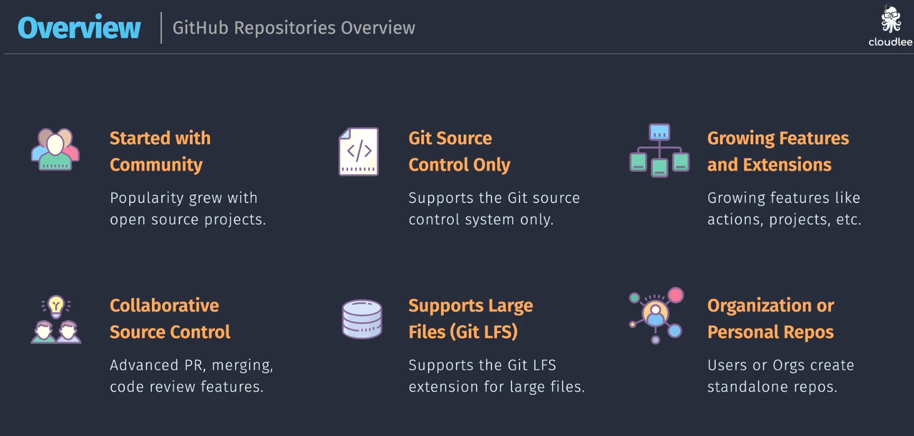
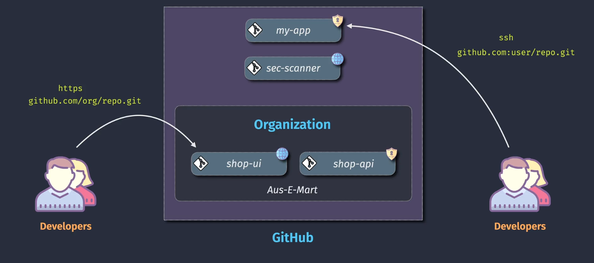
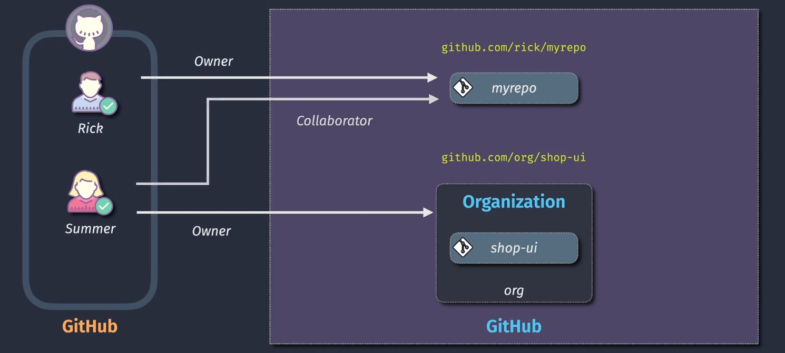
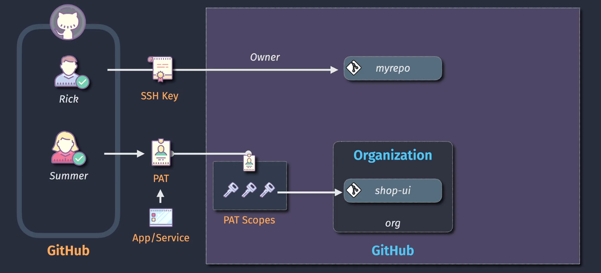

# 🐙 GitHub Repo Overview

> GitHub is the #1 platform for social + professional collaboration around code.  
> Here’s how repos, roles, and access work behind the scenes.

---

<div style="text-align:center;">
    
</div>

---

## ✅ 1. Features of GitHub

| 🔥 Feature                       | 💬 Description                                         |
| -------------------------------- | ------------------------------------------------------ |
| **Started with Community**       | Designed for and popularized by the open-source world  |
| **Git Source Control Only**      | Supports only the Git protocol (no TFVC like ADO)      |
| **Growing Ecosystem**            | GitHub Actions, Projects, Codespaces, Copilot, Pages   |
| **Collaborative Source Control** | Pull requests, reviews, threaded comments, suggestions |
| **Supports Git LFS**             | Efficient handling of large files (media, datasets)    |
| **Org or Personal Repos**        | Users or organizations can host repos                  |

💡 **Summary**: GitHub is Git-native, community-rooted, and constantly evolving with built-in CI/CD and dev features.

---

## 🏗️ 2. GitHub Architecture

<div align="center">
  
</div>

---

### 📦 Repositories in GitHub

Repos can live under:

- **User accounts** (personal)
- **Organizations** (shared/team)

---

### 🔄 Repository Location Options:

| Repo Owner            | URL Format                   | Auth Model                             |
| --------------------- | ---------------------------- | -------------------------------------- |
| Personal (e.g. Rick)  | `github.com/rick/myrepo.git` | Owner + Collaborators                  |
| Org (e.g. aus-e-mart) | `github.com/org/repo.git`    | Multiple roles (admin, billing, teams) |

---

## 👥 Roles in GitHub

<div style="text-align:center;">
    
</div>

---

### 📁 On a Personal Repo:

- **Owner** – full control
- **Collaborator** – invited users with repo access

### 🏢 In a GitHub Organization:

| Role              | Permissions                           |
| ----------------- | ------------------------------------- |
| **Owner**         | Full control (repos, people, billing) |
| **Admin**         | Repo settings, teams, permissions     |
| **Billing Admin** | Subscription and invoice access       |
| **Members**       | Default team members                  |

---

### 🌐 Git Protocol Access in GitHub

📸 From your visual:

```bash
# HTTPS (most common)
git clone https://github.com/org/repo.git

# SSH (preferred for CLI)
git@github.com:org/repo.git
```

| Protocol       | Used by     | Auth                 |
| -------------- | ----------- | -------------------- |
| **HTTPS**      | Web UI, CLI | PAT, GitHub CLI, GCM |
| **SSH**        | CLI         | SSH Key              |
| **GitHub CLI** | gh CLI tool | Token-based          |

---

## 🔐 3. Access Control and Permissions

📸 Based on your diagram:

<div align="center">
  
</div>

---

### 🔑 GitHub Auth Methods

| Method                             | Used For               | How It Works                                          |
| ---------------------------------- | ---------------------- | ----------------------------------------------------- |
| **🔐 SSH Key**                     | Dev CLI workflows      | Public key added to GitHub → private key used locally |
| **🧾 PAT (Personal Access Token)** | CI/CD, automation      | Generated via UI and passed as password               |
| **🔑 OAuth / Browser Login**       | Web login & GitHub CLI | GitHub handles via session/cookies                    |
| **🤖 GitHub App Token**            | Bots & GitHub Actions  | Used for secure automated workflows                   |

---

### 🎯 Repo Access via PAT or SSH

- 🔸 **Rick** uses SSH to push to his personal repo (`myrepo`)
- 🔸 **Summer** uses a PAT to push to `shop-ui` under the `org`

Both are **authenticated securely** and permissions are scoped based on **their roles**.

---

### 👮 Permissions Breakdown

| Scope                 | Action                                 |
| --------------------- | -------------------------------------- |
| **Read**              | Clone, browse, fetch repo              |
| **Write**             | Push, create branches                  |
| **Admin**             | Manage settings, teams, webhooks       |
| **Triage** (optional) | Moderate PRs, issues (no write access) |

---

### ✅ Teams in GitHub Orgs

- GitHub allows you to define **Teams** (groups of users)
- Assign team access to a repo once — and control all users easily
- Combine this with branch protection rules for scalable governance

---

## 📌 Summary: GitHub vs Azure Repos

| Feature        | GitHub                      | Azure Repos                |
| -------------- | --------------------------- | -------------------------- |
| Target Users   | Open Source + Teams         | Enterprise DevOps          |
| VCS Support    | Git only                    | Git + TFVC                 |
| Hosting        | GitHub cloud                | Azure DevOps cloud/on-prem |
| CI/CD          | GitHub Actions              | Azure Pipelines            |
| Access Control | PAT, SSH, OAuth, App Tokens | PAT, SSH, OAuth, GCM       |
| Collaboration  | PRs, Issues, Discussions    | PRs, Work Items            |
