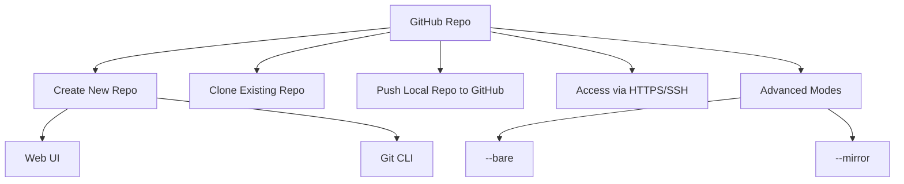

# 🚀 Get Started with GitHub Repository

> A GitHub repo is your code’s **cloud home** + **collaboration space** + **versioned history** — all in one!

---

## ✅ 1. What Is a GitHub Repo?

A GitHub repository is:

- A **remote version** of your Git repo
- Hosted on GitHub (free/paid)
- Enables **collaboration**, **tracking**, **issues**, and **automation**

Think of it like your **Dropbox for Code**, but with **version history**, **team roles**, **pull requests**, and **CI/CD** baked in.

---

## 🛠️ 2. Create a GitHub Repository (2 Ways)

### 🧍 A. From GitHub Website

1. Go to: [github.com/new](https://github.com/new)
2. Fill:

   - **Repo name** (e.g., `my-first-repo`)
   - Add README (optional)
   - Add `.gitignore`, license (optional)

3. Click **"Create Repository"**

---

### 🧑‍💻 B. From Git CLI (Local to Remote)

```bash
# 1️⃣ Create local folder
mkdir my-first-repo && cd my-first-repo

# 2️⃣ Initialize Git
git init

# 3️⃣ Create a file
echo "# Hello GitHub" > README.md

# 4️⃣ Commit it
git add .
git commit -m "Initial commit"

# 5️⃣ Add remote URL from GitHub
git remote add origin https://github.com/your-username/my-first-repo.git

# 6️⃣ Push code
git push -u origin main
```

---

## 📂 3. What's Inside a Git Repo (GitHub or Local)?

```bash
.git/               ← Git system folder (metadata, refs, objects)
README.md           ← Project intro
src/                ← Your source code
.gitignore          ← Files to exclude from Git tracking
```

> When you `git init`, the `.git` folder is created, and that's where the magic lives.

---

## 🔁 4. Clone an Existing GitHub Repo

You can bring someone else’s GitHub repo to your local machine:

```bash
git clone https://github.com/user/repo.git
```

Or use SSH (more secure):

```bash
git clone git@github.com:user/repo.git
```

---

## 🧠 5. Common Git Commands You’ll Use

| Command                    | Description                      |
| -------------------------- | -------------------------------- |
| `git init`                 | Initialize new repo locally      |
| `git clone URL`            | Copy remote repo to your machine |
| `git status`               | Check current branch and changes |
| `git add .`                | Stage all changes                |
| `git commit -m "msg"`      | Save staged changes to history   |
| `git push`                 | Upload commits to GitHub         |
| `git pull`                 | Fetch and merge remote changes   |
| `git branch`               | Show branches                    |
| `git checkout -b feat-xyz` | Create new branch                |
| `git merge branch-name`    | Merge other branch into current  |

---

## 🎯 Advanced: `--bare` vs `--mirror`

These are **special clone/init modes**, used in advanced scenarios like backups, server-to-server sync, or setting up a Git server.

---

### 1️⃣ `--bare`: Repo with **no working files**

```bash
git init --bare myproject.git
```

📁 You get only the `.git` internals (no actual files like `README.md`, etc).
Used for **Git servers** or shared **central repositories**.

🧠 Summary:

- No working directory
- Cannot run `git status`, `git add`, etc.
- Meant **only for pushing/pulling** between devs

---

### 2️⃣ `--mirror`: Clone EVERYTHING (branches + tags + remotes)

```bash
git clone --mirror https://github.com/user/repo.git
```

🛠️ It copies:

- All **refs** (branches, tags, remotes)
- All configuration (like remotes, hooks)

📦 Used for **repo backups**, or **full migrations** from GitHub to GitLab, etc.

✅ Example: Create full GitHub backup

```bash
git clone --mirror https://github.com/user/repo.git
cd repo.git
git remote set-url --push origin git@gitlab.com:user/repo.git
git push --mirror
```

---

### 🤔 TL;DR

| Flag       | Use Case                   | Has Working Files? | Used In            |
| ---------- | -------------------------- | ------------------ | ------------------ |
| `--bare`   | Create central server repo | ❌ No              | Git server hosting |
| `--mirror` | Full clone with refs       | ❌ No              | Backup / Migration |

---

## ✅ Summary



GitHub is beginner-friendly, but also powerful enough for large enterprise DevOps pipelines.
