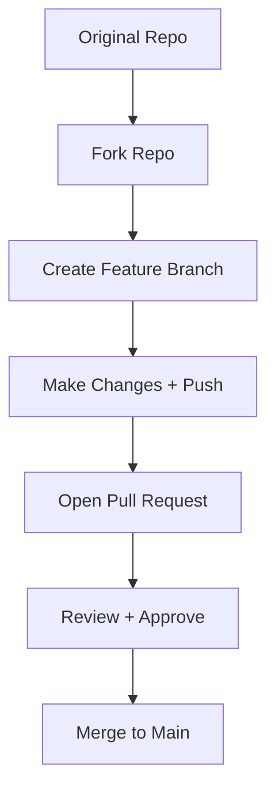

# 🤝 Collaborating with Git (Simplified)

> Teamwork in Git = Copying, Modifying, and Proposing Changes in a clean, trackable way.

Let’s understand this through an analogy:

## 🏗️ Imagine GitHub as a Construction Company:

- 🧱 **Main building** = Original repo
- 🧑‍💻 Workers = Developers
- 👷‍♂️👷‍♀️ Each worker takes a blueprint, makes changes, and **proposes** the updated design.

---

## 🍴 Forking (💯 For External Contributions)

### 🤔 What is Forking?

> A **fork** is a complete **copy of someone else’s repo** into your GitHub account.

Used when:

- You **don’t own** the original repo.
- You want to **suggest changes** to someone else's project.

---

### ✅ Example: Open Source Flow

1. You find a cool repo: `github.com/microsoft/sample-app`
2. You **click “Fork”** ➡️ Creates: `github.com/yourname/sample-app`
3. You `git clone` your fork:

   ```bash
   git clone https://github.com/yourname/sample-app.git
   ```

4. You make your changes (fix bugs, add features).
5. You push to your fork:

   ```bash
   git push origin my-changes
   ```

6. Then you click: **“Create Pull Request”** back to the original.

> 🧠 Tip: You don’t need permission to fork – but you do to **merge** into the main repo!

---

## 🌱 Branching (💯 For Internal Teamwork)

### 🤔 What is Branching?

> A **branch** is like a **parallel universe** of your code where you can safely make changes without touching `main`.

Used when:

- You're working **inside your team repo**.
- You want to **try something new**, fix a bug, or add a feature.

---

### ✅ Example: Team Collaboration

1. Team's main repo: `github.com/your-org/app`
2. You create a new branch:

   ```bash
   git checkout -b feature/login-form
   ```

3. You work safely without affecting `main`.
4. Once done:

   ```bash
   git push origin feature/login-form
   ```

5. You create a **Pull Request** from `feature/login-form` → `main`.

> 🎯 Main goal = Keep `main` branch clean and stable!

---

## 🔃 Pull Requests (aka Merge Requests in GitLab)

### 🤔 What is a Pull Request?

> A **pull request (PR)** is a formal **request to merge your code** into another branch.

It includes:

- Your code changes
- Discussion/comments
- CI/CD checks
- Review/approval workflow

---

### ✅ Example: Merging Your Work

Let’s say:

- You fixed a bug on branch `fix/navbar`
- You push it:

  ```bash
  git push origin fix/navbar
  ```

- On GitHub, you click: **“New Pull Request”**
- Choose:

  - `from: fix/navbar`
  - `into: main`

- Reviewer (e.g., team lead) checks, comments, and **approves**
- Once approved → Click **Merge**

> 🔒 Some teams add branch protection (e.g., 2 approvals needed to merge into `main`)

---

## 🧠 Summary Table

| Concept      | Ownership | Use Case                        | Typical Flow                          |
| ------------ | --------- | ------------------------------- | ------------------------------------- |
| Fork         | External  | Contributing to other’s repo    | Fork → Clone → Change → PR back       |
| Branch       | Internal  | Adding features/bugfixes safely | Branch → Work → Push → PR into `main` |
| Pull Request | Shared    | Review + merge collaboration    | Open PR → Code review → Merge         |

---

## 🔁 Flow Chart



---

## 🎯 Best Practices

✅ **Always branch** from the latest `main`
✅ **Use descriptive branch names** (`bug/fix-login`, `feature/user-auth`)
✅ **Pull before push**: `git pull origin main`
✅ **Never push directly to `main` (unless solo)**
✅ **Always create a PR** for tracking, review, CI checks
