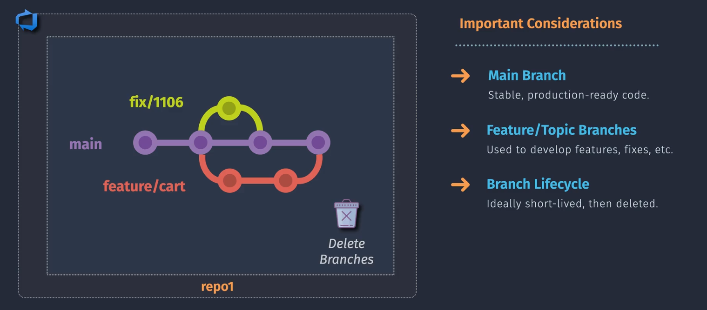
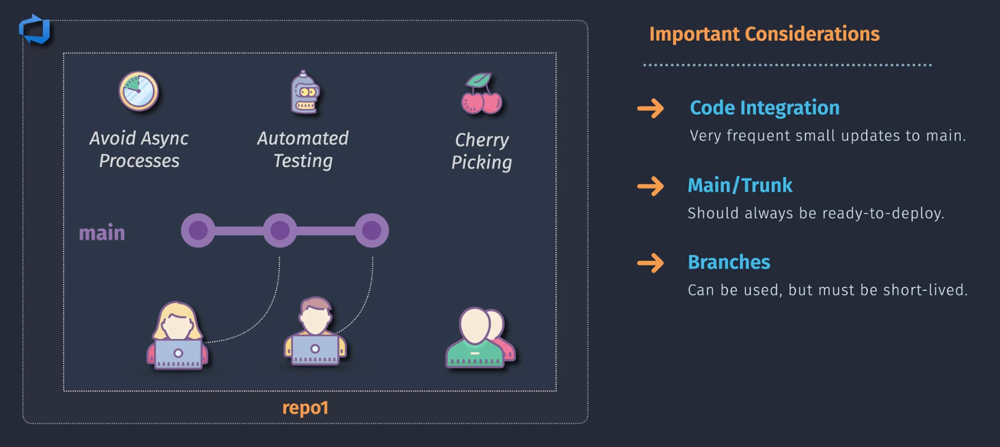
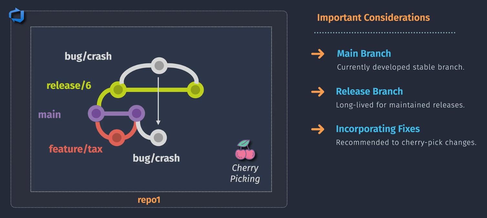

# ✅ Git Branching Strategies — _Professional DevOps Implementation Guide_

## 🔥 1. Feature Branch Strategy

**Goal:** Isolate feature work. Avoid polluting `main` or `develop` with half-done work.

<div align="center">
    
</div>

---

### ✅ Real Usage:

- Each developer works in a `feature/xyz` branch
- Once done → PR → merge to `develop` or `main`
- CI validates the branch on every push + PR

### ✅ When to Use:

- You need parallel feature dev
- You have PR-based code review policies
- You’re working with product owners who validate before merge

### 🔧 Git Pattern:

```bash
git checkout -b feature/login-form
# Work, commit
git push origin feature/login-form
# Open PR to 'develop' or 'main'
```

### 🔐 DevOps Enforcement (e.g., GitHub, GitLab, Azure DevOps):

- ✅ PR required
- ✅ CI: test + lint + security scan
- ✅ Optional: deploy preview environment
- ✅ Require approvals

---

## 🚀 2. Trunk-Based Development

**Goal:** Release fast. Everything goes into `main` (or `trunk`) quickly and safely.

<div align="center">
    
</div>

---

### ✅ Real Usage:

- Teams commit to `main` several times a day
- Use **feature flags** to hide unfinished work
- CI/CD is mandatory and automated

### ✅ When to Use:

- CI/CD is in place
- Small teams or microservices
- You're doing test-first or flag-driven dev

### 🔧 Git Pattern:

```bash
git checkout -b login-cleanup
# Work
git commit -m "Refactor login"
git push origin login-cleanup
# Merge same-day to main (after tests pass)
```

### 🔐 DevOps Enforcement:

- ✅ Protect `main`: no direct push
- ✅ CI runs on every push & PR
- ✅ Use toggles to hide features (`LaunchDarkly`, config flags)
- ✅ Canary + blue/green for prod safety

---

## 📦 3. Release Branching

**Goal:** Lock features and stabilize a version before production.

<div align="center">
    
</div>

---

### ✅ Real Usage:

- Create `release/1.5.0` from `develop`
- Only allow **bug fixes, tests, translations**
- After QA → merge into `main` and tag

### ✅ When to Use:

- You have a versioned product (not always latest)
- QA needs a stable base to test
- Multiple environments (UAT, staging)

### 🔧 Git Pattern:

```bash
git checkout develop
git checkout -b release/1.5.0
# QA, bugfixes
git checkout main
git merge release/1.5.0
git tag v1.5.0
```

### 🔐 DevOps Enforcement:

- ✅ Create build pipelines for `release/*`
- ✅ Deploy to staging/UAT from release branch
- ✅ Tag only on release approval
- ✅ Block features from merging into release

---

## 🛠️ 4. Hotfix Branch

**Goal:** Patch prod _now_, without waiting on `develop`.

### ✅ Real Usage:

- Branch from `main`
- Fix the issue
- Merge back into both `main` and `develop`

### 🔧 Git Pattern:

```bash
git checkout main
git checkout -b hotfix/payment-error
# Fix & test
git commit -m "Fix critical prod bug"
git checkout main
git merge hotfix/payment-error
git checkout develop
git merge hotfix/payment-error
```

### 🔐 DevOps Enforcement:

- ✅ Block all non-critical changes
- ✅ CI must pass before merging to main
- ✅ Auto-deploy after tag (e.g., `v1.5.1-hotfix`)

---

## 🧠 Git Flow (Legacy/Heavyweight)

**Goal:** Manage full lifecycle in strict, versioned workflow.
**Not recommended** for modern CI/CD unless your org has versioned builds, heavy compliance, or legacy tooling.

### 🧱 Branch Types:

- `main`: prod only
- `develop`: integration branch
- `feature/*`
- `release/*`
- `hotfix/*`

**Too heavy for fast-paced teams. Only useful if you must control releases tightly.**

---

## 🛡️ Branch Naming Standards (Real Teams Use These)

| Type    | Pattern             | Example                       |
| ------- | ------------------- | ----------------------------- |
| Feature | `feature/<ticket>`  | `feature/PROJ-1234-login`     |
| Bugfix  | `bugfix/<ticket>`   | `bugfix/PROJ-2034-validation` |
| Release | `release/<version>` | `release/2.0.0`               |
| Hotfix  | `hotfix/<desc>`     | `hotfix/prod-502-error`       |

---

## 📦 CI/CD Setup Per Strategy (Table)

| Branch Type | Test | Lint | Deploy             | Tag    | Environments |
| ----------- | ---- | ---- | ------------------ | ------ | ------------ |
| `feature/*` | ✅   | ✅   | Optional (preview) | ❌     | Dev only     |
| `release/*` | ✅   | ✅   | ✅ (QA/UAT)        | Manual | QA, UAT      |
| `main`      | ✅   | ✅   | ✅ (Auto to Prod)  | ✅     | Production   |
| `hotfix/*`  | ✅   | ✅   | ✅ (Auto to Prod)  | ✅     | Production   |

---

## 💡 Real World Best Practices

- Never allow direct commits to `main`
- Auto-delete merged branches (keep repo clean)
- Always tag production releases (`v2.1.0`)
- Automate branch-based deployments (e.g., `release/*` → staging, `main` → prod)
- Use short-lived feature branches (<3 days ideal)
- Review metrics on stale PRs
