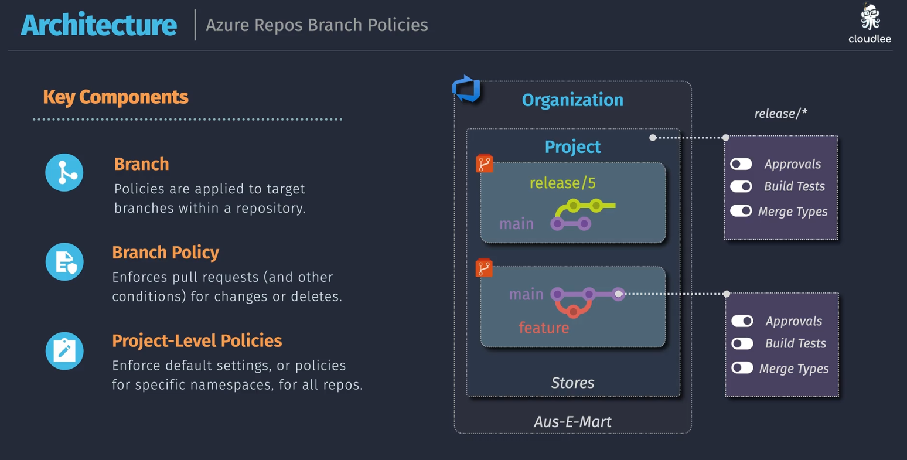

# 🏗️ **Azure Repos Branch Policies**

> 💬 "How do you protect your `main`, `release`, and `feature` branches like a security guard with CI/CD powers?"  
> 👉 **Answer:** You use **Branch Policies** in Azure Repos.

---

## 🧠 What Are Branch Policies?

| Concept               | What It Means                                                              |
| --------------------- | -------------------------------------------------------------------------- |
| 🔀 **Branch**         | A line of development (e.g. `main`, `feature/api`, `release/5`)            |
| 🛡️ **Branch Policy**  | Rules enforced on pull requests before changes are merged into the branch  |
| 🏢 **Project Policy** | Default/global rules applied to **all repos/branches** under a project/org |

---

## 📌 Diagram Breakdown

  

---

### 🏢 **Organization Layer**

- Your DevOps Org (like `ContosoDevOps`)
- Contains 1 or more **Projects**

---

### 📁 **Project: Aus-E-Mart**

- Contains repositories (e.g., `Stores`)
- Inside `Stores`, we see 2 branches being worked on:

| Branch Type | Description                       |
| ----------- | --------------------------------- |
| `release/5` | Release branch (production track) |
| `feature`   | Feature branch (in development)   |

---

## 🧩 Policies You Can Apply

| Policy Type        | Description                                                            |
| ------------------ | ---------------------------------------------------------------------- |
| ✅ **Approvals**   | Require X reviewers to approve PR before merge                         |
| 🧪 **Build Tests** | Enforce CI builds to pass before merge (e.g., Azure Pipelines)         |
| 🔀 **Merge Types** | Allow/disallow specific merge strategies (`Squash`, `Merge`, `Rebase`) |

---

## 🛡️ Example Use Case

| Branch      | Policy Example                                                                        |
| ----------- | ------------------------------------------------------------------------------------- |
| `release/*` | ✅ Require 2 reviewers 🧪 CI pipeline must pass 🔀 Only allow **merge commits** |
| `main`      | ✅ Require 1 reviewer 🧪 CI pass 🔀 Allow **semi-linear merge** only            |
| `feature/*` | No enforced policy (devs can push freely, no PR required)                             |

---

## 🔧 Where to Set These?

- 🔗 Navigate to:
  **Azure DevOps → Project Settings → Repos → Branches**
- Click `...` next to a branch → **Branch Policies**
- Configure:

  - ✅ Required reviewers
  - 🔄 Merge strategy allowed
  - 🧪 Build validation (CI Pipelines)
  - 🚫 Who can bypass policies

---

## ✅ Why It Matters

| Without Branch Policies 🧨        | With Branch Policies 🔒            |
| --------------------------------- | ---------------------------------- |
| Anyone can merge anything anytime | Pull Requests enforce discipline   |
| Code can break builds             | CI must pass before merging        |
| No traceability                   | Reviews + history = traceable code |
| Hard to maintain release quality  | You gatekeep what enters `main`    |

---

## 🧠 TL;DR

> **Azure Repos Branch Policies** are your **PR guardians**:

- 🔒 Enforce rules **before code hits protected branches**
- 💬 Require **reviews**, 🧪 **tests**, and restrict 🔀 **merge methods**
- 🎯 Help teams deliver safe, clean, and auditable code
