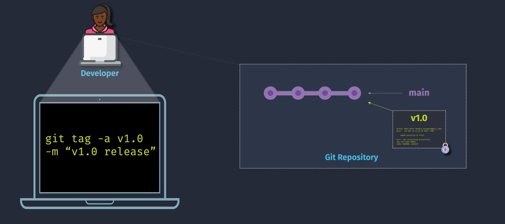

# 🏷️ Git Tags – The Smart DevOps Way

> A **tag** is a **named pointer** to a specific commit — like a **sticky note** you put on a milestone.

Tags are mainly used to **mark release points**, like `v1.0`, `v2.3.5`, etc.

---

<div style="text-align:center;">
    
</div>

---

## 🧩 Two Types of Tags

| Type            | Description                                                                 | Mutable? | Example Use Case              |
| --------------- | --------------------------------------------------------------------------- | -------- | ----------------------------- |
| **Lightweight** | Just a name pointing directly to a commit (like a branch, but doesn’t move) | ✅ Yes   | Quick dev marker (e.g. POC)   |
| **Annotated**   | Includes metadata: tagger, date, message, and GPG signature                 | ❌ No    | Official releases (e.g. v1.0) |

---

### 🆚 Lightweight vs Annotated

```bash
# Create Lightweight Tag
git tag v1.0

# Create Annotated Tag
git tag -a v1.0 -m "Release version 1.0"

# View tag details
git show v1.0
```

---

## 🎯 Why Use Tags?

| Purpose                     | Benefit                                                       |
| --------------------------- | ------------------------------------------------------------- |
| 📌 Release Versioning       | Mark stable releases (v1.0, v2.1.3)                           |
| 🔁 CI/CD Deployment Trigger | Deploy when a tag is pushed (Azure Pipelines, GitHub Actions) |
| 📜 Immutable Reference      | Tags are read-only history points (esp. annotated)            |
| 📦 Artifact Matching        | Match container/images with Git tag (e.g. `app:v1.0`)         |

---

## 📚 Tag Naming Convention Best Practices

| Pattern              | Meaning                              |
| -------------------- | ------------------------------------ |
| `v1.0.0`             | Semantic version (major.minor.patch) |
| `release-2025-07-23` | Date-based release                   |
| `hotfix-v1.2.1`      | Emergency fix version                |

📌 **Semantic Versioning (SemVer)** is highly recommended for consistency.

---

## 🚀 Tagging in Azure DevOps

### ✳️ Manual Tag in DevOps

You can manually add tags via Azure Repos (in a branch view):

1. Go to your repo → **Tags**
2. Click **New Tag**
3. Choose commit & tag name

---

### ⚙️ Add Tag in Pipeline (YAML)

You can create a Git tag **programmatically** during CI/CD pipeline run.

```yaml
- script: |
    git config user.email "devops@myorg.com"
    git config user.name "azure-pipeline"
    git tag -a v1.2.0 -m "Release 1.2.0"
    git push origin v1.2.0
  displayName: "Tag Release"
```

---

## 🧪 Trigger Pipeline on Tags

In Azure Pipelines:

```yaml
trigger: none

pr: none

# Trigger only on tags starting with v
tag:
  include:
    - v*
```

✅ This is useful for **Release Pipelines** or **Production Deployments**.

---

## 🧹 Deleting a Tag (Use with Caution!)

```bash
# Local delete
git tag -d v1.0

# Remote delete
git push origin :refs/tags/v1.0
```

---

## 🛠️ Viewing Tags

```bash
git tag           # list all tags
git show v1.2.0   # show details of a tag
```

---

## 📌 TL;DR for Interviews

> “Tags in Git are used to mark specific commits, especially for releases. Annotated tags are preferred for production release tagging because they carry metadata and are immutable. Tags can be used to trigger CD pipelines in Azure DevOps, and they form the backbone of version control for artifact deployment.”
