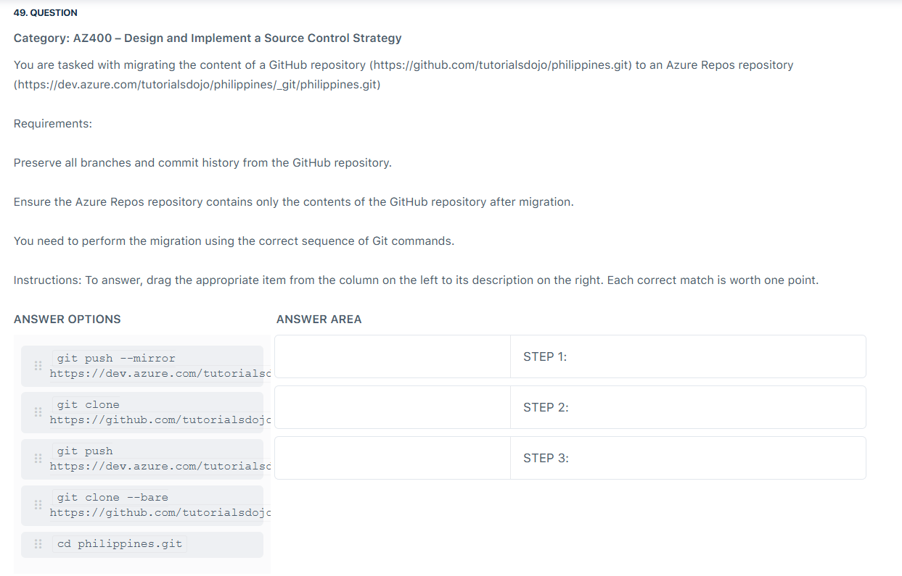

# ⚖️ Bare vs Mirror in Git

## 🟢 1. Normal `git clone`

```bash
git clone https://github.com/org/repo.git
```

* ✅ You get a **working directory** with all project files.
* ✅ You can edit code, commit, run tests.
* ❌ Not ideal for **migration/backup** because it only fetches the default branch + tags.

---

## 🟠 2. Bare Clone (`--bare`)

```bash
git clone --bare https://github.com/org/repo.git
```

* ❌ No working files (only `.git` database).
* ✅ Contains **all history, branches, tags** (the “meat” of the repo).
* ✅ Perfect for migration, backup, or hosting.
* ⚠️ Does **not** auto-track every exotic ref type (like notes, refs/remotes/\*).

👉 Think: **“Repo skeleton — all history, but no code to edit.”**

---

## 🔴 3. Mirror Clone (`--mirror`)

```bash
git clone --mirror https://github.com/org/repo.git
```

* ❌ Also no working files (like `--bare`).
* ✅ Includes **everything `--bare` has PLUS**:

  * **All refs** (branches, tags, remote-tracking refs, notes).
  * Configures repo so `git fetch`/`git push --mirror` will keep **source and target identical**.

👉 Think: **“Exact twin — every ref, every change, auto-synced.”**

---

## 🔑 Differences Summarized

| Feature                     | `--bare` ✅                  | `--mirror` 🔥                  |
| --------------------------- | --------------------------- | ------------------------------ |
| Working files?              | ❌ No                        | ❌ No                           |
| All branches + tags?        | ✅ Yes                       | ✅ Yes                          |
| Remote-tracking refs, notes | ❌ Not all                   | ✅ Everything                   |
| Auto mirror config          | ❌ No                        | ✅ Yes                          |
| Common use                  | Hosting, backups, migration | Full repo replication, syncing |

---

## 🛠️ When to Use Which?

* **Use `--bare` + `git push --mirror`**
  👉 Standard migrations (GitHub → Azure Repos)
  👉 Backups where you only care about branches/tags/history

* **Use `--mirror`**
  👉 When you must include **every single ref** (rare: Gerrit, custom Git servers, advanced workflows).
  👉 When you need a **long-term mirror** repo that stays identical to the source.

---

## 📌 Example: Migrating to Azure DevOps

<div align="center">
  
</div>

---

✅ **Microsoft docs way (safe, common):**

```bash
git clone --bare https://github.com/contoso/old-repo.git
cd old-repo.git
git push --mirror https://dev.azure.com/contoso/project/_git/new-repo
```

🔥 **Advanced mirroring way:**

```bash
git clone --mirror https://github.com/contoso/old-repo.git
cd old-repo.git
git push --mirror https://dev.azure.com/contoso/project/_git/new-repo
```

Both work — but Microsoft recommends `--bare` because it’s simpler and enough for **99% of cases**.

---

## 🎯 TL;DR

* Both **don’t give you working files** (so you can’t edit code).
* **`--bare`** = repo skeleton (branches + tags + history).
* **`--mirror`** = full twin (includes **all refs** + mirror config).
* For Azure DevOps migrations → `clone --bare` + `push --mirror`.

---

👉 So:

* You’ll never use `--mirror` daily as a developer.
* You’ll use `--bare` whenever you just want the repo’s Git data (not files).
* You’ll use `--mirror` only if you need **exact replication**.
