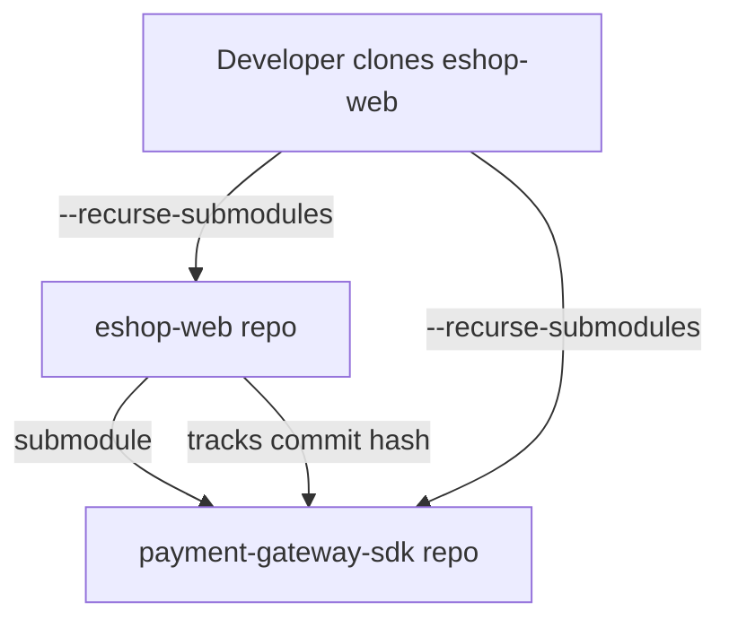

# 📦 Git Submodules

## 🔹 1. What is a Submodule?

A **submodule** = a Git repo **inside another Git repo**.

- It looks like a folder in the parent repo.
- But that folder is actually a pointer (`.gitmodules` file + commit hash) to another repo.
- Lets you **reuse external code** (like libraries, SDKs, plugins) without copying it.

👉 Think: **“npm install” but with full Git repos pinned at exact commits.**

---

## 🔹 2. Why Use Submodules?

- 📦 Reuse shared components (UI library, API SDK, Terraform modules).
- 🎯 Lock dependency to a specific commit (not just “latest”).
- 🔄 Keep external projects separate (don’t mix commits of library with your app).
- 👨‍💻 Good for **microservices** where each service is its own repo, but a master repo ties them together.

⚠️ Downside: Submodules require discipline → you must **update & commit** the submodule pointer when it changes.

---

## 🔹 3. Real Example: E-commerce Platform

Imagine we’re building **E-Shop**:

- Repo A = `eshop-web` (main website).
- Repo B = `payment-gateway-sdk` (reusable library).

Instead of copy-pasting SDK code into `eshop-web`, we add it as a **submodule**.

---

## 🔹 4. Hands-on Demo

### Step 1 — Create Main Repo

```bash
git init eshop-web
cd eshop-web
```

### Step 2 — Add Submodule

```bash
git submodule add https://github.com/company/payment-gateway-sdk libs/payment-sdk
```

👉 This does two things:

1. Clones the SDK into `libs/payment-sdk`.
2. Adds an entry to `.gitmodules` file:

   ```ini
   [submodule "libs/payment-sdk"]
       path = libs/payment-sdk
       url = https://github.com/company/payment-gateway-sdk
   ```

3. Records the current commit hash of the SDK inside parent repo.

---

### Step 3 — Commit Changes

```bash
git add .gitmodules libs/payment-sdk
git commit -m "Added payment SDK as submodule"
```

Now, your repo knows:

- _Where the submodule lives_ (URL).
- _Which commit it’s locked to_.

---

### Step 4 — Clone with Submodules

If someone else clones your repo:

```bash
git clone https://github.com/company/eshop-web.git
cd eshop-web
git submodule init
git submodule update
```

Or shortcut:

```bash
git clone --recurse-submodules https://github.com/company/eshop-web.git
```

👉 This ensures they also fetch `payment-gateway-sdk` at the correct commit.

---

### Step 5 — Updating Submodule

Suppose the SDK team fixes a bug:

1. Go into submodule folder:

   ```bash
   cd libs/payment-sdk
   git checkout main
   git pull origin main
   ```

2. Go back to main repo:

   ```bash
   cd ../..
   git add libs/payment-sdk
   git commit -m "Updated payment SDK to latest version"
   ```

Now the main repo points to a **new commit** in the submodule.

---

## 🔹 5. Day-to-Day Commands

| Action                  | Command                                                                       |
| ----------------------- | ----------------------------------------------------------------------------- |
| Add submodule           | `git submodule add <url> <path>`                                              |
| Clone with submodules   | `git clone --recurse-submodules <url>`                                        |
| Init + fetch submodules | `git submodule init && git submodule update`                                  |
| Update all submodules   | `git submodule update --remote`                                               |
| Change submodule commit | Go into submodule, checkout commit/branch, then commit pointer in parent repo |

---

## 🔹 6. Real-World Use Cases

- 🏗 **Monorepos with shared libs** → UI component library used across multiple apps.
- 🛠 **SDKs or vendor code** → Payment gateways, logging frameworks, ML models.
- ☁️ **Infrastructure modules** → Terraform or Ansible roles tracked separately.
- 🔄 **Microservices** → one parent repo that references multiple service repos.

---

## 📊 Visual Flow



---

## ✅ TL;DR

- Submodule = repo inside repo.
- Keeps dependency **linked but separate**.
- Parent repo stores a **commit pointer**, not the actual submodule history.
- Use `git submodule update` to sync.
- Great for SDKs, shared libraries, infra modules.

---

⚡ Exam/Interview Tip:
If you see a question like:

- _“How do you share code across repos without duplicating it, while keeping version control?”_ → **Git Submodules** (or sometimes Git Subtree).

---

👉 Do you also want me to compare **Submodules vs Subtree** (another Git technique) — since exam questions sometimes ask which to use in a collaboration scenario?
