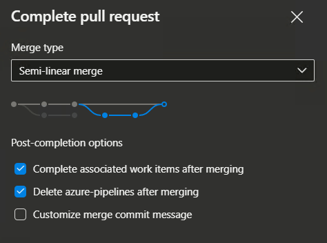

# 🧠 Merge Strategies in Azure DevOps

> "How do we combine code from one branch into another?"  
> That’s the art (and science) of _merge strategies_ 🔄

---

<div align="center">
    
</div>

---

## ⚙️ What Are Merge Strategies?

When you **merge a Pull Request (PR)** in Azure DevOps, you decide how the commits will be recorded in the target branch (`main`, `develop`, etc).

> The strategy you pick affects:
>
> - Git history
> - Commit visibility
> - Traceability (blame, revert, bisect)
> - How clean or messy your logs are

---

## 🔢 All 4 Merge Strategies in Azure DevOps

| Strategy                        | History                    | Keeps Commits | Auto Mergeable | Best For                        |
| ------------------------------- | -------------------------- | ------------- | -------------- | ------------------------------- |
| 🔀 Merge Commit                 | 🌀 Full history            | ✅ Yes        | ✅ Yes         | Auditable logs, large teams     |
| 📦 Squash                       | 🧼 Single commit           | ❌ No         | ✅ Yes         | Clean logs, feature-level PRs   |
| 📏 Rebase & Fast-Forward        | 📈 Linear only             | ✅ Yes        | ❌ Manual      | OSS, advanced Git workflows     |
| ✂️ Rebase + Merge (Semi-linear) | 🧬 Hybrid (rebase + merge) | ✅ Yes        | ❌ Manual      | Keeps clean logs _and_ PR trace |

---

## 📌 Perquisites

### 🛬 Fast-Forward Merge (FF)

**What It Is:**

If the target branch (e.g. `main`) is **directly behind** the source branch, Git just **moves the pointer forward**. No new commit is created.

**Visual:**

```bash
Before:
main:     A --- B
                 \
feature:          C --- D


After fast-forward:
main:     A --- B --- C --- D
```

> No merge commit, just a pointer shift.

**When Possible:**

- Target branch has **no new commits** since the feature branch split.
- Clean linear history.

---

### 🏃🏻‍➡️ Rebase

**What It Is:**

Rewrites the feature branch to **replay its commits on top** of the latest `main`.

**Visual:**

```bash
Before:
main:     A --- B --- C
                 \
feature:           D --- E

After rebase:
main:     A --- B --- C
                       \
feature:                D --- E
```

> Commit hashes change — it’s rewriting history!

**Use With Caution:**

- Don't rebase shared branches.
- Good for cleaning up local history before PR.

---

## 🧩 Azure DevOps Merge Types

1. 1️⃣ **Merge** (No Fast-Forward) Commit
2. 2️⃣ **Squash** Commit
3. 3️⃣ **Rebase** and **Fast-Forward**
4. 4️⃣ **Semi-Linear** (**Rebase** + **Merge**)

---

## 1️⃣ Merge Commit (aka No Fast-Forward Merge)

### 📌 What It Does:

Adds a **new commit** that has **two parents**: one from the **source branch** and one from the **target branch**.


### 🧱 Visual:

```bash
Before:
main:     A --- B
                 \
feature:          C ----- D


After:
main:     A --- B --------- `E`
                 \         /
feature:          C ----- D
```

> 🧾 Merge commit E has **2 parents**: B and D

---

### ✅ Use When:

- You want a **clear record** of the merge
- Teams rely on Git audit trail or revert PR functionality

### 🔧 How to Enable:

1. In Azure DevOps PR:

   - Set **Merge type**: `Merge (no fast-forward)`

2. Repo policy: enable `Allow merge commits`

---

## 2️⃣ Squash Commit Merge

### 📌 What It Does:

**Squashes all commits** from the feature branch into a **single commit** on `main`.

### 🧱 Visual:

```bash
Before:
main:     A --- B
                 \
feature:          C ----- D ----- E

After:
main:     A --- B --------------- `F`
                 \
feature:          C ----- D ----- E
```

> 📌 No merge commit, just a single combined commit.

---

### ✅ Use When:

- You want clean Git history
- Feature branches are small/atomic
- CI/CD logs should stay tidy

### 🔧 How to Enable:

1. In Azure DevOps PR:

   - Set **Merge type**: `Squash commit`

2. Repo policy: enable `Allow squash merge`

---

## 3️⃣ Rebase and Fast-Forward

### 📌 What It Does:

- Rebases your commits on top of the latest `main`
- Then **fast-forwards** the target branch

### 🧱 Visual:

```bash
Before:
main:     A --- B --- C
                 \
feature:           D --- E

After:
main:     A --- B --- C
                       \
feature:                 D --- E


After:
main:     A --- B --- C  --- D --- E
```

> 📌 No merge commit — just rebased commits applied on top.

---

### ✅ Use When:

- You want clean, linear history
- Team is confident with rebasing

### 🔧 How to Enable:

1. In Azure DevOps PR:

   - Set **Merge type**: `Rebase and fast-forward`

2. Repo policy: enable `Allow rebase and fast-forward`

---

## 4️⃣ Semi-Linear Merge (Rebase + Merge Commit)

### 📌 What It Does:

- Rebases your branch on top of `main`
- Then creates a **merge commit**

🧱 Visual:

```bash
main:     A --- B --- C
                 \
feature:           D --- E

After semi-linear:
main:     A --- B --- C
                       \
feature:                 D --- E

After semi-linear:
main:     A --- B --- C  ------ `M`
                       \        /
feature:                 D --- E
```

> 🧾 Merge commit `M` has 2 parents: D' and B

---

### ✅ Use When:

- You want **both** clean commit history **and** merge commit for traceability
- Hybrid teams using automated pipelines or revert-based rollbacks

### 🔧 How to Enable:

1. In Azure DevOps PR:

   - Set **Merge type**: `Semi-linear merge`

2. Repo policy: enable `Allow semi-linear merge`

---

## 🔍 Summary Table

| Merge Strategy               | Creates Merge Commit | Keeps All Commits | Clean History  | Requires Rebase | Ideal For                     |
| ---------------------------- | -------------------- | ----------------- | -------------- | --------------- | ----------------------------- |
| Merge (no fast-forward)      | ✅ Yes               | ✅ Yes            | ❌ No          | ❌ No           | Full audit trail              |
| Squash Commit                | ❌ No                | ❌ No (1 commit)  | ✅ Yes         | ❌ No           | Simpler logs, atomic features |
| Rebase + Fast-Forward        | ❌ No                | ✅ Yes            | ✅ Ultra clean | ✅ Yes          | Expert teams, linear history  |
| Semi-Linear (Rebase + Merge) | ✅ Yes               | ✅ Yes (rebased)  | ✅ Clean       | ✅ Yes          | CI-friendly + audit-friendly  |

---

## 🔧 Azure DevOps Policy Setup (Recommended)

Go to:
**Project Settings → Repos → \[Repo] → Policies → Pull Request Merge Types**

| Suggested Setup for Most Teams  |
| ------------------------------- |
| ✅ Allow Merge Commit           |
| ✅ Allow Squash Commit          |
| ✅ Allow Semi-linear (optional) |
| ❌ Disable plain Rebase + FF    |
