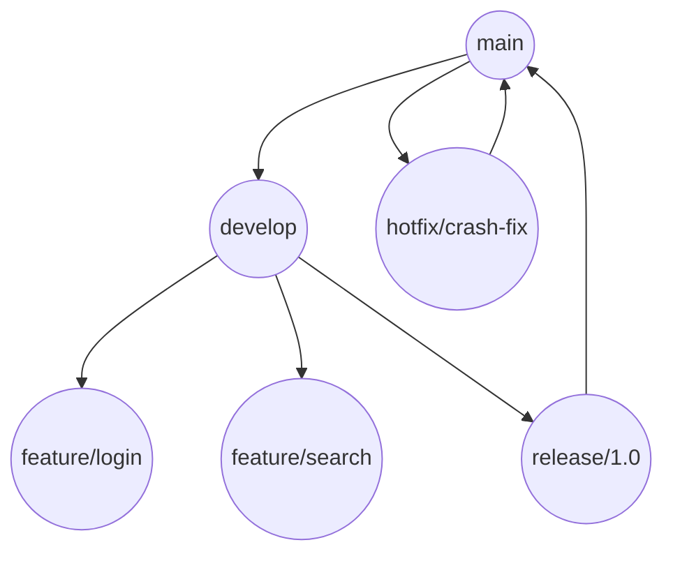

# 🌱 Git Branching Strategies in Azure DevOps

> Git branching = how you structure collaboration, features, releases, and hotfixes in a dev team.  
> Azure DevOps supports all common strategies — but **you choose** what works best for your workflow.

---

## 🧠 Why Branching Strategy Matters

1. ✅ Helps teams **collaborate safely**
2. ✅ Controls what goes to **production**
3. ✅ Enables **pull requests**, **CI/CD**, **code reviews**
4. ✅ Prevents **breaking the main branch**

---

## 🧭 Popular Git Branching Strategies (In Azure DevOps)

Let’s walk through the most common ones 👇

---

### 1️⃣ **Main Only (Trunk-Based)**

> 🏎️ Fastest, simplest, no frills

**Characteristic:**

1. 🔧 All work happens on `main` or short-lived feature branches
1. 🔁 Feature branches are merged back into `main` quickly
1. 🧪 CI/CD runs on every push to `main`
1. 🚫 No long-lived `dev` or `release` branches

#### ✅ Use When:

- Small team
- Continuous deployment
- You want _speed over ceremony_

---

### 2️⃣ **Feature Branching (Most Common)**

> 🛠️ Create a branch per feature, bug, or task

```bash
main
├── feature/login
├── feature/search
├── bugfix/session-timeout
```

**Characteristic:**

1. 📦 Feature branches from `main` or `develop`
2. 🧪 PRs used for review + testing
3. 🔁 Merged back when ready
4. 👮 Often gated by **branch policies** in Azure DevOps

#### ✅ Use When:

- You want **code reviews**
- Medium/large teams
- You’re using **Azure Boards** (map branches to work items!)

---

### 3️⃣ **Release Branching**

> 🏗️ Isolate each release with dedicated branch

```bash
main
├── release/v1.0
├── release/v1.1
```

**Characteristic:**

1. ✅ Good for maintaining old versions
2. ✅ Backport hotfixes between releases
3. 🚨 Merge carefully to avoid regressions

---

### 4️⃣ **GitFlow**

> 🧙‍♂️ Full-blown release workflow (many branches)

```plaintext
main        → production
develop     → next release
feature/*   → work in progress
release/*   → staging
hotfix/*    → critical fixes
```

| Branch      | Purpose                       |
| ----------- | ----------------------------- |
| `main`      | Only production-ready code    |
| `develop`   | Latest dev build              |
| `feature/*` | Feature development           |
| `release/*` | Prep for release (QA/staging) |
| `hotfix/*`  | Fix prod bugs fast            |

#### ✅ Use When:

- You have QA/UAT/staging flows
- Long-lived releases
- Enterprise workflow

#### ❌ Downside:

- Can get complex
- Lots of merging

> ❌ **Not recommended** for modern CI/CD unless your org has versioned builds, heavy compliance, or legacy tooling.

---

## 🔐 Branch Policies in Azure DevOps

💡 Azure DevOps lets you **enforce rules on any branch**. Example policies:

| Policy              | What it Does                    |
| ------------------- | ------------------------------- |
| ✅ PR required      | No direct push to `main`        |
| 🔍 Code reviewers   | Must approve PR                 |
| 🧪 Build validation | Run CI before merging           |
| 🔁 Merge strategy   | Squash / rebase / merge commit  |
| 🛡️ Status checks    | Enforce tests or external gates |

You configure this in **Project → Repos → Branches → \[Branch] → Policies**

---

## 🔄 Merge Strategies in Azure DevOps

When merging PRs:

| Strategy     | What it does                           |
| ------------ | -------------------------------------- |
| Merge commit | Keeps full history with a merge commit |
| Squash       | Combines all commits into one          |
| Rebase       | Linear history, no merge commits       |

---

## 🧰 DevOps Best Practices

- ✅ Link branches to Azure Boards work items
- ✅ Use meaningful branch names (`feature/login-ui`, `bugfix/1234-crash`)
- ✅ Use short-lived branches
- ✅ Protect `main` and `release/*` with policies
- ✅ Automatically deploy on `main` push (CI/CD)

---

## 📌 Example Setup for Teams

| Team Size | Recommended Strategy | Notes                            |
| --------- | -------------------- | -------------------------------- |
| Small     | Trunk-Based          | Speed, less ceremony             |
| Medium    | Feature Branching    | PRs, tests, quality gates        |
| Large     | GitFlow + Releases   | Complex releases, hotfix control |

---

## 🖼️ Visual Summary



---

## ✅ TL;DR: Strategy Quick Pick

| Need                         | Use This          |
| ---------------------------- | ----------------- |
| 🚀 Fast iteration            | Trunk-Based       |
| 👨‍👩‍👧‍👦 Team reviews, stable main | Feature Branching |
| 🏗️ Complex release/hotfix    | GitFlow           |
| 🧓 Maintain old versions     | Release Branching |
