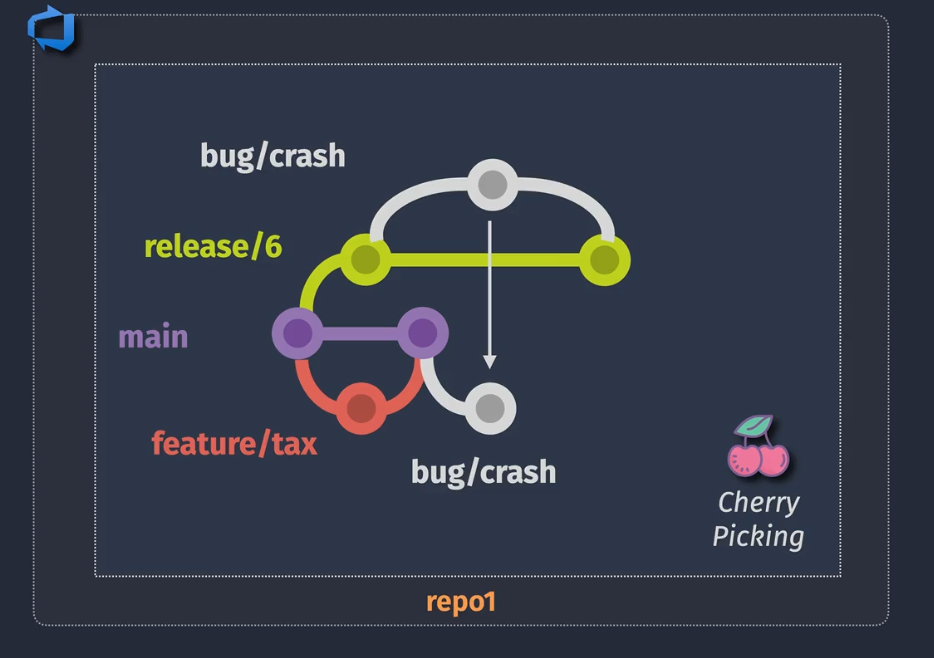
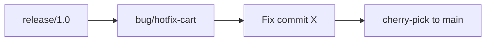

# 🍒 What is Git Cherry-Picking?

> **Cherry-picking in Git** means selecting a specific commit from one branch and applying it to another branch — **without merging the full branch**.

🔧 Use it when:

- You need **a specific fix** or feature from another branch
- You **can’t or don’t want** to merge the entire branch
- You want **surgical control** over what code moves between branches

> ⚠️ **Cherry-pick is a copy of the commit**, not a reference. Git literally **re-applies the changes**, like replaying the exact diff, but creates a **new commit**.

---

<div align="center">
  
</div>

---

## 🧬 Behind the Scenes: What Happens?

When you cherry-pick a commit:

1. Git reads the **diff** (i.e., code changes) from the original commit `X`
2. It **reapplies that diff** onto your current branch
3. Then it creates a **new commit** with:

   - A new **hash**
   - A new **timestamp**
   - A **different parent**
   - Optional metadata (you can edit the message)

🔁 This is **not a reference**, alias, or symbolic pointer to the original commit.

---

### 💡 Think of it like:

> Cherry-pick is like **copy-pasting** just the contents of the commit — not linking to the original.
> Same code, different commit ID (SHA).

---

## ✅ Example

```bash
# original branch
feature/cart:
e1a2b3c Fix: prevent double-submit in cart

# cherry-pick onto main
git checkout main
git cherry-pick e1a2b3c
```

After that:

| Branch         | Commit ID | Message                       |
| -------------- | --------- | ----------------------------- |
| `feature/cart` | `e1a2b3c` | Fix: prevent double-submit... |
| `main`         | `f9d8e7a` | Fix: prevent double-submit... |

👉 Even if the **message and content are identical**, the commits are **completely separate**.

---

## 🔐 Implication: Cherry-picking ≠ Merging

- ✅ You don’t bring unrelated commits or history
- ✅ You don’t mess up your DAG or branch structure
- ❌ But you **do create a duplicate history**, so Git can’t track them as the _same commit_ in logs

---

## 🔍 How Git Sees It

You can even compare history:

```bash
git log --cherry main feature/cart
```

That command detects that both branches contain **equivalent diffs**, but different commits.

---

## ⚠️ Gotcha: Rebasing vs Cherry-Picking

| Operation   | Rewrites History? | Keeps Original SHA? | Reuses Commit? |
| ----------- | ----------------- | ------------------- | -------------- |
| Merge       | ❌ No             | ✅ Yes (as-is)      | ✅             |
| Rebase      | ✅ Yes            | ❌ No (new SHAs)    | 🔁 Re-applied  |
| Cherry-pick | ✅ Yes (1 commit) | ❌ No (new SHA)     | 🔁 Re-applied  |

> Both rebase and cherry-pick **copy** commits by diff. Merge **references** them.

---

---

---

## 🧠 Real-World Use Case

Imagine you have this repo state:

```bash
main       A---B---C
                  \
feature/fix-bug     D---E  ← Fix is here (commit E)
```

You want to apply **only commit `E`** from `feature/fix-bug` onto `main`, without bringing in D or the rest of the branch.

---

## ✅ Git Cherry-Pick Syntax

```bash
# Step 1: Checkout the target branch
git checkout main

# Step 2: Cherry-pick the commit (single commit)
git cherry-pick <commit-hash>

# Example
git cherry-pick e1a2b3c
```

---

## 🧪 Example in Action

### 🛠️ Scenario:

- `release/1.0` is in production
- A hotfix was made on a `bug/hotfix-cart` branch
- You need to apply the same fix to `main` (which is ahead and has other unrelated changes)

### 🧱 Diagram



---

## 🔄 Example Git Commands

```bash
# You are on the bugfix branch
git log --oneline

# Shows something like:
# e1a2b3c Fix: prevent double-submit in cart
# d4f5a6b Update test cases
# ...

# Switch to main and cherry-pick the fix
git checkout main
git cherry-pick e1a2b3c
```

Now `main` contains that **specific commit**, but **not the whole branch**.

---

## ✅ Cherry-Picking Multiple Commits

You can cherry-pick a **range**:

```bash
# Pick a range of commits (from old to new)
git cherry-pick <old_commit_hash>^..<new_commit_hash>
```

> `^` includes the old commit too

---

## 💥 What Happens Under the Hood?

- Git **re-applies the diff** from that commit
- It creates a **new commit** on your current branch (with new hash)
- If conflicts happen, Git pauses for manual resolution

---

## ⚠️ Important Considerations

| Risk / Concern        | Recommendation                                      |
| --------------------- | --------------------------------------------------- |
| 🧨 Merge conflicts    | Cherry-pick smaller commits, resolve carefully      |
| 🧪 Duplicate commits  | Don’t cherry-pick something already merged          |
| 🔁 History divergence | Document clearly which branch had cherry-picked fix |
| 📝 Audit trail        | Add `[cherry-picked]` in commit or PR title         |

---

## ❓ Why Use Cherry-Pick Instead of Creating a New Bugfix Branch from `main`?

> **TL;DR**: Because **the fix already exists somewhere else** (like a feature branch or a release), and you want to **re-use that exact commit**, **not reimplement it**.

---

### 🔍 The Two Scenarios Side-by-Side

| Option                        | Description                                      | What Happens                                                    |
| ----------------------------- | ------------------------------------------------ | --------------------------------------------------------------- |
| ✅ **New branch from `main`** | Create new bugfix branch, write fix from scratch | You're duplicating a fix manually                               |
| ✅ **Cherry-pick**            | Take existing commit from another branch         | You re-use the original work **exactly**, safely, and traceably |

---

## 🧠 When to Cherry-Pick

### 📌 Scenario 1: Fix was already done on another branch (e.g. feature)

- Dev `A` fixed a bug inside `feature/cart`, but this branch isn’t ready to merge
- The fix is small and useful **now**
- You don’t want to merge the full `feature/cart` yet — maybe it has unfinished or unapproved code
- So you cherry-pick only that commit to `main` (or `release/6`)

✅ Result: You get the tested fix immediately, without importing WIP or unstable code.

---

### 📌 Scenario 2: Fix was applied to `release/6`, but not in `main` yet

You patch production via `release/6`, but now you must:

- Ensure `main` doesn’t lose that fix
- Avoid merging full release into main (could be backward-looking)

✅ Cherry-pick the fix to `main` to bring it forward cleanly.

---

## 🧪 Example to Visualize

```bash
main:        A -- B -- C
                       \
feature/cart:            D -- E [bug fixed here]
```

- You need fix `E` from `feature/cart`, but `D` is not ready or stable
- Merging `feature/cart` is unsafe (not done, not reviewed)
- Solution: cherry-pick just `E` to `main`

```bash
git checkout main
git cherry-pick <hash-of-E>
```

Now `main` has **E**, but **not D** or other feature work.

---

## 🛠️ Why Not Just Recode the Fix in `main`?

1. ❌ Duplicates effort (rewrite what already exists)
2. ❌ Introduces inconsistency — what if your fix slightly differs?
3. ❌ Creates two separate commits to maintain (hard to track)
4. ✅ Cherry-pick gives:

   - One commit history
   - Easy traceability (`git log --cherry`)
   - Easy audit trail in PRs

---

## ✅ Summary: When to Cherry-Pick

| Situation                          | Cherry-pick? | Reason                                       |
| ---------------------------------- | ------------ | -------------------------------------------- |
| Fix is already committed elsewhere | ✅ Yes       | Avoid duplication, reuse exact tested commit |
| Fix needed from WIP feature branch | ✅ Yes       | Feature not ready, but fix is                |
| Fix not yet implemented            | ❌ No        | Better to just make new fix from `main`      |
| You want entire feature            | ❌ No        | Merge the whole branch instead               |
