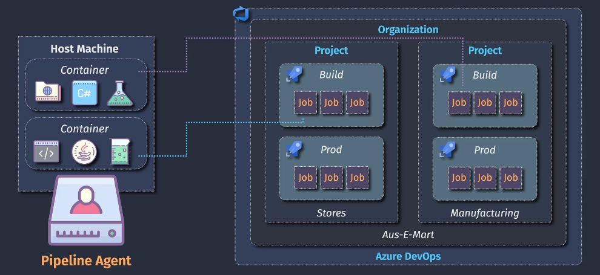
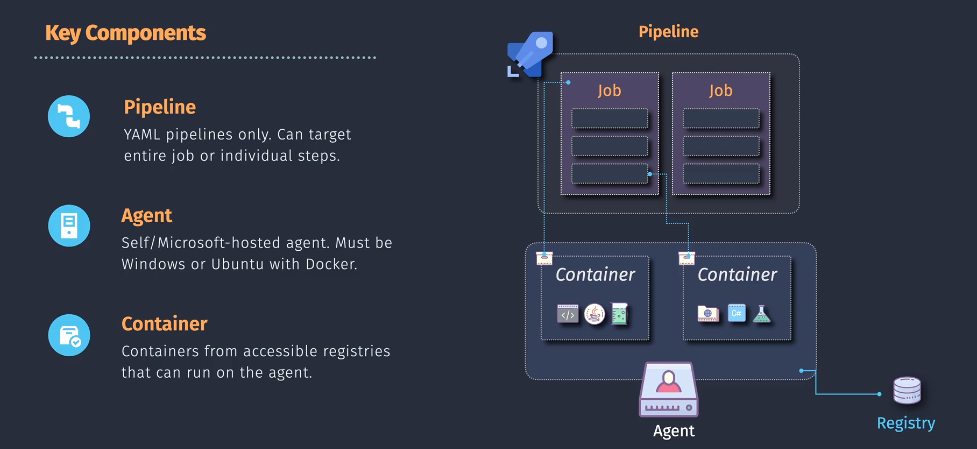
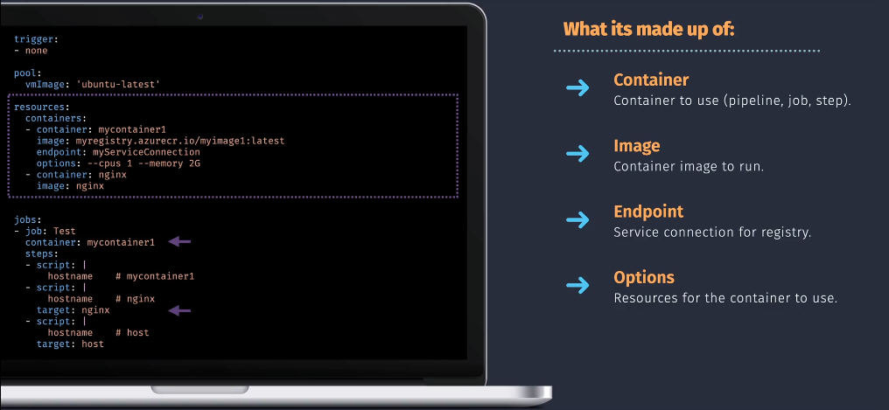

# 🐳 Azure DevOps Container Jobs

Default agent pools like `ubuntu-latest`, `windows-latest`, or `macOS-latest` are **general-purpose VMs** maintained by Microsoft. They come preloaded with **tons of SDKs, runtimes, and tools** to support most use cases.

But here's the **catch**:

---

## 🎯 Problem: Too Many Tools on the Same Agent

### 🧱 Default Agents Include:

- Multiple versions of .NET (e.g., 3.1, 5, 6, 7, 8-preview)
- Multiple versions of Node.js, Java (JDKs), Python
- Docker, PowerShell, Git, Go, Ruby, etc.

---

### 😵 Result: Environment Chaos

| Issue                      | Description                                                                                                       |
| -------------------------- | ----------------------------------------------------------------------------------------------------------------- |
| **Version Conflicts**      | You might build with .NET 6 locally, but Azure builds with .NET 7 due to `dotnet` default                         |
| **Tool Shadowing**         | Multiple `dotnet`, `node`, or `python` versions can confuse build steps                                           |
| **Unpredictable Behavior** | Pipelines work one day, fail the next because agent images are updated weekly                                     |
| **Build Drift**            | Your dev/test/stage environments don't match what's in the hosted agent                                           |
| **Global Installations**   | All tools share the same global path (`/usr/bin`, `C:\Program Files`) — recipe for disaster in multi-version apps |

---

## ✅ Solution: Use Container Jobs

Instead of depending on whatever’s installed in the VM, you:

- 🐳 Run your job inside a specific Docker container
- 📌 Pin exact versions (`dotnet/sdk:6.0`, `node:18`)
- 🔄 Reuse that environment everywhere (local dev, CI, CD)
- ❌ No more global conflicts

### ✅ Benefits:

| Feature                      | Default Agent                        | Container Job                                   |
| ---------------------------- | ------------------------------------ | ----------------------------------------------- |
| Reproducibility              | ❌ Agent may change every week       | ✅ Container never changes unless you update it |
| Tooling control              | ❌ Shared, global path               | ✅ Scoped to container runtime                  |
| Version management           | ❌ Complex (global.json, PATH hacks) | ✅ You define the exact SDK image               |
| Parallel environment support | ❌ Error-prone                       | ✅ Run .NET 6 and 7 in isolated jobs safely     |

---

## 🎯 What Are Container Jobs?

Container jobs allow you to run your **pipeline jobs inside Docker containers**, instead of using the base VM image (like `ubuntu-latest`). This gives you:

- 💡 Full control over the runtime environment
- 🧪 Language-specific tools pre-installed (e.g., `dotnet`, `node`, `python`)
- 💼 Isolation between job environments
- 🔄 Reproducible builds (same environment every time)

---

<div align="center">
  
</div>

---

## 🚧 Container Job Placement Levels

| Level                | Scope                              | Syntax                   |
| -------------------- | ---------------------------------- | ------------------------ |
| Job-level container  | The entire job runs in a container | `container:` under `job` |
| Step-level container | A single step runs in a container  | `target:` under `step`   |

> ✅ Most common usage = **job-level containers**

---

## 🔧 Definition in Pipeline

<div align="center">
  
</div>

---

This defines **available containers** to use throughout the pipeline.

```yaml
resources:
  containers:
    - container: dotnet6 # 🔖 Name used in jobs/steps
      image: mcr.microsoft.com/dotnet/sdk:6.0

    - container: node16
      image: node:16

    - container: nginx
      image: nginx

    - container: myapp
      image: myregistry.azurecr.io/myimage:latest
      endpoint: myAcrServiceConnection
      options: --cpus 1 --memory 2G
```

---

## 🛠️ Usage in Pipeline

You **use** the defined containers in either of the following scopes:

---

### 1. 🧱 **Job-level Container** (`container:`)

Runs **all steps in a job** inside a container.

```yaml
jobs:
  - job: BuildApp
    container: dotnet6 # 👈 container name from 'resources'
    steps:
      - script: dotnet build
```

---

### 2. 🧩 **Step-level Container Override** (`target:`)

Overrides the container **only for a specific step**:

```yaml
jobs:
  - job: MixedJob
    container: dotnet6 # default container

    steps:
      - script: echo "Hello from dotnet6"

      - script: node -v
        target: node16 # 👈 runs this step in node:16 container

      - script: az --version
        target: host # 👈 runs this step on the host agent (not in any container)
```

---

## 🧪 Sample Usage

<div align="center">
  
</div>

---

```yml
trigger:
  - none

pool:
  vmImage: "ubuntu-latest"

resources:
  containers:
    - container: mycontainer1
      image: myregistry.azurecr.io/myimage1:latest
      endpoint: myServiceConnection
      options: --cpus 1 --memory 2G

    - container: nginx
      image: nginx

jobs:
  - job: Test
    displayName: "Run scripts across containers"
    container: mycontainer1 # All steps run inside this container unless overridden
    steps:
      - script: |
          echo "Running inside mycontainer1"
          hostname
        displayName: "Inside mycontainer1"

      - script: |
          echo "Running inside nginx container"
          hostname
        target: nginx
        displayName: "Inside nginx"

      - script: |
          echo "Running directly on the host agent"
          hostname
        target: host
        displayName: "On Host Machine"
```

## ✍🏻 Example Scenario: Deploy Two .NET App Services

You want to:

- Build and deploy a **.NET 6** app
- Build and deploy a **.NET 7** app
- Do this in a **single pipeline**
- First use the **default agent pool**
- Then convert to use **container jobs**

---

## ✅ Version 1: Default Agent Pool

### YAML Pipeline (No Containers Yet)

```yaml
trigger:
  - main

variables:
  app6Name: "auswebtest6"
  app7Name: "auswebtest7"
  aspName: "web1-plan"
  resourceGroup: "web1-rg"
  location: "australiaeast"
  sku: "F1"

jobs:
  # ─────────────────────────────────────────────
  - job: DotNet6
    displayName: "Deploy using .NET 6"
    pool:
      vmImage: "ubuntu-latest"
    steps:
      - task: UseDotNet@2
        displayName: "Install .NET 6 SDK"
        inputs:
          packageType: "sdk"
          version: "6.x"

      - script: |
          dotnet publish --configuration ReleaseDotnet6 --output $(Pipeline.Workspace)/publish6
        displayName: "Build .NET 6 app"

      - task: AzureCLI@2
        displayName: "Prep and deploy .NET 6"
        inputs:
          azureSubscription: "ARM - Prod Sub 1"
          scriptType: "bash"
          scriptLocation: "inlineScript"
          inlineScript: |
            cd $(Pipeline.Workspace)/publish6
            zip -r $(Pipeline.Workspace)/publish6.zip .

            az group create \
              --name $(resourceGroup) \
              --location $(location)

            az appservice plan create \
              --name $(aspName) \
              --resource-group $(resourceGroup) \
              --sku $(sku) \
              --is-linux \
              --location $(location)

            az webapp create \
              --name $(app6Name) \
              --plan $(aspName) \
              --resource-group $(resourceGroup) \
              --runtime "DOTNETCORE|6.0"

            az webapp deployment source config-zip \
              --name $(app6Name) \
              --resource-group $(resourceGroup) \
              --src $(Pipeline.Workspace)/publish6.zip

  # ─────────────────────────────────────────────
  - job: DotNet7
    displayName: "Deploy using .NET 7"
    pool:
      vmImage: "ubuntu-latest"
    steps:
      - task: UseDotNet@2
        displayName: "Install .NET 7 SDK"
        inputs:
          packageType: "sdk"
          version: "7.x"

      - script: |
          dotnet publish --configuration ReleaseDotnet7 --output $(Pipeline.Workspace)/publish7
        displayName: "Build .NET 7 app"

      - task: AzureCLI@2
        displayName: "Prep and deploy .NET 7"
        inputs:
          azureSubscription: "ARM - Prod Sub 1"
          scriptType: "bash"
          scriptLocation: "inlineScript"
          inlineScript: |
            cd $(Pipeline.Workspace)/publish7
            zip -r $(Pipeline.Workspace)/publish7.zip .

            az group create \
              --name $(resourceGroup) \
              --location $(location)

            az appservice plan create \
              --name $(aspName) \
              --resource-group $(resourceGroup) \
              --sku $(sku) \
              --is-linux \
              --location $(location)

            az webapp create \
              --name $(app7Name) \
              --plan $(aspName) \
              --resource-group $(resourceGroup) \
              --runtime "DOTNETCORE|7.0"

            az webapp deployment source config-zip \
              --name $(app7Name) \
              --resource-group $(resourceGroup) \
              --src $(Pipeline.Workspace)/publish7.zip
```

> ✅ Simple.  
> ❌ But you’re stuck with whatever tools Ubuntu has pre-installed.

---

## 🐳 Version 2: Container Jobs

Let’s make the same jobs run in official **.NET SDK containers**!

---

```yaml
trigger:
  - main

variables:
  app6Name: "auswebtest6"
  app7Name: "auswebtest7"
  aspName: "web1-plan"
  resourceGroup: "web1-rg"
  location: "australiaeast"
  sku: "F1"

resources:
  containers:
    - container: dotnet6
      image: mcr.microsoft.com/dotnet/sdk:6.0
    - container: dotnet7
      image: mcr.microsoft.com/dotnet/sdk:7.0

jobs:
  # ─────────────────────────────────────────────
  - job: DotNet6
    displayName: "Deploy using .NET 6"
    pool:
      vmImage: "ubuntu-latest"
    container: dotnet6
    steps:
      - script: |
          dotnet publish --configuration ReleaseDotnet6 --output $(Pipeline.Workspace)/publish6
        displayName: "Build .NET 6 app"

      - task: AzureCLI@2
        displayName: "Prep and deploy .NET 6"
        inputs:
          azureSubscription: "ARM - Prod Sub 1"
          scriptType: "bash"
          scriptLocation: "inlineScript"
          inlineScript: |
            cd $(Pipeline.Workspace)/publish6
            zip -r $(Pipeline.Workspace)/publish6.zip .

            az group create \
              --name $(resourceGroup) \
              --location $(location)

            az appservice plan create \
              --name $(aspName) \
              --resource-group $(resourceGroup) \
              --sku $(sku) \
              --is-linux \
              --location $(location)

            az webapp create \
              --name $(app6Name) \
              --plan $(aspName) \
              --resource-group $(resourceGroup) \
              --runtime "DOTNETCORE|6.0"

            az webapp deployment source config-zip \
              --name $(app6Name) \
              --resource-group $(resourceGroup) \
              --src $(Pipeline.Workspace)/publish6.zip

  # ─────────────────────────────────────────────
  - job: DotNet7
    displayName: "Deploy using .NET 7"
    pool:
      vmImage: "ubuntu-latest"
    container: dotnet7
    steps:
      - script: |
          dotnet publish --configuration ReleaseDotnet7 --output $(Pipeline.Workspace)/publish7
        displayName: "Build .NET 7 app"

      - task: AzureCLI@2
        displayName: "Prep and deploy .NET 7"
        inputs:
          azureSubscription: "ARM - Prod Sub 1"
          scriptType: "bash"
          scriptLocation: "inlineScript"
          inlineScript: |
            cd $(Pipeline.Workspace)/publish7
            zip -r $(Pipeline.Workspace)/publish7.zip .

            az group create \
              --name $(resourceGroup) \
              --location $(location)

            az appservice plan create \
              --name $(aspName) \
              --resource-group $(resourceGroup) \
              --sku $(sku) \
              --is-linux \
              --location $(location)

            az webapp create \
              --name $(app7Name) \
              --plan $(aspName) \
              --resource-group $(resourceGroup) \
              --runtime "DOTNETCORE|7.0"

            az webapp deployment source config-zip \
              --name $(app7Name) \
              --resource-group $(resourceGroup) \
              --src $(Pipeline.Workspace)/publish7.zip
```

---

### 🧱 Step 1: Define Reusable Containers

Define each container **once** at the top using the `resources.containers` block.

```yaml
resources:
  containers:
    - container: dotnet6
      image: mcr.microsoft.com/dotnet/sdk:6.0

    - container: dotnet7
      image: mcr.microsoft.com/dotnet/sdk:7.0
```

✅ These are now **named aliases** (like `dotnet6`, `dotnet7`) you can reuse inside jobs or steps.

---

### 🧱 Step 2: Build and Zip in Container Jobs

Each job runs fully inside its own containerized environment — clean, isolated, and reproducible 💡.

```yaml
jobs:
  # ─────────────────────────────────────────────
  - job: DotNet6
    displayName: "Build & Zip .NET 6 App"
    pool:
      vmImage: "ubuntu-latest"
    container: dotnet6
    steps:
      - script: |
          dotnet publish --configuration ReleaseDotnet6 --output $(Pipeline.Workspace)/publish6
        displayName: "Build .NET 6 App"

      - script: |
          cd $(Pipeline.Workspace)/publish6
          zip -r $(Pipeline.Workspace)/publish6.zip .
        displayName: "Zip .NET 6 Output"

  # ─────────────────────────────────────────────
  - job: DotNet7
    displayName: "Build & Zip .NET 7 App"
    pool:
      vmImage: "ubuntu-latest"
    container: dotnet7
    steps:
      - script: |
          dotnet publish --configuration ReleaseDotnet7 --output $(Pipeline.Workspace)/publish7
        displayName: "Build .NET 7 App"

      - script: |
          cd $(Pipeline.Workspace)/publish7
          zip -r $(Pipeline.Workspace)/publish7.zip .
        displayName: "Zip .NET 7 Output"
```

---

### 🧱 Step 3: Deploy from Host Agent (Azure CLI)

Use a **third deployment job** on the host machine (not containerized), so you can safely run `az` commands and deploy both zipped apps to Azure Web Apps.

```yaml
- job: Deploy
  displayName: "Deploy Both Apps to Azure"
  dependsOn: [DotNet6, DotNet7]
  pool:
    vmImage: "ubuntu-latest"
  steps:
    - task: AzureCLI@2
      displayName: "Create and Deploy .NET 6 & 7 Web Apps"
      inputs:
        azureSubscription: "ARM - Prod Sub 1"
        scriptType: bash
        scriptLocation: inlineScript
        inlineScript: |
          # 👇 Environment Variables (Already defined globally if needed)
          app6Name="auswebtest6"
          app7Name="auswebtest7"
          aspName="web1-plan"
          resourceGroup="web1-rg"
          location="australiaeast"
          sku="F1"

          # 👇 Ensure Resource Group and App Service Plan Exist
          az group create \
            --name $resourceGroup \
            --location $location

          az appservice plan create \
            --name $aspName \
            --resource-group $resourceGroup \
            --sku $sku \
            --is-linux \
            --location $location

          # 👇 Create Web App for .NET 6
          az webapp create \
            --name $app6Name \
            --plan $aspName \
            --resource-group $resourceGroup \
            --runtime "DOTNETCORE|6.0"

          az webapp deployment source config-zip \
            --name $app6Name \
            --resource-group $resourceGroup \
            --src $(Pipeline.Workspace)/publish6.zip

          # 👇 Create Web App for .NET 7
          az webapp create \
            --name $app7Name \
            --plan $aspName \
            --resource-group $resourceGroup \
            --runtime "DOTNETCORE|7.0"

          az webapp deployment source config-zip \
            --name $app7Name \
            --resource-group $resourceGroup \
            --src $(Pipeline.Workspace)/publish7.zip
```

> ⛔ Note: `AzureCLI@2` does **not** work inside a container. It must run on the host VM.

---

## ✅ Summary: Default Agent vs Container Job

| Feature                     | Default Agent                  | Container Job                    |
| --------------------------- | ------------------------------ | -------------------------------- |
| .NET SDK used               | Whatever is installed in image | You choose specific version      |
| Environment reproducibility | ❌ Depends on image updates    | ✅ 100% pinned via Docker image  |
| Steps isolation             | ❌ Shared across job           | ✅ Fully isolated per container  |
| Multi-version builds        | Harder (conflicts)             | ✅ Easy: one job = one container |
| Runtime management          | Limited                        | Full Docker control              |
