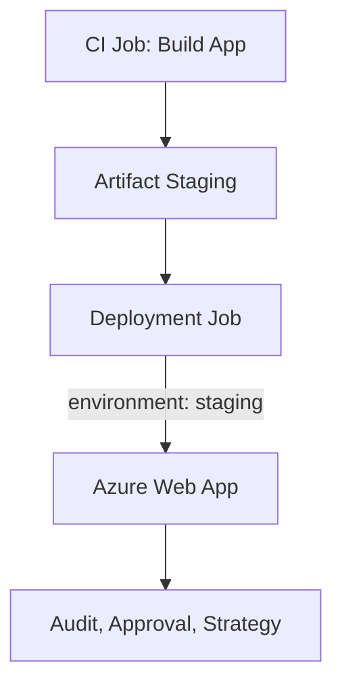

# 🚀 Azure DevOps Deployment Jobs

Deployment jobs are special types of jobs meant for deploying to environments like **Azure**, **Kubernetes**, **VMs**, or **on-prem** targets — and are tightly integrated with Azure Pipelines' **environment**, **approval**, and **deployment strategy** features.

---

## 🧩 What is a Deployment Job?

A **deployment job**:

- Is a special `job` that **targets an `environment`**
- Supports **pre-deployment approvals**, **gates**, and **checks**
- Allows **rollbacks**, **multi-phase deployment strategies** (runOnce, canary, rolling, etc.)
- Can run on a **deployment group**, **agent pool**, **VM**, **K8s**, or **container**

---

## 🧱 Basic Structure

```yaml
jobs:
  - deployment: DeployWebApp
    displayName: "Deploy Web App to Azure"
    environment: "production"
    strategy:
      runOnce:
        deploy:
          steps:
            - task: AzureCLI@2
              inputs:
                azureSubscription: "MyServiceConnection"
                scriptType: bash
                scriptLocation: inlineScript
                inlineScript: |
                  echo "Deploying app to production..."
```

---

## 🔍 Key Components Breakdown

| Key            | Description                                                          |
| -------------- | -------------------------------------------------------------------- |
| `deployment:`  | Marks the job as a **deployment job**                                |
| `environment:` | Links this job to a named **Azure Pipeline environment**             |
| `strategy:`    | Controls **how** the deployment proceeds (e.g., `runOnce`, `canary`) |
| `steps:`       | The tasks to execute **during the deployment phase**                 |

---

## 🌎 Environments = Deployment Targets + History + Approvals

- Can represent **prod**, **staging**, **test**, etc.
- Can be linked to:

  - **Azure Web Apps**
  - **Kubernetes clusters**
  - **VM targets**
  - Or just logical names + approvals

- Created in **Pipelines → Environments** UI or automatically from pipeline

---

## 🧪 Example: Deploy to Azure Web App

### 🧱 Step 1: Define Environment

You can create it manually in Azure DevOps UI → Pipelines → Environments → `production`, or just reference it in YAML:

```yaml
environment: "production"
```

Azure Pipelines will auto-create it if it doesn’t exist.

---

### 🧱 Step 2: Use Deployment Job

```yaml
trigger:
  - main

variables:
  appName: "my-dotnet-web"
  resourceGroup: "webapp-rg"
  location: "eastus"

jobs:
  - deployment: DeployWebApp
    displayName: "Deploy to Azure Web App"
    environment: "production"
    pool:
      vmImage: "ubuntu-latest"

    strategy:
      runOnce:
        deploy:
          steps:
            - task: AzureCLI@2
              displayName: "Deploy using Azure CLI"
              inputs:
                azureSubscription: "ARM-PROD-CONNECTION"
                scriptType: bash
                scriptLocation: inlineScript
                inlineScript: |
                  echo "🔁 Creating Resource Group..."
                  az group create --name ${{ variables.resourceGroup }} --location ${{ variables.location }}

                  echo "🚀 Creating Web App"
                  az webapp create \
                    --name ${{ variables.appName }} \
                    --resource-group ${{ variables.resourceGroup }} \
                    --plan "my-service-plan" \
                    --runtime "DOTNETCORE|6.0"

                  echo "📦 Deploying ZIP"
                  az webapp deployment source config-zip \
                    --name ${{ variables.appName }} \
                    --resource-group ${{ variables.resourceGroup }} \
                    --src $(Pipeline.Workspace)/publish.zip
```

---

## 🧠 Why Use Deployment Jobs?

| Feature                    | Benefit                                                       |
| -------------------------- | ------------------------------------------------------------- |
| 🔐 **Approvals**           | Enforce approvals before promotion to env (like `production`) |
| 📜 **Audit History**       | Track exactly who deployed what and when                      |
| 🔁 **Rollback & Strategy** | Add `canary`, `rolling`, or `manual` rollback                 |
| 📈 **Environment UI**      | See deployment status & logs in Pipelines → Environments      |

---

## 🎯 Advanced Strategies (Optional)

You can replace `runOnce` with:

### 🐦 Canary

```yaml
strategy:
  canary:
    increments: [50, 100]
    preDeploy:
      steps: ...
    deploy:
      steps: ...
    routeTraffic:
      steps: ...
```

### 🔁 Rolling

```yaml
strategy:
  rolling:
    maxParallel: 2
    preDeploy:
      steps: ...
    deploy:
      steps: ...
```

---

## 🎨 Visual Summary (Mermaid)



---

## ✅ Final Tip

- Use **deployment jobs** when you want:

  - ✅ Audited, environment-specific deployments
  - ✅ Built-in approvals + visibility
  - ✅ Multi-phase strategies like canary or rolling
