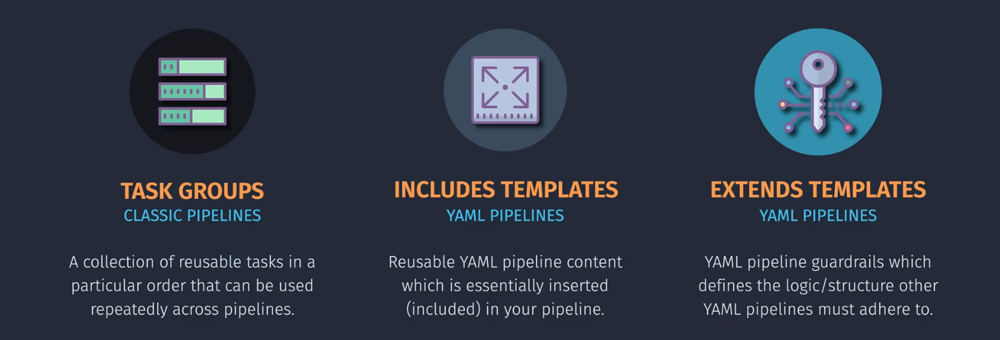

# 🧩 Azure Pipeline Modularization

> "Don't repeat yourself (DRY)" – the golden rule of pipeline reusability!

Modularizing Azure Pipelines makes your CI/CD pipeline:

- More **reusable**
- Easier to **maintain**
- Simpler to **collaborate** across teams

There are two main modularization types:

| Type              | For                  | Description                                           |
| ----------------- | -------------------- | ----------------------------------------------------- |
| ✅ **Task Group** | Classic UI Pipelines | UI-based group of steps reused across pipelines       |
| ✅ **Templates**  | YAML Pipelines       | Reusable YAML blocks that can be included or extended |

---

<div align="center">
  
</div>

---

## 🎯 1. Task Groups (Classic Pipelines)

🔹 **What it is:** A named group of UI steps you can reuse  
🔹 **Use Case:** Encapsulate complex builds or deployment steps  
🔹 **How to Use:**

1. Go to Classic Pipeline → Edit Pipeline
2. Select the steps you want to group
3. Click `Create task group`
4. Give it a name and specify parameters

💡 Once created, the task group appears like a regular task but accepts parameters.

🧠 Example:
Let’s say you encapsulated this step group:

```ini
1. Restore NuGet packages
2. Build solution
3. Run unit tests
```

It becomes a task group `BuildAndTestGroup`, and in other pipelines, you just reference it.

---

## 📦 2. Templates (YAML Pipelines)

> ✅ YAML templates **must exist in your repo** or a **repository resource**  
> ✅ Templates can be reused with parameters across jobs/stages/steps

---

### 🧱 a. Include Template

🔹 **What it is:** A `template` keyword is used to include and pass parameters to a YAML file

---

### ✅ Example: Include a Template with Parameters

📁 Your Repository Folder structure:

```ini
/azure-pipelines.yml         ← main pipeline
/templates/
  - deploy-webapp.yml        ← included template
```

🧾 **deploy-webapp.yml**

```yaml
parameters:
  - name: webAppName
    type: string
  - name: resourceGroup
    type: string
  - name: packagePath
    type: string

steps:
  - task: AzureCLI@2
    inputs:
      azureSubscription: "ARM-Prod"
      scriptType: bash
      scriptLocation: inlineScript
      inlineScript: |
        az webapp deployment source config-zip \
          --name ${{ parameters.webAppName }} \
          --resource-group ${{ parameters.resourceGroup }} \
          --src ${{ parameters.packagePath }}
```

🧾 **azure-pipelines.yml**

```yaml
trigger:
  - main

jobs:
  - job: DeployJob
    displayName: Deploy Web App
    pool:
      vmImage: ubuntu-latest
    steps:
      - template: templates/deploy-webapp.yml # 👈 must be in your repo
        parameters:
          webAppName: "auswebapp1"
          resourceGroup: "aus-rg"
          packagePath: "$(Pipeline.Workspace)/publish.zip"
```

📌 You can also load templates from another repo using `repository` resources.

---

### 🧱 b. Extend Template

🔹 **What it is:** Replaces a whole job/stage definition with a reusable **job or stage template**  
🔹 **Used with:** `extends:` block

🧠 Use when you want to apply a job layout to multiple pipelines.

---

### ✅ Example: Reusable Job Template with `extends`

📁 Folder structure:

```ini
/pipeline.yml
/templates/
  - job-template.yml
```

🧾 **job-template.yml**

```yaml
parameters:
  - name: dotnetVersion
    type: string
  - name: outputDir
    type: string

jobs:
  - job: BuildJob
    pool:
      vmImage: "ubuntu-latest"
    steps:
      - script: |
          echo "Building with .NET ${{ parameters.dotnetVersion }}"
          dotnet build --output ${{ parameters.outputDir }}
        displayName: "Build with specified .NET SDK"
```

🧾 **pipeline.yml**

```yaml
trigger:
  - main

extends:
  template: templates/job-template.yml # 👈 must be in your repo
  parameters:
    dotnetVersion: "6.0"
    outputDir: "$(Build.ArtifactStagingDirectory)/out"
```

---

## 🔄 When to Use Which

| You Want To                                          | Use              |
| ---------------------------------------------------- | ---------------- |
| Reuse common set of **UI tasks** in Classic pipeline | Task Group       |
| Reuse shared **steps** inside jobs                   | Include Template |
| Reuse entire **jobs/stages** with custom parameters  | Extend Template  |

---

## 🧠 Best Practices

- Keep templates in `/templates/` folder
- Use `parameters` instead of hardcoding
- Use `extends` only for consistent jobs/stages
- Include comments in your templates for readability
- Use `runtime expressions` (`$[ ... ]`) for logic, `parameters` for structure

---

## ✅ Summary

| Feature             | Classic | YAML                                        |
| ------------------- | ------- | ------------------------------------------- |
| Task Group Support  | ✅ Yes  | ❌ No                                       |
| Include Template    | ❌ No   | ✅ Yes                                      |
| Extend Template     | ❌ No   | ✅ Yes                                      |
| Parameterized Input | ✅ Yes  | ✅ Yes                                      |
| Must Be in Repo     | ❌ N/A  | ✅ Required (or defined as a repo resource) |
