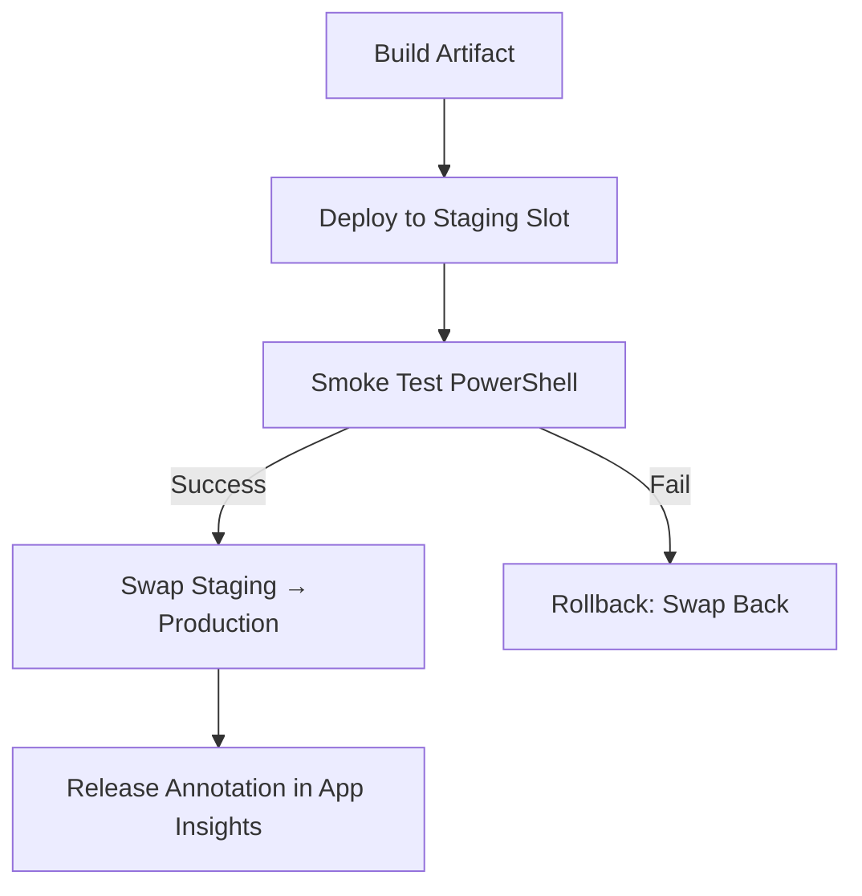

# 🔄 Azure DevOps **Task Groups** – Hands-On Project

## 🏗 Scenario – Blue/Green App Service Deployment

Your company has **multiple web apps** hosted in **Azure App Service**.
Every deployment must:

1. Deploy to a **staging slot**
2. Run a **smoke test**
3. Swap to **production slot**
4. Add a **release annotation**

👉 Instead of repeating these tasks in every pipeline, you’ll create a **Task Group** (Classic pipelines feature) so all teams use the same deployment standard.

---

## ⚙️ Prerequisites

- Azure DevOps Project with **Classic Release Pipelines enabled**
- A **build artifact** (e.g., `drop/**/*.zip`)
- Azure Service Connection (ARM)
- App Service with **staging** slot
- Application Insights (optional)

---

## 🧩 Step 1: Build the initial Classic Release stage

Go to **Pipelines → Releases → New pipeline**

1. Add **Artifact** → your build output
2. Add a stage: **BlueGreen Deploy**
3. Inside the stage, add tasks:

### Task 1: Azure App Service Deploy

- App type: Web App
- Slot: `staging`
- Package: `$(System.DefaultWorkingDirectory)/drop/*.zip`

### Task 2: PowerShell Smoke Test

```powershell
$url = "$(SMOKE_URL)"   # e.g., https://myapp-staging.azurewebsites.net/health
$timeout = [int]"$(SMOKE_TIMEOUT_SEC)"
$end = (Get-Date).AddSeconds($timeout)

do {
  try { $code = (Invoke-WebRequest -UseBasicParsing $url -TimeoutSec 10).StatusCode }
  catch { $code = 0 }
  if ($code -eq 200) { Write-Host "Healthy"; exit 0 }
  Start-Sleep -Seconds 5
} while ((Get-Date) -lt $end)

Write-Error "Smoke test failed"
exit 1
```

### Task 3: Azure App Service Manage – Swap Slots

- Source slot: `staging` → Target slot: `production`

### Task 4: Release Annotation (optional)

- Writes deployment version + notes into Application Insights.

---

## 🧩 Step 2: Convert to a Task Group

- Select all four tasks
- **Right click → Create Task Group**
- Name: `AppService-BlueGreen-Deploy`
- Promote inputs to **parameters**:

  - `azureSubscription`
  - `webAppName`
  - `packagePath`
  - `stagingSlotName` (default: `staging`)
  - `prodSlotName` (default: `production`)
  - `smokeUrl`
  - `smokeTimeoutSec`

💡 Azure DevOps saves this under **Library → Task Groups** as version **v1**.

---

## 🧩 Step 3: Replace with Task Group in pipeline

- Delete the original 4 tasks
- Add **Task Group → AppService-BlueGreen-Deploy**
- Fill parameter values with variables or hard-coded strings
- Run a release → logs expand the Task Group back into the original steps ✅

---

## 🧩 Step 4: Reuse across projects

- Other teams just **add the Task Group** instead of repeating all tasks
- Pass app-specific parameters
- Secrets? Store in **Variable Groups** or **Key Vault**

---

## 🧩 Step 5: Centralize updates (versioning)

- Go to **Library → Task Groups → AppService-BlueGreen-Deploy**
- Edit → Add improvements (ex: rollback on failure)
- Save as **v2**
- Pipelines can either:

  - Pin to v1 for stability
  - Always use **latest** for updates org-wide

---

## 🧩 Step 6: Bonus – Rollback Automation

Add one more **App Service Manage (Swap)** task:

- Action: Swap Slots
- Source: `production` → Target: `staging`
- Condition: `failed()`

👉 If smoke test fails, swap back automatically.

---

## 🔍 Visual Flow



---

## ✅ Why Task Groups?

- ♻️ **Reuse** across pipelines/projects
- 🛠 **Centralized updates** (version control)
- 🔐 **Parameters & variable groups** keep secrets secure
- 🚦 **Governance**: restrict who can edit Task Groups vs. use them

---

## 🆚 YAML Templates vs Task Groups

- **Task Groups** → Classic pipelines only
- **YAML Templates** → Modern YAML pipelines
  👉 Same goal (reuse), different technology.

---

## ⚠️ Common Pitfalls

- Don’t hard-code secrets
- Make **service connection** a parameter
- Check permissions: teams need **Use** rights, not **Manage**
