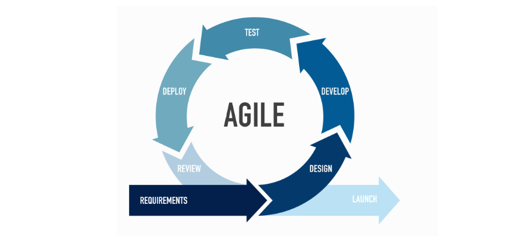
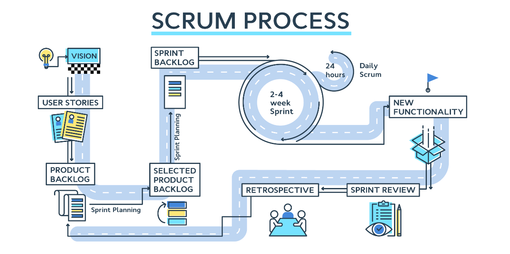
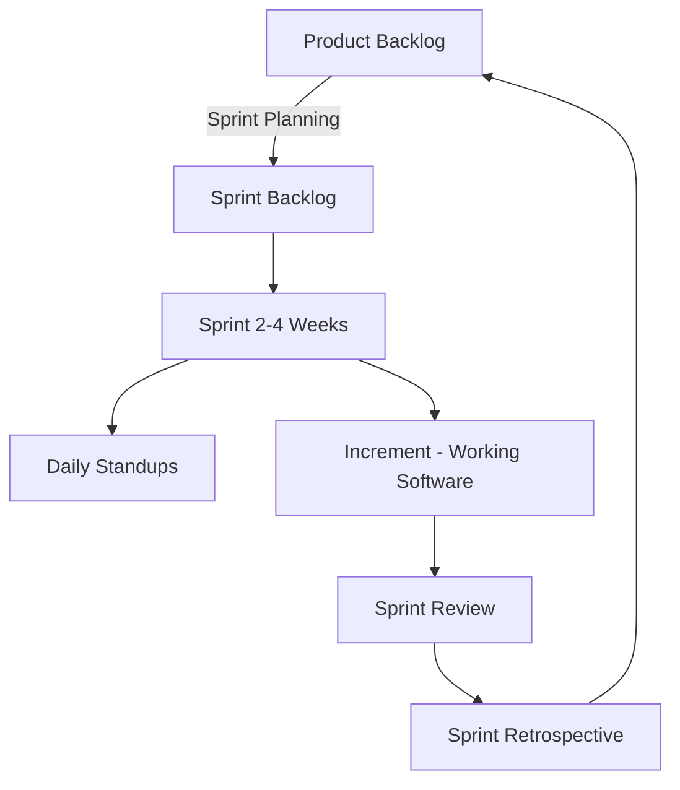

# 🗻 **Primer to DevOps**

We’ll cover:

1. 🌍 What is Azure DevOps?
2. 🔄 Project Lifecycle (why DevOps matters)
3. ⚡ Agile Primer (foundation before DevOps)
4. 🏉 Scrum Primer (framework inside Agile)
5. 📊 Azure DevOps Work Item Processes (Basic, Agile, Scrum, CMMI)
6. 🔑 How to choose the right process

---

## 🌍 **What is Azure DevOps?**

**Azure DevOps** is Microsoft’s **end-to-end DevOps platform** that helps you plan, develop, test, deliver, and monitor software.

It includes:

- **Boards** – Agile project tracking (stories, sprints, tasks, bugs)
- **Repos** – Git repositories with branching policies
- **Pipelines** – CI/CD automation
- **Test Plans** – Manual & automated testing
- **Artifacts** – Package management (NuGet, npm, Maven)

👉 Think: Azure DevOps is your **control center** for the **software delivery lifecycle**.

---

## 🔄 **Software Project Lifecycle**

> Before Agile & DevOps, projects was followed **Waterfall** which adopted from manufacture/construction projects:

  

⚠️ Problems with Waterfall:

- Late feedback.
- Risk of big-bang failures.
- Inflexible to changes.

👉 Agile & DevOps solved these pain points:

- Agile → Iterative planning & tracking.
- DevOps → Automated build, deploy & monitor.

---

## ⚡ **Agile Methodology**

> Agile = **mindset** (not a tool).  
> It focuses on **short iterations, continuous feedback, and collaboration**.

  

### 🧭 Agile Principles (from Manifesto)

- Working software over documentation.
- Customer collaboration over contracts.
- Responding to change over rigid plans.

### 🔑 Agile in practice

- Break work into **User Stories**.
- Deliver in **iterations (sprints)**.
- Continuous communication & review.

---

## 🏉 **Scrum Framework**

> Scrum = the **most popular Agile framework**.  
> Azure DevOps supports Scrum out of the box via **Scrum process template**.

  

### 🎭 Roles

- **Product Owner** – Manages backlog.
- **Scrum Master** – Ensures Scrum process.
- **Development Team** – Builds product.

### 📦 Artifacts

- **Product Backlog** – Ordered list of all work.
- **Sprint Backlog** – Selected items for current sprint.
- **Increment** – Working software delivered.

### ⏳ Events

- Sprint Planning
- Daily Scrum (Stand-up)
- Sprint Review
- Sprint Retrospective

👉 In Azure DevOps → PBIs (Product Backlog Items), Sprints, Boards map directly to Scrum events.

---

## 📊 5. Azure DevOps Work Item Processes

When creating a project in Azure DevOps, you must choose a **process**.
This defines:

- **Work Item Types (WITs)**
- **Workflow states**
- **Backlog/board structure**

---

### 🟢 1. Basic Process

- **Audience**: Small/simple teams, or beginners.
- **Work Items**:

  - **Epics → Issues → Tasks**

- **Style**: Minimal, lightweight.
- **Best For**: Startups, POCs, non-technical projects.

---

### ⚡ 2. Agile Process

- **Audience**: Teams using general Agile practices.
- **Work Items**:

  - **Epics → Features → User Stories → Tasks**
  - Bugs tracked separately.

- **Style**: Uses **User Story** terminology.
- **Best For**: Most dev teams.

---

### 🏉 3. Scrum Process

- **Audience**: Teams practicing strict Scrum.
- **Work Items**:

  - **Epics → Features → Product Backlog Items (PBIs) → Tasks**
  - Bugs tracked separately.

- **Style**: Uses Scrum terms (**PBI instead of User Story**).
- **Best For**: Scrum teams with Product Owner + Scrum Master.

---

### 🏗️ 4. CMMI Process

- **Audience**: Enterprise, regulated industries.
- **Work Items**:

  - **Epics → Features → Requirements → Tasks**
  - Bugs, Change Requests, Risks, Reviews.

- **Style**: Heavy governance, structured workflows.
- **Best For**: Banking, healthcare, gov projects.

---

### 📊 Comparison Table

| Process   | Work Items                                                  | Style            | Best For             |
| --------- | ----------------------------------------------------------- | ---------------- | -------------------- |
| **Basic** | Epic, Issue, Task                                           | Minimal          | Simple teams / POCs  |
| **Agile** | Epic, Feature, User Story, Task, Bug                        | Agile stories    | Most dev teams       |
| **Scrum** | Epic, Feature, PBI, Task, Bug                               | Scrum terms      | Scrum teams          |
| **CMMI**  | Epic, Feature, Requirement, Change Request, Risk, Task, Bug | Formal, governed | Enterprise/regulated |

---

## 🔑 6. Choosing the Right Process

- New/small team → **Basic**.
- Normal Agile dev team → **Agile**.
- Scrum purists → **Scrum**.
- Large enterprises w/ governance → **CMMI**.

👉 Exam Tip: They may ask which process introduces “PBIs” → **Scrum**.
👉 They may ask which process is best for regulatory projects → **CMMI**.

---

## ✅ Quick Summary

- **Project Lifecycle** → Requirements → Design → Build → Test → Deploy → Operate.
- **Agile** → Iterative delivery mindset.
- **Scrum** → Agile framework with roles, artifacts, ceremonies.
- **Azure DevOps Processes** → define work tracking model (Basic, Agile, Scrum, CMMI).
- Choosing a process affects **work item types + board views**, not code or pipelines.
