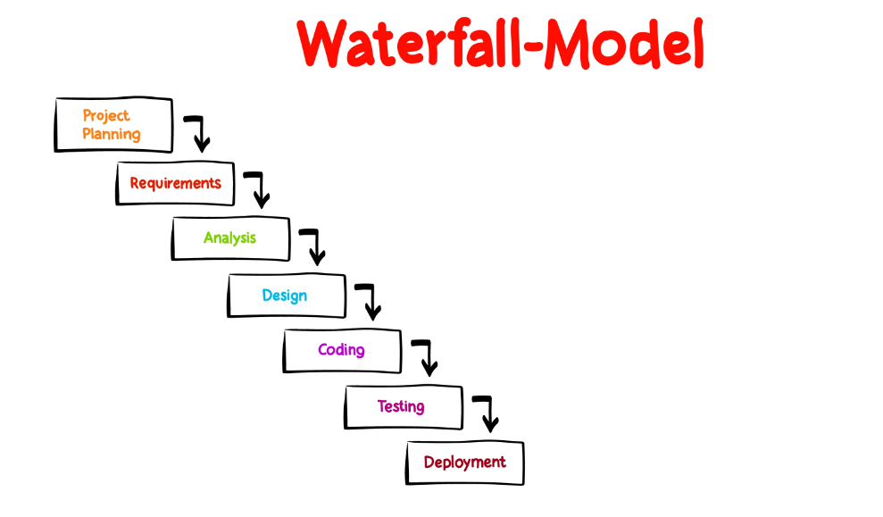
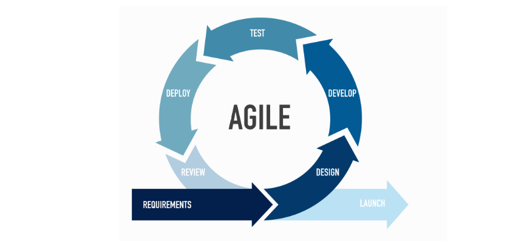
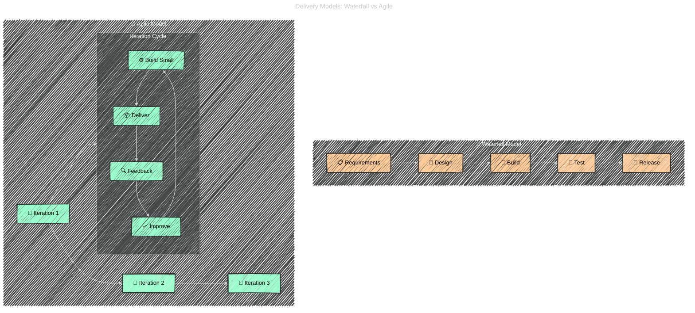

# ⚡ Agile Methodology

## 🔄 **Software Project Lifecycle**

> Before Agile & DevOps, projects was followed **Waterfall** which adopted from manufacture/construction projects:

  

---

⚠️ Problems with Waterfall:

- Late feedback.
- Risk of big-bang failures.
- Inflexible to changes.

👉 Agile & DevOps solved these pain points:

- Agile → Iterative planning & tracking.
- DevOps → Automated build, deploy & monitor.

---

## 🌍 1. What is Agile?

Agile is a **mindset and methodology** for software development that focuses on:

- Delivering **value quickly** (in small chunks)
- **Adapting to change** instead of fighting it
- Involving the **customer continuously**

👉 In contrast to **Waterfall** (big plan upfront → late delivery), Agile works in **short cycles** with fast feedback.

---

  

---

## 📜 2. Agile Manifesto (2001)

The foundation of Agile is the **Agile Manifesto**, which declares:

> **We value:**
>
> - **Individuals & interactions** over processes & tools
> - **Working software** over comprehensive documentation
> - **Customer collaboration** over contract negotiation
> - **Responding to change** over following a plan

🔑 Meaning: Agile prioritizes **people, product, and feedback** over bureaucracy.

---

## 🧩 3. Agile Principles

The manifesto is supported by **12 principles** (shortened here):

1. Customer satisfaction through **early and continuous delivery**.
2. Welcome changing requirements, even late in development.
3. Deliver working software **frequently** (weeks, not months).
4. Business & developers work **together daily**.
5. Build projects around **motivated individuals**.
6. Face-to-face conversation is best.
7. Working software is the **primary measure of progress**.
8. Sustainable pace (no burnout).
9. Technical excellence & good design matter.
10. Simplicity = maximize work not done.
11. Self-organizing teams produce best results.
12. Regular reflection → adjust & improve.

---

## 🔄 4. Agile vs Waterfall

- **Waterfall** = sequential, rigid, feedback comes late.
- **Agile** = iterative, flexible, feedback every cycle.

---

## 🏗️ 5. Agile Frameworks

Agile is the **umbrella**, Scrum is one of its **frameworks**. Others include:

- 🏉 **Scrum** → sprints, roles, ceremonies (most popular).
- 📊 **Kanban** → continuous flow, WIP limits.
- 🔄 **XP (Extreme Programming)** → test-driven dev, pair programming.
- 📦 **Lean** → eliminate waste, maximize value.
- 📉 **SAFe (Scaled Agile Framework)** → applies Agile at enterprise scale.

👉 Azure DevOps supports Agile via **Boards, Backlogs, Sprints, Kanban boards**.

---

## 🧑‍💻 6. Agile in Practice (Step-by-Step)

Imagine our e-commerce project again:

1. **Product Backlog** created with user stories:

   - “As a shopper, I want to view product details so I can decide what to buy.”

2. **Sprint Planning**: Team selects a small set of stories (say 20 SP worth).

3. **Iteration (Sprint)**:

   - Developers code features.
   - QA tests continuously.
   - Scrum Master removes blockers.
   - PO clarifies requirements.

4. **Demo/Review**: Team shows working product (e.g., browsing & cart).

5. **Retrospective**: Team reflects & improves process.

6. Repeat cycle → each iteration delivers more value.

---

## 📊 7. Agile in Azure DevOps

In Azure DevOps:

- **Boards** → manage stories, tasks, bugs.
- **Sprints** → plan 2–4 week iterations.
- **Queries/Charts** → track velocity & burndown.
- **Kanban board** → visualize work in progress.

👉 Example:

- Epic = Checkout system
- Feature = Payment integration
- User Story = “As a user, I want to pay with credit card”
- Task = “Implement payment API”

---

## ✅ 8. Quick Exam-Style Recap

- **Agile** = philosophy/methodology, not a specific tool.
- Core values = People, Product, Collaboration, Adaptability.
- Agile delivers in **short cycles**, feedback every iteration.
- **Scrum** is a framework under Agile (others: Kanban, XP, SAFe).
- In Azure DevOps, Agile maps to **Boards, Backlogs, Sprints, Velocity, Burndown**.
