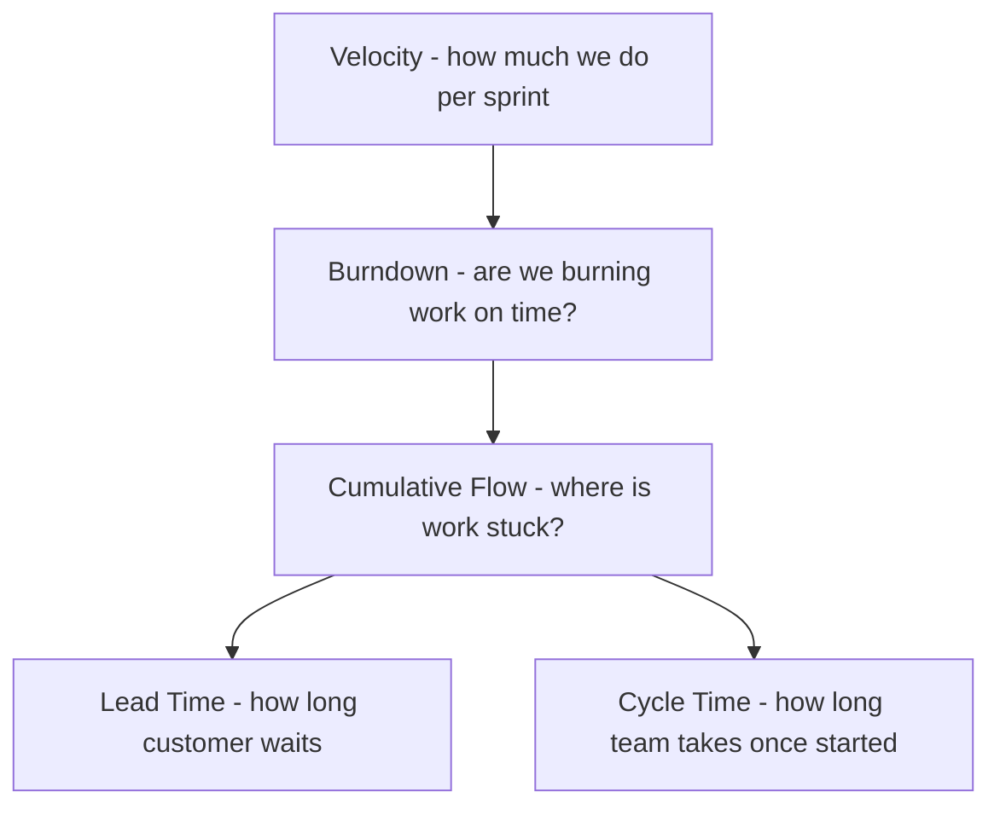

# 📊 Agile Metrics & Reporting in Azure DevOps

> the “health check” tools inside Azure DevOps that stop your project from turning into chaos.

Imagine you’re running a marathon with your team 🏃‍♀️🏃‍♂️:

- You need to know how fast you’re going,
- If you’re running out of energy,
- Where people are slowing down,
- And how long until you actually reach the finish line.

That’s exactly what `Velocity`, `Burndown`, `Cumulative Flow`, `Lead Time`, and `Cycle Time` do in Azure DevOps.

---

## 🟢 1. Velocity

> - **Definition** → The **amount of work a team completes per sprint**, usually measured in **Story Points (SP)**.
> - **Purpose** → Predictability. Helps forecast _“How much can we commit to in the next sprint?”_
> - **Where in Azure DevOps** → **Velocity Chart** (shows bars per sprint).

---

  

---

📌 Example:

- Sprint 1: 18 SP completed
- Sprint 2: 20 SP
- Sprint 3: 22 SP  
  👉 Average velocity ≈ 20 SP → team can commit \~20 SP next sprint.

⚠️ **Exam Tip**: Velocity ≠ productivity measure. It’s for **forecasting**, not comparing teams.

---

## 🔻 2. Burndown Chart

> - **Definition** → Graph that shows **remaining work vs. time** in a sprint.
> - **Purpose** → See if the team is on track to finish sprint scope.
> - **Shape** → Should “burn down” smoothly toward zero.

  

📌 Example:

- Day 1: 40 SP left
- Day 5: 25 SP left
- Day 10 (end): 0 SP left  
  👉 If the line is _above_ ideal → team is behind.

⚠️ **Exam Tip**: If question says _“team is not finishing sprint work on time”_ → check **Burndown**.

---

## 📊 3. Cumulative Flow Diagram (CFD)

> - **Definition** → chart that shows **how work items move through different stages over time** — like To Do, In Progress, and Done.
> - **Purpose** → Detect bottlenecks (too many stuck in “Doing”).
>
> - **How It Works:**
>
>   - **X-axis = Time** (days, weeks, sprints)
>   - **Y-axis = Number of work items**
>   - Each **colored band** = a stage in your process

  

**📌 Example:**

- 🔵 Bottom band = To Do
- 🟠 Middle band = In Progress
- 🟢 Top band = Done

> As time passes, these bands **grow upward**. The shape and thickness of each band tells you how work is flowing.

⚠️ **Exam Tip**: If question says _“identify bottlenecks in process”_ → **Cumulative Flow Diagram**.

---

## ⏱️ 4. Lead Time & Cycle Time

  

### **🕛 Lead Time**

- **Definition** → Time from **work item created → completed**.
- **Purpose** → How fast customer requests are delivered.
- **Good for** → Measuring customer satisfaction.

### **🕧 Cycle Time**

- **Definition** → Time from **work item started → completed**.
- **Purpose** → How fast the team finishes once they start.
- **Good for** → Measuring internal efficiency.

📌 Example:

- Bug created on Jan 1 → finished Jan 10 = **Lead Time = 9 days**
- Work started on Jan 5 → finished Jan 10 = **Cycle Time = 5 days**

⚠️ **Exam Tip**:

- _“Customer waits from request to delivery”_ → **Lead Time**
- _“Team speed once started”_ → **Cycle Time**

---

## 📊 Comparison Table

| Metric              | What it Measures                  | Purpose                         | Where in Azure DevOps | Exam Keyword       |
| ------------------- | --------------------------------- | ------------------------------- | --------------------- | ------------------ |
| **Velocity**        | Story Points completed per sprint | Forecast future sprint capacity | Velocity chart        | _forecasting_      |
| **Burndown**        | Remaining work vs. time           | Track sprint progress           | Sprint backlog        | _on track or not_  |
| **Cumulative Flow** | Flow of items across states       | Find bottlenecks                | Boards Analytics      | _bottleneck_       |
| **Lead Time**       | Request → Delivery                | Customer responsiveness         | Analytics views       | _customer waiting_ |
| **Cycle Time**      | Start → Delivery                  | Team efficiency                 | Analytics views       | _execution speed_  |

---

## 🔄 Visual Flow

---

## ✅ Recap

- **Velocity** = capacity forecasting (SP per sprint).
- **Burndown** = sprint progress (remaining work vs. time).
- **Cumulative Flow** = bottlenecks (flow through states).
- **Lead Time** = customer wait time.
- **Cycle Time** = team execution speed.

---

## 🎯 Exam Hack

- _Forecasting future sprint capacity_ → Velocity.
- _Tracking sprint progress daily_ → Burndown.
- _Finding bottlenecks_ → Cumulative Flow Diagram.
- _Customer-focused metric_ → Lead Time.
- _Team efficiency metric_ → Cycle Time.

👉 Do you want me to now expand into **how these metrics show up in Azure DevOps Dashboards & Widgets** (so you can connect them with reporting and visibility tools)?

## References

- [Understanding Agile Metrics: How to Use Burndown Charts, Velocity Charts, and More!](https://plan.io/blog/burndown-chart-and-agile-metrics/)
