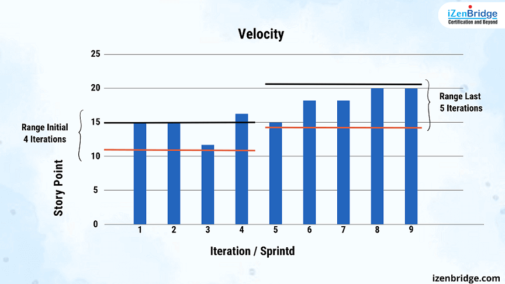
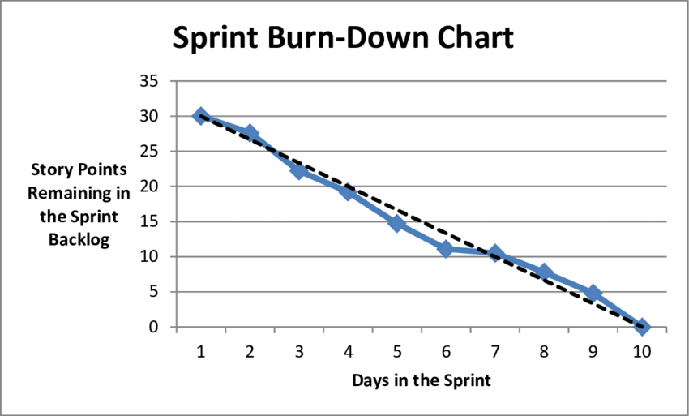
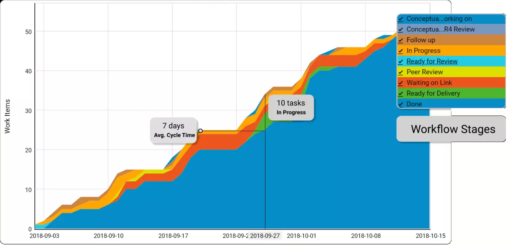
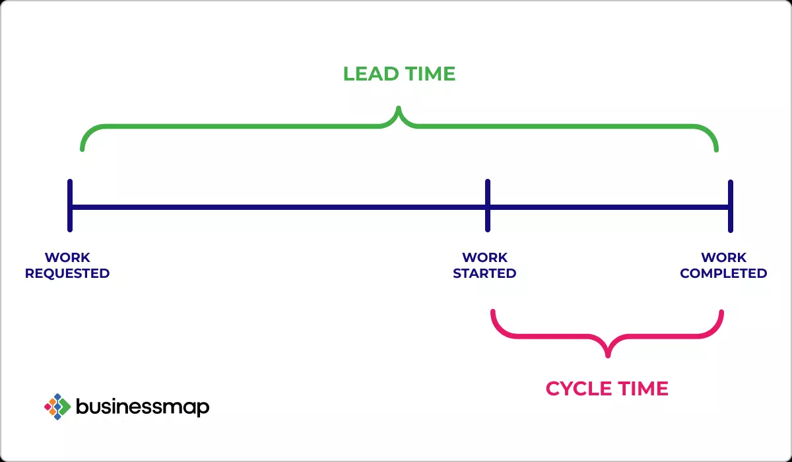
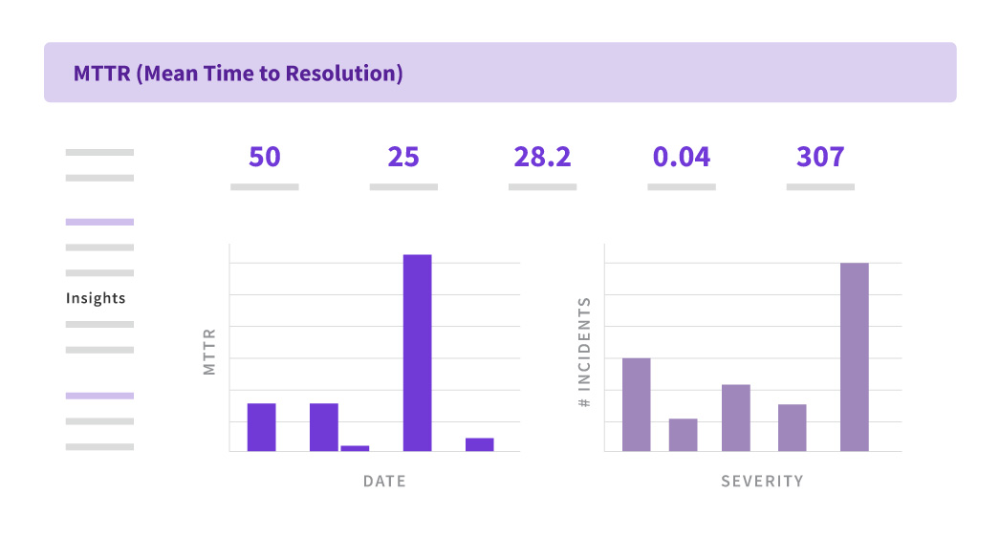
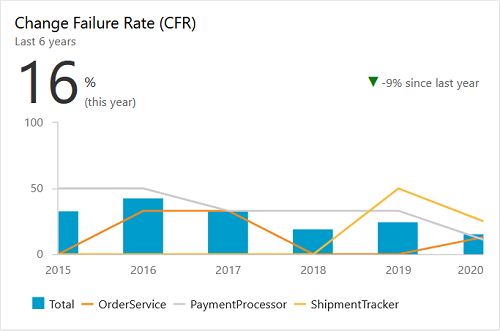
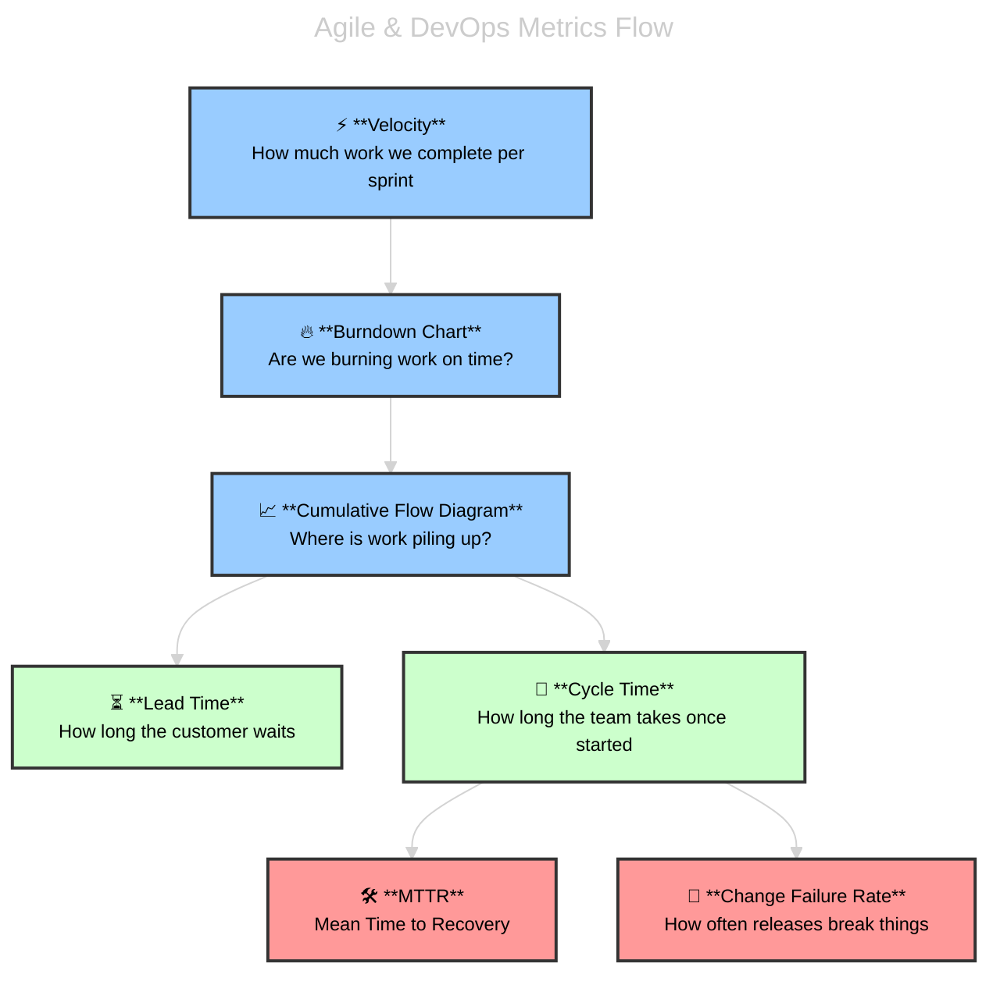

# 📊 Delivery Metrics & Reporting in Azure DevOps

> the “health check” tools inside Azure DevOps that stop your project from turning into chaos.

Imagine you’re running a marathon with your team 🏃‍♀️🏃‍♂️:

- You need to know how fast you’re going,
- If you’re running out of energy,
- Where people are slowing down,
- And how long until you actually reach the finish line.

That’s exactly what `Velocity`, `Burndown`, `Cumulative Flow`, `Lead Time`, and `Cycle Time` do in Azure DevOps.

---

## 🟢 1. Velocity

> - **Definition** → The **amount of work a team completes per sprint**, usually measured in **Story Points (SP)**.
> - **Purpose** → Predictability. Helps forecast _“How much can we commit to in the next sprint?”_
> - **Where in Azure DevOps** → **Velocity Chart** (shows bars per sprint).

---

  

---

📌 Example:

- Sprint 1: 18 SP completed
- Sprint 2: 20 SP
- Sprint 3: 22 SP  
  👉 Average velocity ≈ 20 SP → team can commit \~20 SP next sprint.

⚠️ **Exam Tip**: Velocity ≠ productivity measure. It’s for **forecasting**, not comparing teams.

---

## 🔻 2. Burndown Chart

> - **Definition** → Graph that shows **remaining work vs. time** in a sprint.
> - **Purpose** → See if the team is on track to finish sprint scope.
> - **Shape** → Should “burn down” smoothly toward zero.

  

📌 Example:

- Day 1: 40 SP left
- Day 5: 25 SP left
- Day 10 (end): 0 SP left  
  👉 If the line is _above_ ideal → team is behind.

⚠️ **Exam Tip**: If question says _“team is not finishing sprint work on time”_ → check **Burndown**.

---

## 📊 3. Cumulative Flow Diagram (CFD)

> - **Definition** → chart that shows **how work items move through different stages over time** — like To Do, In Progress, and Done.
> - **Purpose** → Detect bottlenecks (too many stuck in “Doing”).
>
> - **How It Works:**
>
>   - **X-axis = Time** (days, weeks, sprints)
>   - **Y-axis = Number of work items**
>   - Each **colored band** = a stage in your process

  

**📌 Example:**

- 🔵 Bottom band = To Do
- 🟠 Middle band = In Progress
- 🟢 Top band = Done

> As time passes, these bands **grow upward**. The shape and thickness of each band tells you how work is flowing.

⚠️ **Exam Tip**: If question says _“identify bottlenecks in process”_ → **Cumulative Flow Diagram**.

---

## ⏱️ 4. Lead Time & Cycle Time

  

### **🕛 Lead Time**

- **Definition** → Time from **work item created → completed**.
- **Purpose** → How fast customer requests are delivered.
- **Good for** → Measuring customer satisfaction.

### **🕧 Cycle Time**

- **Definition** → Time from **work item started → completed**.
- **Purpose** → How fast the team finishes once they start.
- **Good for** → Measuring internal efficiency.

📌 Example:

- Bug created on Jan 1 → finished Jan 10 = **Lead Time = 9 days**
- Work started on Jan 5 → finished Jan 10 = **Cycle Time = 5 days**

⚠️ **Exam Tip**:

- _“Customer waits from request to delivery”_ → **Lead Time**
- _“Team speed once started”_ → **Cycle Time**

---

Perfect ✅ — let’s write these two metrics in the **same clear, exam-ready style** you like (definition → purpose → example → exam tip).

---

## 5. ⏱️ MTTR (Mean Time to Restore)

> - **Definition** → Average time it takes to **recover from a production failure** (incident, outage, rollback).
> - **Purpose** → Measures **resilience** and **operational excellence**. A low MTTR = team can quickly restore service.
> - **Source in Azure DevOps** → Release Pipelines + Monitoring tools (App Insights, Azure Monitor, Alerts).

  

📌 Example:

- Outage starts: 14:00
- Service restored: 15:30
- MTTR = **90 minutes**

If over a month:

- Total downtime = 450 min
- Total incidents = 5
- MTTR = 450 ÷ 5 = **90 min**

⚠️ **Exam Tip**:
If you see **“How fast can the team recover from incidents?”** → Answer = **MTTR**.

---

## 6. 🚦 Change Failure Rate (CFR)

> - **Definition** → % of deployments that **cause a failure** (rollback, hotfix, outage, user-impacting bug).
> - **Purpose** → Measures **quality of deployments**. A lower CFR means safer, more reliable releases.
> - **Source in Azure DevOps** → Pipelines (failed deployments) + Release logs + Incident tracking.

  

📌 Example:

- 20 deployments in a month.
- 3 caused issues needing rollback.
- CFR = (3 ÷ 20) × 100 = **15%**.

⚠️ **Exam Tip**:
If the question says **“Which metric shows deployment reliability?”** or **“% of changes that lead to incidents”** → Answer = **Change Failure Rate**.

---

## 📊 Comparison Table

| Metric                        | What it Measures                   | Purpose                         | Where in Azure DevOps             | Exam Keyword         |
| ----------------------------- | ---------------------------------- | ------------------------------- | --------------------------------- | -------------------- |
| **Velocity**                  | Story Points completed per sprint  | Forecast future sprint capacity | Velocity chart (Boards → Sprints) | _forecasting_        |
| **Burndown**                  | Remaining work vs. time            | Track sprint progress           | Sprint backlog                    | _on track or not_    |
| **Cumulative Flow**           | Flow of items across states        | Find bottlenecks                | Boards Analytics                  | _bottleneck_         |
| **Lead Time**                 | Request → Delivery                 | Customer responsiveness         | Analytics views                   | _customer waiting_   |
| **Cycle Time**                | Start → Delivery                   | Team efficiency                 | Analytics views                   | _execution speed_    |
| **MTTR**                      | Avg. time to restore after failure | Measure resilience & recovery   | Pipelines + Monitoring (Alerts)   | _recovery speed_     |
| **Change Failure Rate (CFR)** | % of deployments causing incidents | Measure deployment reliability  | Pipelines + Release logs          | _deployment quality_ |

---

## 🔄 Visual Flow

---

## ✅ Recap

- **Velocity** = team capacity forecasting.
- **Burndown** = sprint progress day by day.
- **Cumulative Flow** = bottleneck detector.
- **Lead Time** = customer’s waiting time.
- **Cycle Time** = team’s execution speed.
- **MTTR** = resilience (recovery speed).
- **CFR** = reliability (deployment quality).

---

## 🎯 Exam Hack

- _Forecasting capacity_ → Velocity.
- _Tracking sprint progress_ → Burndown.
- _Finding bottlenecks_ → Cumulative Flow.
- _Customer-focused_ → Lead Time.
- _Team efficiency_ → Cycle Time.
- _Ops recovery speed_ → MTTR.
- _Deployment reliability_ → Change Failure Rate.

---

## 📊 **Burndown vs Sprint Burndown vs Burnup in Azure DevOps**

### 1️⃣ **Sprint Burndown** (most common in exams 🚨)

- **Scope** → A single **sprint/iteration**.
- **What it tracks** → Remaining work (tasks, hours, story points) **per day** across the sprint timeline.
- **Use case** → Team checks **daily progress** toward sprint goal.
- **Question clue** → “Progress toward completing work in **current sprint**”

✅ Example:
If sprint is 10 days, it shows how much work should “burn down” each day to hit zero by the end.

---

### 2️⃣ **Burndown Chart** (more general)

- **Scope** → Can be applied to **epics, features, releases, or custom queries**.
- **What it tracks** → Remaining work **over time** (not limited to a sprint).
- **Use case** → Managers track progress on a **project or release**, not just sprint.
- **Question clue** → If they don’t mention “sprint” but say _“progress toward release completion”_ → Burndown Chart.

⚠️ Trick: In Azure DevOps UI, people often just say “Burndown” when they mean “Sprint Burndown,” but exam questions make the distinction.

---

### 3️⃣ **Burnup Chart**

- **Scope** → Sprint, release, or project.
- **What it tracks** → Work **completed** vs **total scope**.
- **Key difference** → Shows both ✅ _done work_ and 📦 _scope changes_.
- **Use case** → When scope may change (features added mid-release).
- **Question clue** → “Overall completion rate of tasks” or _“track completed vs scope”_ → Burnup.

---

### 🎯 **How to Differentiate in Exam**

| **Chart**           | **Focus**              | **Scope**                 | **Best Exam Clue**                                |
| ------------------- | ---------------------- | ------------------------- | ------------------------------------------------- |
| **Sprint Burndown** | Remaining work         | Single sprint             | “Current sprint progress”                         |
| **Burndown Chart**  | Remaining work         | Release, Epic, or Project | “Track completion of a release/project”           |
| **Burnup Chart**    | Work completed + scope | Sprint or Release         | “Overall completion rate” / “Track scope changes” |

---

✅ So:

- If they mention **sprint** → **Sprint Burndown**
- If they mention **release/project** → **Burndown Chart**
- If they mention **completion rate / scope tracking** → **Burnup**

---

## References

- [Understanding Agile Metrics: How to Use Burndown Charts, Velocity Charts, and More!](https://plan.io/blog/burndown-chart-and-agile-metrics/)
