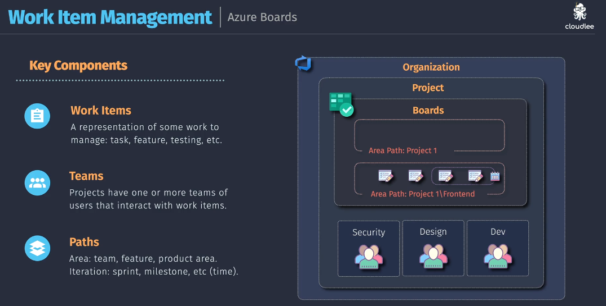
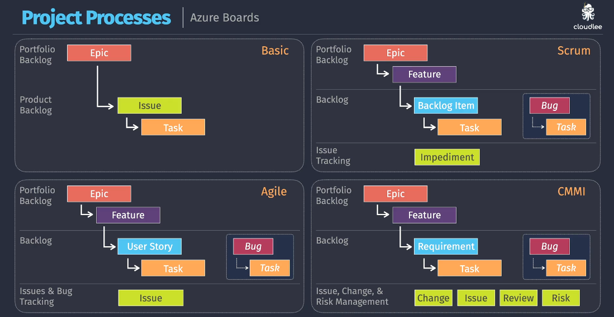

# 🔖 Azure DevOps Work Items

> "A work item is like a sticky note on whiteboard — it tracks everything your team wants to build, fix, discuss, or remember."

---

## 🧩 What Is a Work Item?

A **work item** in Azure DevOps is a **single unit of work** used to:

- 📌 Track features, bugs, or tasks
- ⛓️ Connect code to deployments
- ✅ Manage planning & progress
- 💬 Collaborate via comments, attachments, state transitions

> Think of it like a **Jira ticket** or a **GitHub issue** — but with richer integrations into your builds, code, and pipelines.

---

<div align="center">
  
</div>

---

## 🧠 Key Components of a Work Item

| Property               | Description                                    |
| ---------------------- | ---------------------------------------------- |
| 🏷️ Title               | Brief name for the task                        |
| 🧾 Description         | What needs to be done and why                  |
| 👤 Assigned To         | Who’s responsible                              |
| 🧭 State               | New → Active → Resolved → Closed               |
| 🕓 Priority / Severity | Business urgency                               |
| 🔗 Links               | Related work items, PRs, commits               |
| 🏷️ Tags                | Label for easy filtering                       |
| 📎 Attachments         | Diagrams, screenshots, logs                    |
| 🧪 Custom Fields       | Estimation, customer impact, environment, etc. |

---

## 🏗️ Work Item Types by Process

Azure Boards supports different **process templates** — each with its own **Work Item Types (WITs)**:

| Process Type | Work Items                                                |
| ------------ | --------------------------------------------------------- |
| **Basic**    | Epic → Issue → Task                                       |
| **Agile**    | Epic → Feature → User Story → Task / Bug                  |
| **Scrum**    | Epic → Feature → Backlog Item → Task / Bug                |
| **CMMI**     | Epic → Feature → Requirement → Task / Bug / Risk / Change |

---

📊 **Visual from your image**:

<div align="center">
  
</div>

---

## 🗺️ Work Item Paths (Hierarchy + Scoping)

### 1. **Area Path**

> “Where does this work item belong organizationally?”

- Define _teams, components, features_
  `e.g., Project1\Frontend`, `Project1\Security`

### 2. **Iteration Path**

> “When is this work item planned for?”

- Define _sprints, releases, quarters_
  `e.g., Sprint 1`, `Q3 Milestone`, `Release 2.0`

📌 You can **filter boards, backlogs, charts** using Area and Iteration Paths.

---

## 👥 Work Items + Teams

- Each **Team** works within a **project**, but can have:

  - Their own **Area Path**
  - Their own **Iterations**
  - Their own **Boards and Backlogs**

So teams like Security, Design, and Dev (as shown in your image) can **track separately but stay connected** under the same project umbrella. 🌂

---

## 🔁 Common Workflows

| Task              | Work Item Flow                       |
| ----------------- | ------------------------------------ |
| Feature Request   | Epic → Feature → User Story → Task   |
| Bug Fix           | Bug → Task → Pull Request            |
| Incident Response | Issue → Assign DevOps → Close on Fix |
| Release Planning  | Epic → Iterations → Feature delivery |

---

## 🔗 Work Item Linking

> You can link items for traceability, dependencies, and reporting.

| Link Type                        | Meaning                           |
| -------------------------------- | --------------------------------- |
| 🔗 **Parent/Child**              | Builds hierarchy                  |
| 🧩 **Related**                   | Not dependent, but connected      |
| 🧱 **Predecessor/Successor**     | One depends on the other          |
| ⛓️ **Associated Changeset / PR** | Tracks what code fixed what issue |

---

## 🛠️ Work Item in Action

Let’s say you’re an **SRE** handling a postmortem:

1. **Epic** → Improve Incident Response Process
2. **Feature** → Add Alerting for Frontend Latency
3. **User Story** → Add Prometheus rule
4. **Task** → Create alert config
5. **Bug** → Alert not firing due to label mismatch

You link all these together, assign them to people, update states as work progresses, and track them in Boards or Dashboards 📈

---

## 🧪 Bonus: Use Azure CLI or REST

```bash
az boards work-item create \
  --title "Add Azure Monitor Alert for CPU spike" \
  --type "Task" \
  --assigned-to "sre@team.com" \
  --project "CloudOps"
```

Or automate tracking in your CI/CD flow.

---

## ✅ Summary

| Feature            | Value                                                 |
| ------------------ | ----------------------------------------------------- |
| 📦 Definition      | Atomic unit of work (task, bug, story, feature, etc.) |
| 🔗 Relationships   | Link to commits, PRs, test cases, builds              |
| 📊 Supports        | Agile, Scrum, CMMI, Basic                             |
| 🧱 Hierarchy       | Epic → Feature → Story/Task/Bug                       |
| 🧭 Scoped by       | Area Paths (who), Iteration Paths (when)              |
| 👥 Used By         | Devs, PMs, QA, DevOps, SREs, Design teams             |
| 🔄 Integrated With | Azure Repos, Pipelines, Test Plans, GitHub            |
