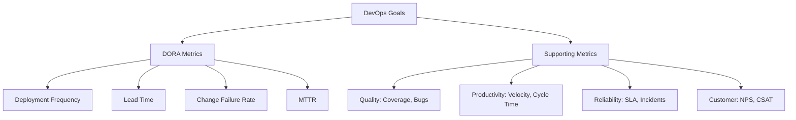

# 📊 KPIs in DevOps / Engineering Metrics

## 📌 1. What are KPIs in DevOps?

👉 **Key Performance Indicators (KPIs)** in DevOps are **quantifiable measures** that track how efficiently teams deliver software, ensure quality, and respond to incidents.

They answer questions like:

- Are we delivering **fast** enough?
- Is our software **stable**?
- How do we improve our **process over time**?

💡 In DevOps, the **DORA Metrics** are considered the gold standard.

---

## 📌 2. The 4 DORA Metrics (Core DevOps KPIs)

| Metric                          | Definition                                   | Goal                             | Example                                    |
| ------------------------------- | -------------------------------------------- | -------------------------------- | ------------------------------------------ |
| **Deployment Frequency (DF)**   | How often you deploy to production           | Deliver **fast, small batches**  | From once a month → multiple times per day |
| **Lead Time for Changes (LT)**  | Time from **code commit → running in prod**  | Faster feedback loops            | Commit today → live in prod tomorrow       |
| **Change Failure Rate (CFR)**   | % of deployments causing incidents/rollbacks | Keep stability while moving fast | 20% failures → improve testing, rollback   |
| **Mean Time to Restore (MTTR)** | Average time to recover from failure         | Resiliency & quick recovery      | Prod outage lasts 10h → fix to 1h          |

👉 **Elite performers** (Google’s _State of DevOps_ report):

- Deploy **on-demand** (multiple times/day).
- Lead time < **1 day**.
- CFR < **15%**.
- MTTR < **1 hour**.

---

## 📌 3. Supporting Engineering Metrics

Beyond DORA, companies track extra KPIs for quality & efficiency:

### 🔹 **Quality Metrics**

- **Code Coverage** → % of code tested by automation.
- **Defect Escape Rate** → Bugs found in prod vs pre-prod.
- **Defect Density** → Bugs per 1,000 lines of code.

### 🔹 **Productivity Metrics**

- **Velocity** → Story Points completed per sprint.
- **Cycle Time** → Start → Done (developer efficiency).
- **WIP (Work in Progress)** → Items actively being worked on.

### 🔹 **Reliability & Operations Metrics**

- **System Uptime / Availability (SLA/SLO)**.
- **Incident Rate** (number of Sev1/Sev2 incidents per month).
- **Error Rate** → % of failed requests (e.g., HTTP 500s).

### 🔹 **Customer Satisfaction Metrics**

- **NPS (Net Promoter Score)** → Would users recommend us?
- **CSAT (Customer Satisfaction Score)** → Post-support surveys.
- **CES (Customer Effort Score)** → How easy was it to achieve X?

---

## 📌 4. How These Connect in Azure DevOps

Azure DevOps provides:

- **Dashboards & Widgets** → visualize KPIs (velocity, burndown, failure rates).
- **Analytics Views** → query Lead Time & Cycle Time.
- **Pipelines + Release logs** → track MTTR & CFR.
- **Boards** → measure velocity, WIP, throughput.
- **Integration with App Insights** → measure reliability (error rates, uptime).

---

## 📊 Visual Map

---

## 📌 5. Exam / Interview Tips

- If the question says:

  - **“How fast are we delivering?”** → Deployment Frequency + Lead Time.
  - **“How stable are deployments?”** → Change Failure Rate.
  - **“How resilient are we?”** → MTTR.
  - **“Are we building quality?”** → Coverage, Defect Rate.
  - **“Are customers happy?”** → CSAT / NPS.

⚡ Don’t confuse:

- **Velocity** (Agile planning metric) vs **Deployment Frequency** (DevOps delivery metric).
- **Code Coverage** = testing metric, **not** a KPI for speed.

---

## ✅ TL;DR

- KPIs in DevOps = measurable indicators of delivery **speed, stability, quality, and satisfaction**.
- **DORA Metrics = Core 4**: Deployment Frequency, Lead Time, CFR, MTTR.
- **Supporting metrics**: velocity, cycle time, coverage, SLA, NPS.
- Azure DevOps + App Insights help visualize these.
- Exam keywords: _“Elite DevOps performers → deploy frequently, low CFR, fast MTTR, short lead times.”_
