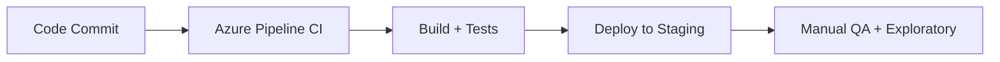
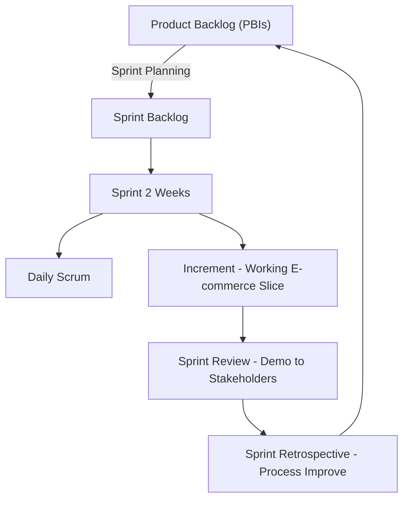

# 🏉 Scrum Explained with a Real E-Commerce Example

## 🌍 Vision & Setup

Imagine we’re building a **minimal e-commerce website**.

- **Vision** → Customers can browse products, add them to a cart, and buy them online.

- **Team Roles**:

  - 👩‍💼 **Product Owner (PO):** Sara (decides _what_ to build)
  - 🧑‍🏫 **Scrum Master (SM):** Omar (ensures smooth Scrum flow)
  - 👨‍💻 **Dev Team:** 4 devs + 1 QA

- **Sprint length:** 2 weeks

- **Azure DevOps process:** **Scrum**

---

## 📦 Product Backlog (Starting Point)

The **Product Backlog** is our shopping list of features.

| Epic     | Sample PBIs (Product Backlog Items)     | Est. (Story Points) | Priority |
| -------- | --------------------------------------- | ------------------- | -------- |
| Catalog  | View product list, View product details | 5 + 5               | High     |
| Cart     | Add to cart, View/edit cart             | 3 + 5               | High     |
| Checkout | Guest checkout, Payment integration     | 8 + 8               | High     |
| Orders   | Confirmation email, Order tracking      | 3 + 5               | Medium   |
| Accounts | Signup/login                            | 8                   | Medium   |

👉 In **Azure DevOps**: create **PBIs** under **Boards → Backlog**, add story points + acceptance criteria.

---

## 🧠 What Is a Story Point?

A **story point** is a number that represents how much **effort** a task (or user story) will take. It’s not about time ⏱️ — it’s about:

- **Complexity** (Is it tricky?)
- **Amount of work** (How much needs to be done?)
- **Uncertainty or risk** (Are there unknowns?)

Think of it like sizing clothes:

- Small task → 1 point
- Medium task → 3 points
- Big, complex task → 8 or more points

Most teams use the **Fibonacci sequence**: 1, 2, 3, 5, 8, 13, 21… because it reflects how effort grows non-linearly.

---

### 🧮 How Are Story Points Calculated?

It’s a **team activity**, usually done during sprint planning. Here's how:

1. **Discuss the task**: Everyone shares what they think it involves.
2. **Compare to known tasks**: “Is this harder than the login feature we gave 3 points?”
3. **Use Planning Poker**: Team members vote with cards (or tools) until they agree on a number.
4. **Assign the point**: Once there's consensus, the story gets its point value.

---

### 📊 What’s Velocity?

Velocity = Total story points completed in a sprint.

Example: If your team finishes 40 points this sprint, your velocity is 40. This helps you **predict** how much work you can handle next time.

---

## 🚀 Sprint 1 – Planning

**Sprint Goal:** _“Customers can browse and add products to a cart.”_

### 🎯 Selected PBIs

- P1: View product list (5)
- P2: View product details (5)
- P3: Add to cart (3)
- P4: View/edit cart (5)

**Total = 18 Story Points (SP)!**

### 🛠️ Breaking PBIs into Tasks

Example (P2: Product Details page)

- API endpoint `/products/{id}` (8h)
- UI page with price/stock (12h)
- Unit tests (4h)
- QA test cases (3h)
- CI job for UI tests (2h)

👉 In **Azure DevOps Sprints**, drag PBIs to Sprint 1 → add Tasks under each.

---

## 🔄 Sprint Execution (2 Weeks)

### 🗓️ Daily Scrum

- Everyone answers: What I did yesterday? What I’ll do today? Any blockers?
- Example blocker: _Payment sandbox keys missing_ → **SM removes this roadblock quickly**.

### 🧑‍💻 Dev & QA Work

- **Repos:** short-lived branches → PRs → main.
- **Pipelines:** Azure Pipelines builds & runs tests on every PR.
- **CD:** auto-deploy to staging after merge.
- **QA:** runs exploratory + acceptance tests.

---

## 🎉 Sprint 1 – Review & Retrospective

### 📢 Sprint Review (demo to stakeholders)

- ✅ Product list & details pages working.
- ✅ Cart works (add, remove, edit qty).
- Stakeholder feedback:

  - Add “price filter” → new PBI
  - Show “in stock” badge → adjust PBI

### 🔎 Retrospective (team only)

- **Went well:** CI fast & stable.
- **Pain point:** Some PBIs lacked full acceptance criteria.
- **Improvement:** Add AC checklist to every new PBI.

---

## 🚀 Sprint 2 – Planning

**Sprint Goal:** _“Customers can checkout and pay.”_

### 🎯 Selected PBIs

- P5: Guest checkout (8)
- P6: Payment integration (8)
- P7: Confirmation email (3)

**Velocity from Sprint 1 = 18 SP → target \~19 SP.**

### 🛠️ Tasks Example (P6: Payment Integration)

- Integrate sandbox gateway API
- Securely store API keys
- Error handling (failed payment)
- Unit + integration tests
- Update pipeline → secret injection

👉 End of Sprint 2 → we have a **usable MVP** ready for production.

---

## 🔑 Azure DevOps Mapping

| Scrum Concept   | Azure DevOps Feature                                                |
| --------------- | ------------------------------------------------------------------- |
| Product Backlog | Boards → Backlog (PBIs)                                             |
| Sprint Backlog  | Boards → Sprint view                                                |
| Tasks           | Child items under PBIs                                              |
| Sprint Planning | Move PBIs into Sprint + define capacity                             |
| Daily Scrum     | Use **Board view** (To Do → Doing → Done)                           |
| Increment       | Working software in **staging/prod**                                |
| Sprint Review   | Demo during Review meeting                                          |
| Retrospective   | Not a tool → but insights logged as PBIs (e.g., “Improve pipeline”) |

---

## 🧠 Quick Recap

- **Backlog = everything we could build.**
- **Sprint Planning = choose small, valuable slice (goal).**
- **Sprint = 2–4 weeks of focused work (with Daily Scrums).**
- **End = Demo (Review) + Improve (Retro).**
- **Azure DevOps maps Scrum concepts directly → PBIs, Sprints, Boards, Pipelines.**

---

## 📊 Visual Overview

> ✅ After **2 sprints**:
>
> - Sprint 1 → Browsing & Cart
> - Sprint 2 → Checkout & Payment  
>   👉 You already have a **working e-commerce MVP** 🎉
