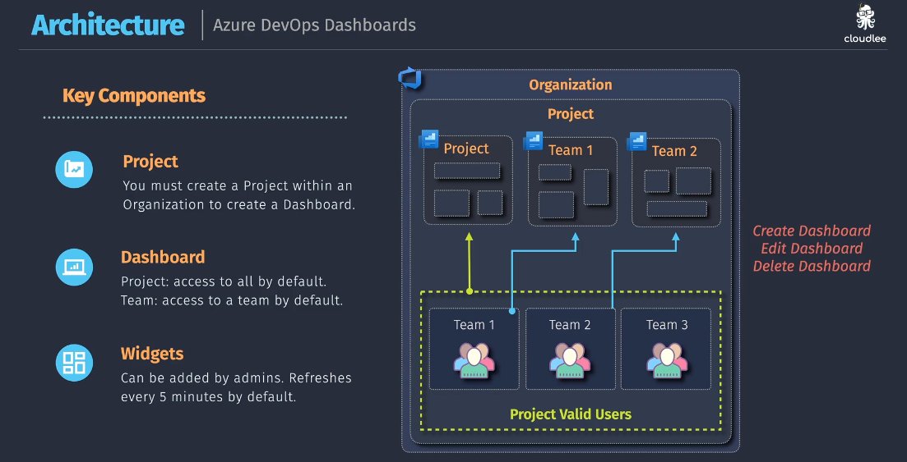
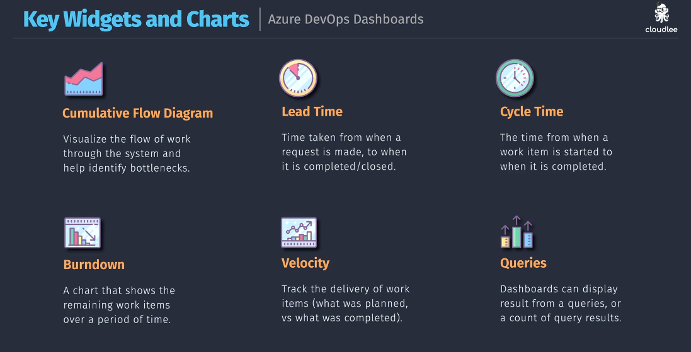
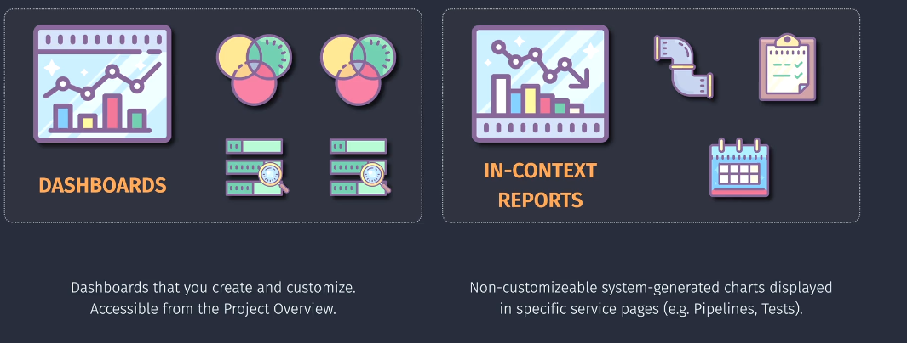

# 📊 Azure DevOps Dashboards

> “Your product might be flying through the cloud, but without a dashboard — you're flying blind.”

---

## 🧠 What Is It Really?

> **Definition**:
> An **Azure DevOps Dashboard** is a **customizable visual interface** that gives your team **real-time insight** into work items, builds, releases, test results, velocity, bugs, and more — across projects and teams.

Imagine you’re running a high-speed DevOps team. You’ve got:

- 🧩 Work items flowing in (features, bugs, incidents)
- 🔄 Pipelines running every commit
- 🔥 On-call incidents that need response
- 📦 Releases deploying every sprint

How do you track **everything in one place** without digging through a dozen tabs?

> 💡 **Answer**: **Azure DevOps Dashboards** — your **customizable cockpit** that brings **visibility**, **focus**, and **real-time tracking** to your projects.

---

## 🔍 Why Use It?

| Problem                           | Dashboard Solves It                              |
| --------------------------------- | ------------------------------------------------ |
| “I don’t know if we’re on track”  | 📉 Burndown chart shows sprint progress          |
| “What did we ship this week?”     | 🚀 Release widgets show deployment history       |
| “Where are the bugs?”             | 🐞 Query charts highlight priority issues        |
| “How fast are we resolving work?” | ⏱️ Lead time, cycle time, velocity widgets       |
| “Are builds failing again?”       | 🧪 Pipeline status widget says it loud and clear |

---

## 🧱 Key Ingredients (Think LEGO 🧱)

### 🏢 **Project**

You need a **Project** inside your Azure DevOps **Organization** — that’s the container where dashboards live.

### 📊 **Dashboard**

A blank canvas. You can create:

- A **Project-wide** dashboard (visible to all)
- A **Team-scoped** dashboard (only visible to one team)

🔐 Default: Everyone in the project can see dashboards. You can limit editing rights if needed.

### 🧩 **Widgets**

The real magic. You mix & match widgets to visualize:

- Work items
- Sprint metrics
- Query results
- Pipeline health
- Test coverage
- Markdown notes

> 🔄 Widgets auto-refresh every **5 minutes**, or manually.

---

  

---

## 🧭 The Most Valuable Widgets

| Widget                         | Why It Rocks                                                                       |
| ------------------------------ | ---------------------------------------------------------------------------------- |
| 📈 **Cumulative Flow Diagram** | See where work is getting stuck (e.g., tons of work in “In Progress” = bottleneck) |
| ⏳ **Lead Time**               | Time from “created” to “closed” — shows customer wait time                         |
| 🔁 **Cycle Time**              | Time from “started” to “done” — shows execution speed                              |
| 📉 **Burndown**                | Are we on track to finish the sprint?                                              |
| ⚡ **Velocity**                | How much work did we actually complete last 3 sprints?                             |
| 🔍 **Query Tiles**             | Show open bugs, failed test cases, or SLA breaches                                 |
| 🧪 **Pipeline Summary**        | Last build: green, red, or a disaster?                                             |
| 📦 **Release Tile**            | Track what's in Prod, and when it went live                                        |

---

  

---

## 👷 Real Use Case: DevOps Team Dashboard

Imagine you're part of a DevOps or SRE squad managing multiple microservices. Here's a killer dashboard setup:

| Widget             | Example                                           |
| ------------------ | ------------------------------------------------- |
| 📉 Sprint Burndown | Remaining stories/tasks                           |
| 🧪 Pipeline Tile   | Build status for “frontend-service”               |
| 📦 Release Tile    | Last successful prod deployment                   |
| 🐞 Bug Chart       | Active bugs by priority                           |
| 🔥 Query Tile      | “Unassigned P1 Incidents”                         |
| ⏱️ Cycle Time      | How fast is our delivery team closing work items? |
| 📎 Markdown Notes  | Team OKRs or on-call checklist                    |

This dashboard keeps everyone aligned — developers, testers, PMs, and ops.

---

## 🔎 Dashboards vs In-Context Reports

| Feature          | Dashboards                         | In-Context Reports                           |
| ---------------- | ---------------------------------- | -------------------------------------------- |
| 📍 Location      | Project Overview → Dashboards      | Inside Pipelines, Repos, Tests, etc.         |
| 🎨 Customizable? | ✅ Fully                           | ❌ No                                        |
| 📊 Data Source   | Queries, pipelines, builds, boards | Specific services only                       |
| 🎯 Use Case      | Team summary, visibility           | Service-specific metrics (e.g., test pass %) |

---

  

---

> 🧠 **Best practice**: Use dashboards for **collaborative visibility**, and in-context reports for **deep-dive analysis**.

---

## 💬 My Pro Tips as Your DevOps Buddy

✅ **Start with one dashboard per team**, with widgets grouped by:

- Work tracking
- Build health
- Deployment history
- Incident status

✅ **Use saved queries** in widgets. This gives flexibility like:

- All bugs assigned to me
- P1 incidents opened in the last 7 days
- Stories not updated in last 3 days

✅ **Pin dashboards to your Azure DevOps overview page** so the team sees it first thing in the morning.

✅ **Use Markdown widget** for quick team notes — OKRs, deployments, or links to runbooks.

✅ **Automate dashboard creation** via REST API for large orgs or CI/CD visibility.

---

## ✅ TL;DR Summary

| Concept             | Value                                                              |
| ------------------- | ------------------------------------------------------------------ |
| 🎨 Custom Dashboard | Yes, per team or project                                           |
| 📊 Widgets          | Show charts, pipelines, releases, bugs, metrics                    |
| 🔄 Refresh Interval | 5 minutes (default)                                                |
| 👥 Visibility       | All users in project unless restricted                             |
| 🔐 Editable         | By project admins or team members with permission                  |
| 🔧 Setup            | Portal or via REST API                                             |
| 📈 Best For         | DevOps metrics, delivery visibility, tracking bugs/sprints/deploys |
