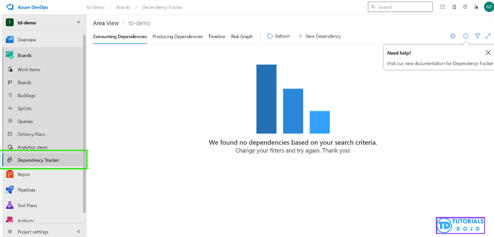

# 🔗 Azure DevOps **Dependency Tracker Extension**

## 📌 1. What is it?

The **Dependency Tracker** is an **Azure DevOps Marketplace extension** that helps teams **visualize and manage dependencies** between work items across teams, projects, and even organizations.

👉 Think of it like a **map of blocked work**:

- “Feature A can’t finish until Feature B is done.”
- “Team Alpha’s work depends on Team Beta’s API.”

Instead of relying on messy spreadsheets or tribal knowledge, you **track dependencies inside Boards**.

---

  

---

## 📌 2. Why Do We Need It?

In **Agile @ Scale** (multiple teams, SAFe, LeSS, big enterprises):

- Dependencies become blockers if unmanaged.
- Teams waste time waiting, or worse → deliver broken features.

Dependency Tracker helps by:

- 🕸️ Showing **all dependencies** in one place.
- 🚦 Marking risks (blocked work items).
- 📊 Supporting **program increment (PI) planning**.
- 🔎 Giving leaders visibility across many teams/projects.

---

## 📌 3. How It Works

### 🔹 Step 1: Install Extension

- From **Azure DevOps Marketplace** → install on your org.

### 🔹 Step 2: Enable Dependency Links

- Work items (User Stories, Features, Epics) already support links like:

  - **“Predecessor → Successor”**
  - **“Related To”**

- Dependency Tracker uses these links to build maps.

### 🔹 Step 3: Visualize in Dependency Tracker Hub

- Go to **Boards → Dependency Tracker**.
- You’ll see:

  - Dependency matrix (grid view).
  - Timeline view (dependencies across sprints/releases).

---

## 📌 4. Features

| Feature                   | What it Does                                    | Why It Helps                    |
| ------------------------- | ----------------------------------------------- | ------------------------------- |
| **Dependency Matrix**     | Table of “who depends on whom.”                 | Spot blocked teams quickly.     |
| **Timeline View**         | Shows dependencies across **sprints/releases**. | Great for PI Planning.          |
| **Cross-Team Visibility** | Works across multiple teams/projects.           | Perfect for scaled Agile.       |
| **Drill-Down**            | Click dependency → opens linked work item.      | No need to context-switch.      |
| **Risk Highlighting**     | Shows overdue or high-risk dependencies.        | Prevents last-minute surprises. |

---

## 📌 5. Real-World Example

### Scenario: Building an **E-commerce Platform**

- **Team A**: Works on **Checkout UI**.
- **Team B**: Works on **Payment API**.

👉 Checkout UI (Team A) **depends** on Payment API (Team B).

1. Team A creates a **User Story**: “As a shopper, I want to pay with credit card.”
2. They link it to Team B’s story: “Build Payment API” → **Predecessor**.
3. Dependency Tracker shows:

   - Team A is blocked until Team B finishes.
   - Timeline view: if Team B’s sprint slips, Team A’s delivery is at risk.

---

## 📌 6. Where It Fits in Azure DevOps

- **Boards** → Dependency Tracker hub.
- Works with **Work Items, Epics, Features, User Stories**.
- Complements **Delivery Plans** (roadmaps) → now you see _what depends on what_.

---

## 📌 7. Exam & Practice Notes

- **Keyword “visualize cross-team dependencies” → Dependency Tracker**.
- If question is about **timeline planning** → Delivery Plans.
- If about **dependencies blocking work** → Dependency Tracker.
- If about **risk visibility in Agile @ Scale** → Dependency Tracker.

---

## ✅ TL;DR

- Dependency Tracker = **extension for Azure Boards**.
- Purpose = **manage dependencies across teams/projects**.
- Views = **Matrix + Timeline**.
- Real-world = “UI team blocked until API team finishes.”
- Exam keyword = _“visualize/manage cross-team dependencies.”_
