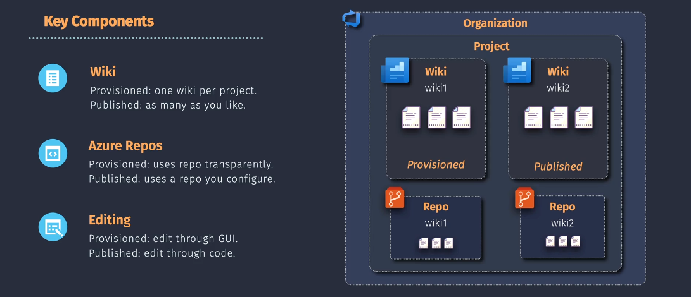

# 📚 Azure DevOps Wiki – Your Team’s Brain in Markdown

> “Where tribal knowledge becomes team knowledge. Document it or forget it.”

---

## 🧠 What Is Azure Wiki?

> Azure Wiki is a **collaborative documentation platform** inside Azure DevOps where your team can **create, edit, and share**:

- Runbooks
- Deployment procedures
- Incident playbooks
- Feature specs
- Internal docs

Think of it like **Confluence**, but built into Azure DevOps.

---

## 🧩 Types of Wikis – Pick Your Weapon 🎯

### 1️⃣ **Provisioned Wiki**

> Created **directly from the Azure DevOps portal**  
> 🧪 WYSIWYG-friendly  
> 📂 **One per project**

| Feature        | Value                                           |
| -------------- | ----------------------------------------------- |
| 🎨 Editor      | Web GUI (WYSIWYG + Markdown)                    |
| 🧾 Storage     | Stored in hidden Azure Repo (in the background) |
| 🔐 Permissions | Project-wide settings                           |
| 💡 Good For    | Small teams, quick setup, minimal git knowledge |

---

### 2️⃣ **Published Wiki**

> Created from **a Git repo you own**, then linked to DevOps Wiki viewer  
> 💻 Git-first, version-controlled  
> 📂 **Supports multiple per project**

| Feature        | Value                                                                        |
| -------------- | ---------------------------------------------------------------------------- |
| ✍️ Editor      | Markdown via repo (VS Code, Git CLI)                                         |
| 🧾 Storage     | Any Git repo (can be version-controlled, branched)                           |
| 🔐 Permissions | Managed via Git repo ACL                                                     |
| 💡 Good For    | Advanced versioning, large teams, CI/CD doc workflows, docs-as-code nerds 😎 |

---

## 🧱 Architecture Breakdown

  

---

## 🧩 Key Differences Table

| Feature                       | 🧾 Provisioned Wiki       | 🧠 Published Wiki               |
| ----------------------------- | ------------------------- | ------------------------------- |
| 📦 Creation                   | From Portal UI            | From Git repo                   |
| 📄 Storage                    | Auto Azure Repo (hidden)  | Custom repo of your choice      |
| ✍️ Editing                    | Web UI (Markdown/WYSIWYG) | Markdown in code editor         |
| 📁 Count per project          | 1 max                     | Unlimited                       |
| 🧪 Supports CI/CD doc updates | ❌ No                     | ✅ Yes                          |
| 👥 Permissions                | Inherited from project    | Controlled via repo permissions |
| 📤 Exportable to Git          | ❌                        | ✅ Already Git                  |

---

## 🔧 When Should You Use Each?

| Use Case                                      | Best Wiki Type                   |
| --------------------------------------------- | -------------------------------- |
| 💡 Quick notes, meeting recaps                | **Provisioned Wiki**             |
| 🧪 Deployment guides, SOPs, checklists        | **Provisioned** or **Published** |
| 🧠 Version-controlled technical documentation | **Published Wiki**               |
| 📦 Multiple documentation types per project   | **Published Wiki**               |
| 🛠️ Docs-as-Code via PR reviews                | **Published Wiki**               |
| 🏃 “Let’s just write now” teams               | **Provisioned Wiki**             |

---

## ✏️ How to Create Each One

### ✅ Provisioned Wiki

1. Go to **Azure DevOps > Project > Wiki**
2. Click **“Create project wiki”**
3. Start editing in browser (Markdown or GUI editor)

### ✅ Published Wiki

1. Create a **repo** (e.g. `infra-wiki`) in Azure Repos
2. Add `.md` files
3. Go to **Wiki → Publish code wiki**
4. Select your repo and folder (like `/docs`)
5. Voila — it’s browsable like a normal Wiki

---

## 🧠 Pro Tips from Me to You

- ✅ Use **Markdown headers and links** to create a Table of Contents
- 🔗 Interlink pages with `[[Page Name]]` (like a wiki)
- 🔐 Control access to published wikis using **repo policies**
- 💥 Use **branching** in Published Wikis to review doc changes via PRs
- 🔄 CI/CD integration? Published Wiki = ✅ (since it’s just Git!)

---

## ✅ Summary

| Feature    | Provisioned Wiki         | Published Wiki                |
| ---------- | ------------------------ | ----------------------------- |
| Creation   | Via Azure portal         | Via Git repo                  |
| Editor     | WYSIWYG + Markdown       | Markdown-only                 |
| Stored In  | Azure DevOps hidden repo | Git repo of your choice       |
| Versioning | Limited                  | Full Git versioning           |
| Use Cases  | Quick project notes      | Docs-as-code, technical teams |
| Count      | 1 per project            | Unlimited                     |
