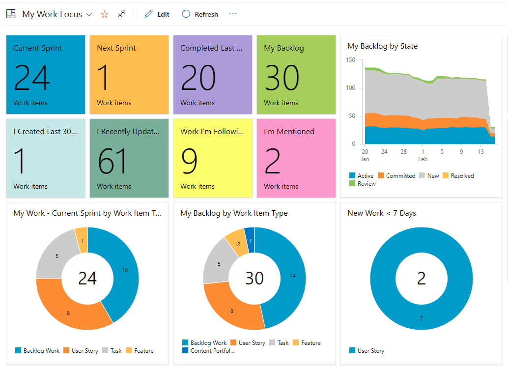
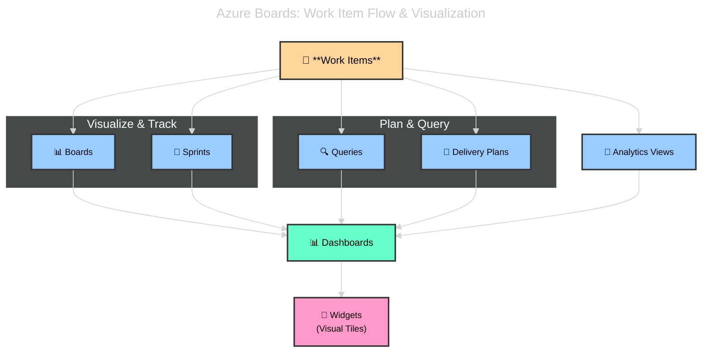
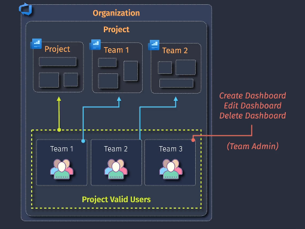

# 📊 **Dashboards & Widgets in Azure DevOps**

## 📖 **What is a Dashboard?**

- A **Dashboard** is a **customizable canvas** inside Azure DevOps where you can pin **Widgets** to show project status, progress, and key metrics.
- Each project can have **multiple Dashboards** (per team, per feature area, or per audience).
- They act like the **team’s mission control center**.

---

<div align="center">
  
</div>

---

## 🧩 **What are Widgets?**

- **Widgets** are the **building blocks of Dashboards**.
- Each widget = a visual component showing specific data.
- Examples:

  - **Burndown chart widget** → sprint progress.
  - **Query result widget** → list of high-priority bugs.
  - **Build history widget** → CI/CD pipeline runs.
  - **Work item chart widget** → pie chart of open bugs by severity.

👉 **Widgets = dashboard tiles that show live project data.**

---

## 📂 **Types of Dashboards**

1. **Team Dashboards**

   - Created at **team level**.
   - Focused on sprint goals, PBIs, and team velocity.

2. **Project Dashboards**

   - High-level view across multiple teams.
   - Used by managers, PMs, stakeholders.

3. **Custom Dashboards**

   - Create as many as needed (e.g., _Release Dashboard_, _QA Dashboard_, _Executive Dashboard_).

---

## 📊 **Common Widgets**

<div align="center">
  
</div>

---

- **📌 Work Tracking Widgets**

  - Sprint Burndown
  - Velocity
  - Cumulative Flow Diagram
  - Work Item Query Results

- **📌 Pipeline Widgets**

  - Build history
  - Release pipeline summary

- **📌 Test Widgets**

  - Test plan progress
  - Bugs found by tests

- **📌 Code Widgets**

  - Pull request activity
  - Code coverage results

📌 Example Dashboard Layout (E-commerce project):

```ini
Dashboard: Sprint 5 Status
 ├─ Sprint Burndown (chart)
 ├─ Velocity (chart)
 ├─ Query: All Priority 1 Bugs
 ├─ Build Pipeline Health
 ├─ Release Deployment Status
```

👉 At a glance: are we delivering features, are builds stable, are bugs under control?

---

## 📊 **Diagram** – Where Dashboards Fit

<div align="center">



</div>

> 👉 **Dashboards sit on top of everything else, showing it all in one place.**

---

## 🔗 **Integration**

Dashboards & Widgets pull data from everywhere in Azure DevOps:

- **Boards** (work items, burndown, velocity).
- **Repos** (PRs, commits).
- **Pipelines** (build/release health).
- **Tests** (test pass rates, bugs).
- **Queries** (custom lists, charts).

👉 They are **the glue** that unifies all Azure DevOps services into one view.

---

## 🧾 **Governance & Best Practices**

<div align="center">
  
</div>

---

- Use **team-level dashboards** for sprint execution.
- Use **executive dashboards** for portfolio progress (Delivery Plans + Velocity trends).
- Keep dashboards **simple, focused** → too many widgets = noise.
- Pin **queries** for transparency (e.g., “All Critical Bugs”).
- Use **Analytics Widgets** for advanced reporting (requires Analytics extension).

---

## ✅ **Exam Cheat Sheet**

- **Dashboard** = customizable page for visibility.
- **Widget** = visual tile that shows data (work items, builds, metrics).
- **Team Dashboard** = sprint-level status.
- **Project Dashboard** = cross-team, high-level view.
- **Common Widgets** = Burndown, Velocity, CFD, Build health, Query results.
- **Integration** = Boards, Pipelines, Repos, Tests, Queries → all feed into dashboards.

⚠️ **Exam traps:**

- If question says _“visualize sprint progress for team”_ → **Dashboard + Burndown widget**.
- If _“see list of open bugs Priority=1”_ → **Query widget on Dashboard**.
- If _“compare velocity across sprints”_ → **Velocity widget**.
