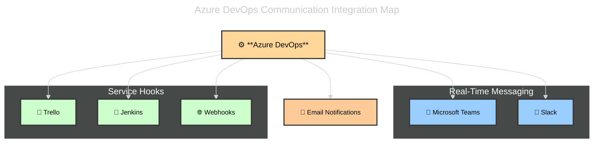

# 📨 Communication & Collaboration in Azure DevOps

## 📖 1. Why Communication Matters in DevOps

Agile + DevOps = **transparency + fast feedback**.
But feedback is useless if no one **sees it**.

- Code merged? → team must know.
- Build failed? → dev must be alerted.
- Bug created? → QA should be notified.
- Release deployed? → stakeholders should celebrate 🎉.

👉 Communication integrations make Azure DevOps a **teamwork hub, not an isolated tool**.

---

## 💬 2. Integrations

### 🔹 Microsoft Teams

- **Tight integration** (since Teams is Microsoft’s product).
- Capabilities:

  - Subscribe to **Boards, Pipelines, Repos** updates.
  - Post notifications directly in Teams channels (e.g., “Build failed”).
  - Use **Azure DevOps bot** in Teams:

    - Query work items (`@AzureDevOps show my bugs`).
    - Create work items directly from Teams.

- **Best For:** Teams already living in MS ecosystem.

---

### 🔹 Slack

- Very similar to Teams, but via **Slack app integration**.
- Capabilities:

  - Notifications for builds, releases, PRs, work items.
  - Slash commands like `/azboards create bug`.

- **Best For:** Teams already using Slack as their chat platform.

---

### 🔹 Email Notifications

- Built-in in Azure DevOps.
- Configurable alerts for:

  - Work item changes (assigned to me, state changed).
  - Builds and releases (success/failure).
  - Pull requests (created, merged, approved).

- **Best For:** Individuals who prefer inbox over chat.
- ⚠️ Downside: Can get noisy → best to filter/limit rules.

---

### 🔹 Service Hooks

- **Definition:** A generic way to connect Azure DevOps to **any external service** (like Zapier, Trello, Jenkins, GitHub, custom webhooks).
- Supported out-of-the-box: Teams, Slack, Trello, Jenkins, Webhooks, and more.
- Example triggers:

  - When a work item is created.
  - When a build completes.
  - When a code push happens.

- **Best For:** Extending DevOps beyond Microsoft tools.

📌 Example:

- New bug created in Azure DevOps → Service Hook sends a webhook → Jira or Trello card created automatically.

---

## 📂 3. Real-World Scenarios

- **Teams integration** → Sprint review scheduled, bot posts “Sprint 5 burndown available.”
- **Slack integration** → Build fails → message instantly posted in `#devops-alerts`.
- **Email alerts** → QA lead gets notified of new P1 bug assigned.
- **Service Hook** → After deployment, trigger a webhook → send status to monitoring dashboard.

---

## 🧾 4. Exam Cheat Sheet

| Integration       | Best Use Case                              | Key Point for Exam                                |
| ----------------- | ------------------------------------------ | ------------------------------------------------- |
| **Teams**         | Daily DevOps collaboration in MS ecosystem | Query work items & get notifications inside Teams |
| **Slack**         | Non-MS chat environments                   | Slash commands + notifications                    |
| **Email**         | Individual alerts                          | Good but noisy; configure rules                   |
| **Service Hooks** | Connect DevOps → external tools            | Generic trigger-action bridge                     |

⚠️ **Exam traps:**

- If question says _“integrate with external system (not MS)”_ → Service Hooks.
- If _“developers want notifications inside Teams”_ → Teams integration.
- If _“need email alerts for work item assignment”_ → Email notifications.

---

## 📊 Diagram – How Comm Integrations Fit

👉 Azure DevOps is the **engine**. Integrations spread its updates everywhere.

---

## ✅ Recap

- **Teams & Slack** → Chat-based collab, with bots/commands.
- **Email** → Individual notifications (classic, but noisy).
- **Service Hooks** → Connect to _anything_ else.
- Together → they ensure DevOps events reach the **right people, at the right time**.
