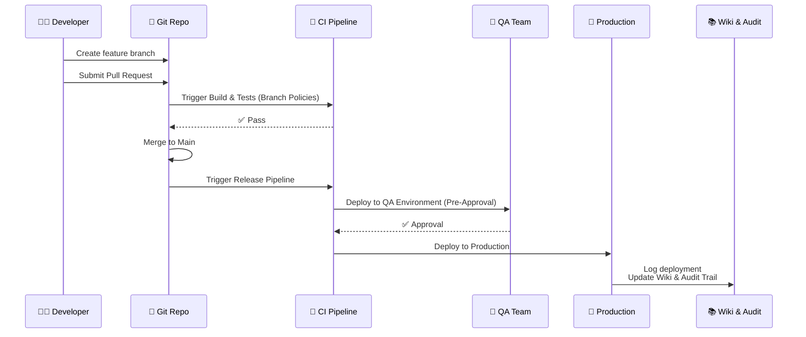

# 🧭 Project Governance in Azure DevOps

## 📖 What is Governance?

- **Governance** = policies, controls, and approvals that ensure software delivery follows **standards, compliance, and quality rules**.
- It balances **agility vs safety**.
- In Azure DevOps, governance is enforced through:

  - **Policies** (rules on repos, pipelines, or work items).
  - **Approvals** (manual checkpoints).
  - **Documentation** (Wikis, compliance evidence).

👉 Think of governance as the **“traffic lights” of DevOps**. You can still drive fast, but within safe limits.

---

## 📜 Policies

### 🔹 Branch Policies (Repos)

- **Require pull requests (PRs)** before merging.
- **Minimum reviewers** → e.g., at least 2 approvals.
- **Check builds must pass** before merge.
- **Limit merge types** → squash, rebase, etc.
- **Work item linking** → PR must be tied to a work item.
- **Require comment resolution** → all feedback addressed before merge.

📌 Example:

- Policy: _All changes to `main` must have 2 reviewers + successful CI build._

⚠️ **Exam Tip**: If you see _“enforce code review before merge”_ → **Branch Policy**.

---

### 🔹 Pipeline Policies

- Require approvals before running pipelines (esp. deployments).
- Gate releases with quality checks (e.g., test coverage, artifact scanning).

📌 Example:

- Deploy to Production requires **security approval**.

---

### 🔹 Work Item Policies

- Control how work items move states.
- E.g., cannot close a Bug unless “Resolved Reason” is filled.

📌 Example:

- Bug must have **priority + severity** fields before moving to Done.

---

## 👥 Approvals

- **Manual checkpoints** before critical actions.
- Commonly used in **release pipelines** (environments).
- Types:

  - **Pre-deployment approvals** → before moving to QA/Prod.
  - **Post-deployment approvals** → after deployment validation.

📌 Example:

- Rule: Deploying to **Production** requires approval from:

  - QA Lead
  - Security Officer
  - Product Manager

👉 Ensures **accountability and traceability**.

---

## 📑 Compliance Documentation

- DevOps is not only coding → it’s also proving compliance.
- **Wikis** used for:

  - Security policies.
  - Release notes.
  - Incident response plans.

- **Dashboards & Analytics** provide **audit trails**:

  - Who approved what.
  - Which PRs had reviews.
  - Which builds/tests passed before release.

📌 Example:

- For ISO/PCI compliance: show “every PR to main had 2 reviews + passing tests.”

---

## 📊 Real-World Governance Example

E-commerce project, deploying checkout service:

1. Dev creates feature branch.
2. Branch policy → must submit PR.
3. PR linked to User Story → at least 2 approvals required.
4. CI pipeline runs automatically (unit + security tests).
5. Policy → build must pass before merge.
6. Merge allowed only via squash → clean history.
7. Deployment pipeline runs → blocked at **QA approval**.
8. After testing, PM + Security approve → production release.
9. Evidence stored in Wiki + Azure DevOps logs.

👉 Result: **Agility with safety**.

---

## 🧾 Exam Cheat Sheet

| Governance Tool             | Purpose                              | Example Exam Phrase                 |
| --------------------------- | ------------------------------------ | ----------------------------------- |
| **Branch Policies**         | Enforce repo standards               | “Require 2 reviewers before merge”  |
| **Pipeline Approvals**      | Control deployments                  | “Prod deployment needs QA approval” |
| **Work Item Policies**      | Ensure tracking compliance           | “Bug cannot close without severity” |
| **Compliance Docs (Wikis)** | Store governance policies & evidence | “Where to document security rules”  |

---

## 📊 Diagram – Governance Flow

---

## ✅ Recap

- **Governance = rules + controls + evidence.**
- **Branch Policies** → code quality & reviews.
- **Pipeline Approvals** → safe deployments.
- **Work Item Policies** → enforce process rules.
- **Compliance Docs** → Wikis + dashboards for audits.
- All ensure agility without sacrificing security or compliance.
