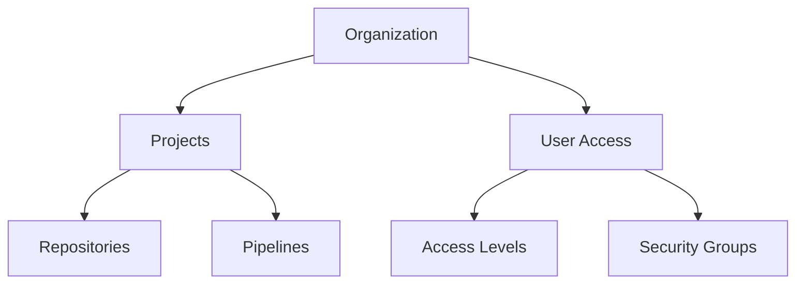

# 👥 Users in Azure DevOps

> 📖 In **Azure DevOps**, you invite users to your **DevOps Organization**, give them **access level + permissions**, and they interact with projects, repos, pipelines, etc.

---

## 🏗️ **How Azure DevOps Are Organized**

Azure DevOps has a **layered structure** where users fit in:

---

- **Organization**: top scope, where users are invited.
- **Project**: workspace (Repos, Boards, Pipelines).
- **Access Level**: license-based (Free, Basic, Stakeholder, Visual Studio Subscriber).
- **Security Groups**: control permissions (Project Admins, Contributors, Readers).

---

## 💳 **Access Levels**

When you invite a user, you must assign an **Access Level**. This is **license-driven**:

| Access Level                 | Typical Use         | Permissions                                        |
| ---------------------------- | ------------------- | -------------------------------------------------- |
| **Stakeholder (Free)**       | Execs, PMs          | View dashboards, work items. No code or pipelines. |
| **Basic (Paid)**             | Developers, Testers | Code repos, pipelines, boards.                     |
| **Basic + Test Plans**       | QA engineers        | Everything in Basic + test management tools.       |
| **Visual Studio Subscriber** | VS IDE users        | Access depends on subscription type.               |

⚡ **Exam Tip**: If they ask “Which license for project managers who only need work tracking?” → **Stakeholder**.

---

## 🔑 **Security Groups**

Security = **who can do what**.
Default groups (auto-created in each project):

**Project-level groups:**

- **Project Administrators** → God mode at project level.
- **Contributors** → Can push code, run pipelines.
- **Readers** → Read-only access.

**Organization-level groups:**

- **Project Collection Administrators** → God mode at org level.
- **Project Collection Build Administrators** → Control pipeline agents, pools.
- **Project Collection Service Accounts** → Used by pipelines internally.

👉 Always assign **least privilege**. Don’t just throw everyone into “Admins” (common anti-pattern).

---

## 🎭 **Access Levels vs Security Groups in Azure DevOps**

### 📌 **Core Difference**

- **Access Levels = License (what features you can see & use)**
- **Security Groups = Permissions (what actions you can perform)**

Think of it like:

- Access Level = 🎟️ your **ticket type** at a theme park (rides available).
- Security Group = 🔑 your **keys** (can you open staff-only doors?).

---

### 🏷️ **1. Access Levels** (License-based)

Access Levels decide **which feature set** of Azure DevOps you get, based on your license.

| Access Level                 | Who uses it   | What they can do                                |
| ---------------------------- | ------------- | ----------------------------------------------- |
| **Stakeholder (Free)**       | PMs, Execs    | Track work items, dashboards, NO code/pipelines |
| **Basic (Paid)**             | Devs, Testers | Code repos, pipelines, boards                   |
| **Basic + Test Plans**       | QA engineers  | Basic + test management                         |
| **Visual Studio Subscriber** | VS IDE users  | Depends on subscription tier                    |

👉 **Key Point**: If you don’t have the right **license**, you can’t even _see_ the feature in the UI.
Example: A **Stakeholder** won’t even see the **Repos** or **Pipelines** tabs.

---

### 🔑 **2. Security Groups** (Permission-based)

Security Groups define **what operations** a user can perform inside features they have access to.

Examples of **Project-level groups**:

- **Project Administrators** → full control over a project.
- **Contributors** → push code, run pipelines.
- **Readers** → view-only.

Examples of **Organization-level groups**:

- **Project Collection Administrators** → admin for the whole org.
- **Project Collection Build Administrators** → manage build pipelines & agent pools.

👉 **Key Point**: If you don’t have the right **permissions**, you may _see_ the feature but can’t act on it.
Example: A **Reader** with **Basic** license can see repos, but cannot push code.

---

### 🔄 **How They Work Together**

```mermaid
flowchart TD
    A[User] --> B[🎟️ Access Level]
    A --> C[🔑 Security Group]

    B --> D[Which features you can SEE/USE]
    C --> E[Which actions you can DO]
```

- Step 1: Access Level decides **what’s visible** (Repos, Pipelines, Test Plans).
- Step 2: Security Group decides **what’s allowed** (read-only vs contribute vs admin).

---

### 🧩 **Real-World Example**

👩‍💻 _User = Alice_

- Alice has **Basic Access Level** → she can see **Repos** and **Pipelines**.
- But Alice is only in the **Readers Group** →

  - She can **see repos**,
  - But **cannot push code or edit pipelines**.

If she’s moved to **Contributors Group** → now she can push code & trigger builds.

---

### 🚨 **Exam Scenarios (Traps!)**

- Q: _A PM needs to track work items but should not access code._

  - Answer: **Stakeholder access** (no repos/pipelines at all).

- Q: _A dev needs to commit code but cannot see Test Plans._

  - Answer: **Basic access + Contributor group**.

- Q: _A stakeholder complains they can’t see pipelines._

  - Trick: It’s not permissions, it’s **license (Access Level)**.

---

## ✅ **Quick Summary for Exam**

- **Users = people or service identities.**
- **Access Level = license.**
- **Security Groups = permissions.**
- **Access Level** = License 🎟️ = _Feature Visibility_.
- **Security Group** = Permission 🔑 = _Action Rights_.
- Use **Service Principals for automation**, not PATs.
- Follow **least privilege**.
