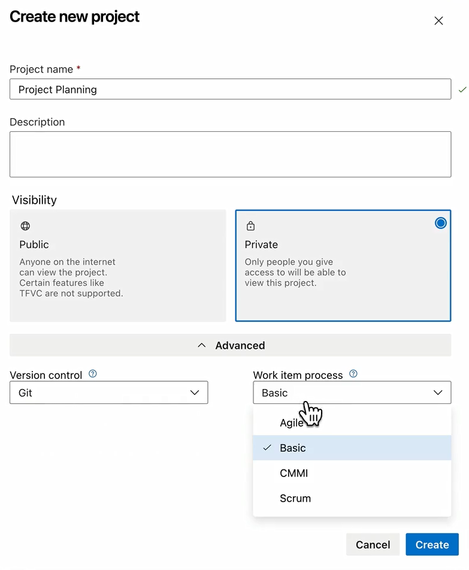
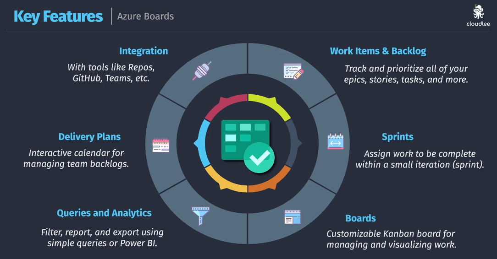
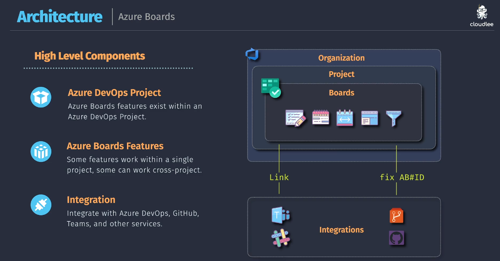
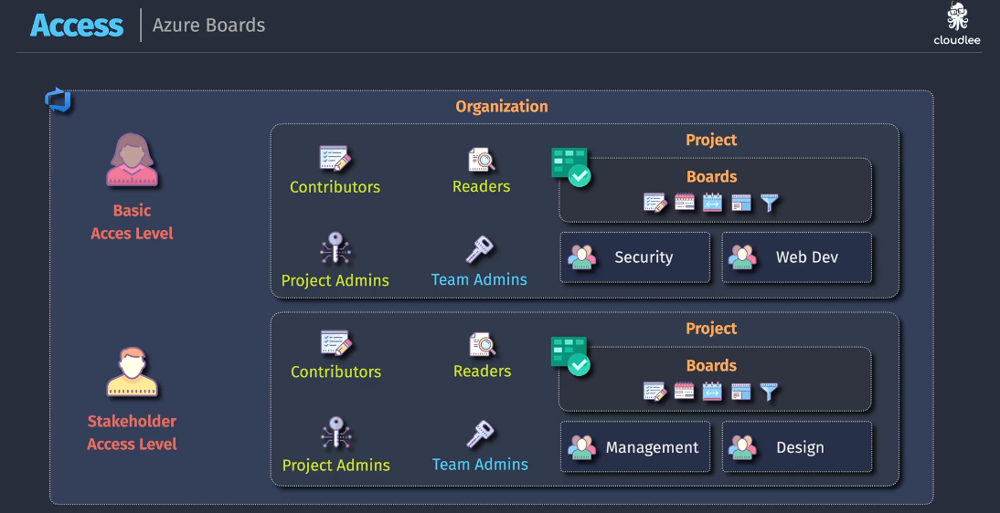
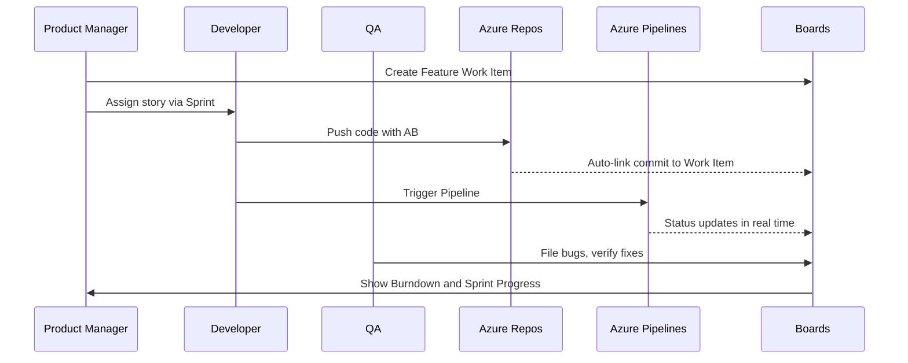

# 🗂️ Azure DevOps Boards – The Engine of Agile 🚦

> 📖 **Official Definition**:  
> Azure Boards is an **agile work tracking tool** inside Azure DevOps for **planning, tracking, and discussing work** across teams.

It’s like **Jira**, but native to Azure DevOps — perfect if you’re already using Azure Repos, Pipelines, or Test Plans.

---

## 🧩 Core Building Blocks

| Concept                       | What It Means                                                      |
| ----------------------------- | ------------------------------------------------------------------ |
| ✔️ **Boards**                 | Visual Kanban boards showing columns for New → Active → Done       |
| 📰 **Work Items**             | Individual units of work (like tickets) — bug, task, feature, etc. |
| ⚙️ **Work Items Process**     | The Methodology of work type — Agile, Basic, CMMI, Scrum, etc.     |
| 🔗 **Work Item Types (WITs)** | Hierarchy of work: Epics → Features → User Stories → Tasks         |
| 🧪 **Queries**                | Custom filtered views of work items                                |
| 📦 **Backlogs**               | Prioritized list of work items (user stories, features)            |
| 📅 **Sprints**                | Time-boxed iterations (1–4 weeks) of deliverable work              |
| 📊 **Dashboards**             | Live progress charts & team metrics                                |

---

## ⚙️ Working Items Process

<div align="center">
  

**1️⃣** Agile
**2️⃣** Basic
**4️⃣** CMMI
**4️⃣** Scrum

</div>

## 🔑 Key Capabilities (Visual Breakdown)

<div align="center">
  
</div>

---

### 🧩 1. **Work Items & Backlog**

- 📌 Every task, bug, feature, or idea starts as a **work item**.
- 🧱 You can organize work items into:

  - **Epics** → **Features** → **User Stories/Tasks**

- 📋 Backlogs show everything pending and help prioritize future work.

### 🏃‍♂️ 2. **Sprints**

- Create **time-boxed iterations** for focused progress.
- Use **Sprint Backlog**, **Capacity Planning**, and **Burndown charts** to stay on track.

### 🧮 3. **Boards**

- Visual **Kanban boards** to manage ongoing work.
- Support custom columns, swimlanes, and WIP limits.
- Real-time drag/drop reflects team progress.

### 📊 4. **Queries & Analytics**

- Powerful filters and custom queries to extract insights.
- 📈 Export data to Power BI for dashboards and trend analysis.

### 🗓️ 5. **Delivery Plans**

- Timeline view of multiple teams, sprints, and milestones.
- Great for **program-level visibility** across parallel tracks.

### 🔗 6. **Integration**

- Out-of-the-box connectors with:

  - Azure Repos / GitHub
  - Microsoft Teams / Slack
  - External CI/CD, tools like Jenkins or JIRA (via extensions)

---

## 🏗️ Architecture

<div align="center">
  
</div>

---

The **structure of Azure Boards** is tightly coupled with the Azure DevOps project hierarchy:

- **Organization** = Your enterprise's root tenant
- **Project** = Logical group of work (e.g., WebApp Project)
- **Boards** = Agile tools within each project
- **External Integration** = Communication & traceability

---

## 🔐 Access Management

<div align="center">
  
</div>

---

Azure Boards access is role-based and highly granular:

| Access Level     | What They Can Do                        | Ideal For            |
| ---------------- | --------------------------------------- | -------------------- |
| 🧑‍💻 Basic      | Full access to Boards, sprints, queries | Dev team, QA, PMs    |
| 🧍 Stakeholder   | View items, comment, create new ones    | Business users       |
| 🔑 Project Admin | Configure settings, permissions         | Tech leads, PMs      |
| 🔑 Team Admin    | Customize workflows, manage iterations  | Scrum Masters, Leads |
| 👀 Readers       | View-only permissions                   | Auditors, Management |

Each team under a project (like `Web Dev`, `Security`) can have its own backlogs and boards, enabling parallel autonomous workflows.

---

## 🔁 Real-World Collaboration Flow

Here’s how process and communication happen using Azure Boards:

<div align="center">



</div>

---

## 📈 Dashboards + Analytics

| Visual             | Insight                           |
| ------------------ | --------------------------------- |
| 🔥 Burndown Chart  | Sprint completion trend           |
| 🧮 Cumulative Flow | Bottleneck visibility             |
| 📊 Velocity        | Compare team capacity vs delivery |
| 📁 Pie/Bar Charts  | Work by type, state, or assignee  |

---

## 🔧 How You Interact With It

| Action              | How                                                |
| ------------------- | -------------------------------------------------- |
| 📝 Create work item | Web portal or `az boards work-item create`         |
| 🔗 Link work items  | Show dependencies                                  |
| ⏳ Track time       | Use Remaining Work field                           |
| 🧠 Add tags         | “High Priority”, “Backend”, “Blocked”              |
| 📬 Assign to user   | From board or item details                         |
| 📋 Queries          | Save filtered views like “All Bugs Assigned To Me” |
| 📍 Dashboards       | Pin charts, queries, goals                         |

---

## ⚙️ Azure Boards vs Jira

| Feature                     | Azure Boards        | Jira                      |
| --------------------------- | ------------------- | ------------------------- |
| 💡 Built into DevOps        | ✅                  | ❌                        |
| 🔧 Highly customizable      | ✅                  | ✅                        |
| 📈 Native reporting         | ✅                  | ✅                        |
| 🧩 Extensible via APIs      | ✅                  | ✅                        |
| 💸 Free Tier                | ✅ Generous         | ⚠️ Limited                |
| 🔁 DevOps CI/CD integration | ✅ Seamless         | ❌ 3rd party plug-ins     |
| ⛓️ Git integration          | Azure Repos, GitHub | Bitbucket, GitHub, others |

---

## 🤖 DevOps Integration Magic

| DevOps Area        | Integration                                                 |
| ------------------ | ----------------------------------------------------------- |
| ✅ Azure Pipelines | Auto-update work item state when a build or deploy succeeds |
| ✅ Azure Repos     | Link commits to work items (via `#123` in commit message)   |
| ✅ GitHub          | Bi-directional linking of PRs and issues                    |
| ✅ Notifications   | Get email/Teams alerts on work item changes                 |
| ✅ REST API        | Automate work item creation/update from scripts             |

---

## 🧠 Pro Tips

- ✅ Use **tags** consistently for filtering (e.g., “infra”, “frontend”, “blocked”)
- 📅 Create a **sprint cadence** (2-week sprints = sweet spot)
- 🧮 Estimate effort using **story points** or hours
- 🔗 Link bugs to features for better traceability
- 🚦 Set up **Board policies** (e.g., prevent closing unless PR is merged)
- 💡 Use **“@mention”** in work item comments to ping teammates

---

## 🧪 Example: Your SRE Task Flow

| Item           | Example                                    |
| -------------- | ------------------------------------------ |
| **Epic**       | “Improve On-Call Observability”            |
| **Feature**    | “Add SLO Dashboards for Web Tier”          |
| **User Story** | “Add uptime alert for Frontend Service”    |
| **Task**       | “Create Grafana panel”                     |
| **Bug**        | “Alert fires even when service is healthy” |

You manage all of this in **Azure Boards**, track progress visually, and sync it with your deployment pipelines 🔁

---

## 🛠️ CLI Example

```bash
az boards work-item create \
  --title "Add Prometheus alert for CPU spike" \
  --type "Task" \
  --assigned-to "devops@contoso.com" \
  --project "InfraOps"
```

---

## ✅ Summary

| Feature            | Azure Boards                                         |
| ------------------ | ---------------------------------------------------- |
| 🧠 Purpose         | Agile planning + work tracking                       |
| 👥 For             | DevOps, Devs, PMs, SREs                              |
| 📦 Key Units       | Work Items (Epics → Features → Stories → Tasks/Bugs) |
| 📈 Visuals         | Boards, Sprints, Charts, Dashboards                  |
| 🔄 Integrates with | Pipelines, Repos, GitHub, Test Plans                 |
| 🚀 Best For        | Teams using Azure DevOps end-to-end                  |
