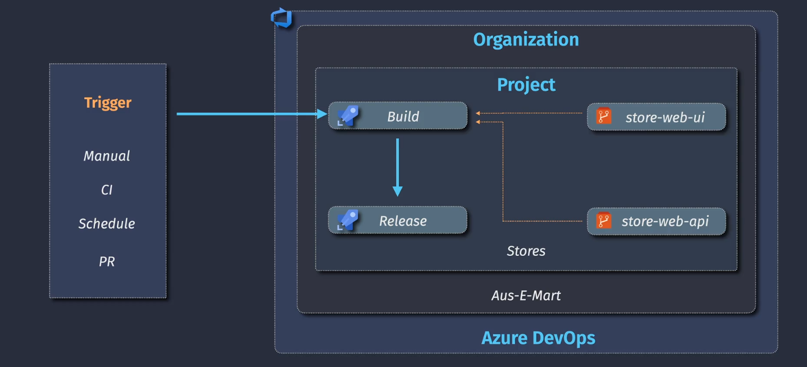
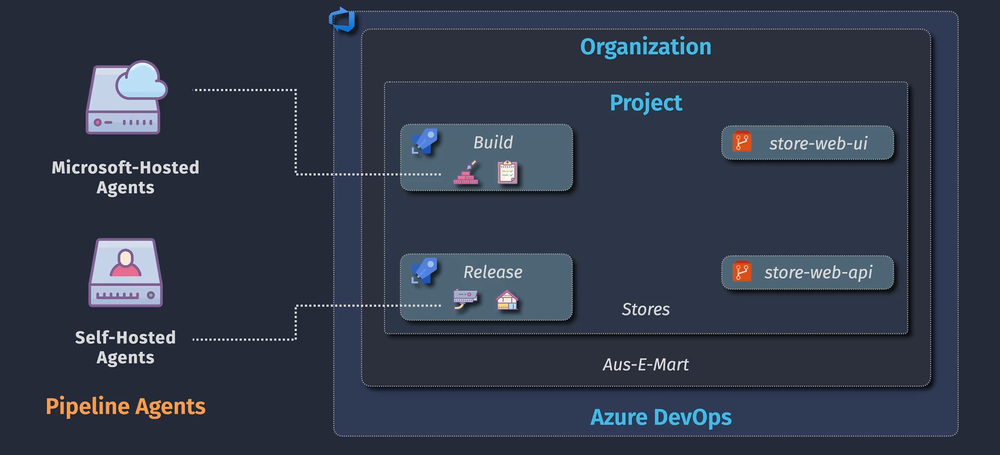

# 🚀 Azure Pipeline Overview

Azure Pipelines is a CI/CD (Continuous Integration / Continuous Delivery) service from Azure DevOps that automates building, testing, and deploying your code to any platform.

---

## 🧬 1. Azure Pipeline Lifecycle

  

### 🔄 Lifecycle Stages:

| Stage                        | Description                                                    |
| ---------------------------- | -------------------------------------------------------------- |
| **Code**                     | Developer writes code in Azure Repos, GitHub, or external Git  |
| **Push / Pull Request**      | Code pushed or a PR is created                                 |
| **Pipeline Triggered**       | Pipeline starts based on trigger (e.g. `trigger:` or PR)       |
| **Build / Test Stage**       | Compiles code, runs unit tests, lints                          |
| **Artifacts**                | Builds produce outputs (e.g. ZIP, DLLs, containers)            |
| **Release Stage (optional)** | Artifact is deployed to environments (e.g. dev, staging, prod) |
| **Monitor**                  | Logs, results, alerts, dashboards for quality & health         |

🔁 This loop continues for every commit → ensuring **automation, quality & speed**.

---

## 🏗️ 2. Azure Pipeline Architecture

  

### 🧱 Core Components in the Architecture:

| Component                                       | Description                                                 |
| ----------------------------------------------- | ----------------------------------------------------------- |
| **Pipeline Definition (`azure-pipelines.yml`)** | Describes the pipeline logic using YAML                     |
| **Pipeline Agent**                              | Executes the steps (can be Microsoft-hosted or self-hosted) |
| **Tasks**                                       | Atomic actions (e.g., `DotNetCoreCLI@2`, `AzureCLI@2`)      |
| **Jobs**                                        | Group of steps (can run in parallel or sequential)          |
| **Stages**                                      | High-level groups of jobs (e.g., Build, Test, Deploy)       |
| **Artifacts**                                   | Compiled outputs saved and passed to next stages            |
| **Triggers**                                    | Auto-run pipelines on code change (e.g., CI or PR triggers) |

💡 Think of YAML as your "pipeline-as-code" brain, and agents as your "hands" doing the work.

---

## 🧩 3. Azure Pipeline Components

  

### 🛠️ Breakdown of Core Components:

| Component       | Description                                                                |
| --------------- | -------------------------------------------------------------------------- |
| **Project**     | Top-level container for everything (repos, pipelines, boards)              |
| **Pipeline**    | Definition that controls build/deploy                                      |
| **Stages**      | Logical grouping (e.g., Build, Deploy)                                     |
| **Jobs**        | Runs on a single agent, can be parallel                                    |
| **Steps**       | Individual tasks or scripts                                                |
| **Tasks**       | Built-in or custom actions                                                 |
| **Variables**   | Reusable values across steps                                               |
| **Artifacts**   | Outputs from build stage                                                   |
| **Environment** | Targets for deployment (Dev, QA, Prod)                                     |
| **Approvals**   | Manual gates before proceeding (e.g., Manager must approve deploy to Prod) |

---

## 🧠 Key Concepts Summary

| Term                   | What it means                                        |
| ---------------------- | ---------------------------------------------------- |
| **CI/CD**              | Continuous Integration / Continuous Delivery         |
| **Agent**              | Machine that runs the pipeline                       |
| **Hosted Agent**       | Microsoft-managed VM (e.g., `ubuntu-latest`)         |
| **Self-hosted Agent**  | Your own VM for custom workloads                     |
| **Artifacts**          | Files you build and want to pass along               |
| **Service Connection** | Secure way to connect to Azure, Docker, GitHub, etc. |
| **YAML**               | Pipeline as code for versioning and automation       |
