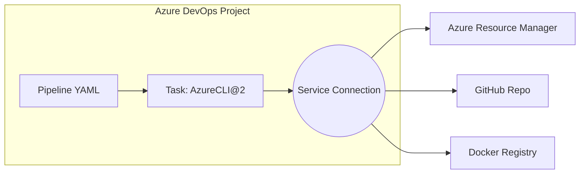
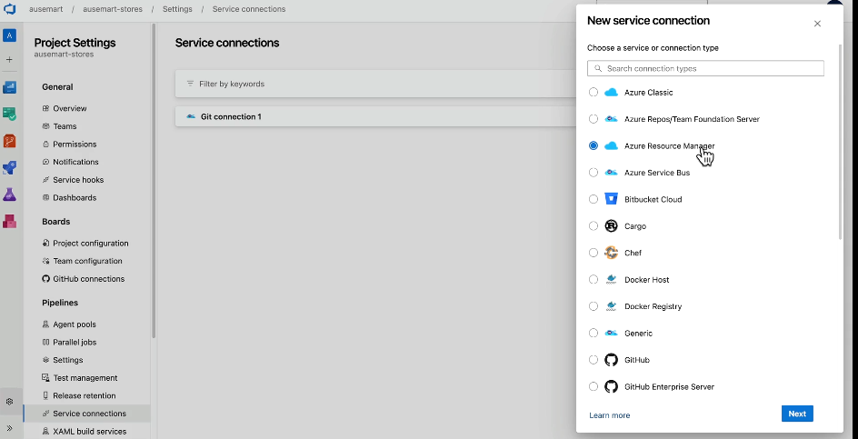
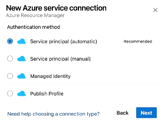
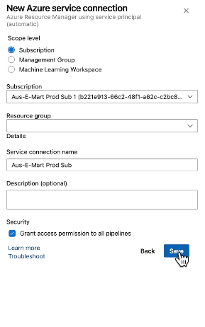

# 🔗 Azure DevOps – Service Connections Overview

> 💡 **Service Connections** are like secure passports that Azure Pipelines uses to **access external services** such as Azure, GitHub, Docker Hub, AWS, etc.

They allow your pipelines to **authenticate** and **perform deployments or actions** in connected services securely — without hardcoding secrets or credentials.

---

## 🧠 What is a Service Connection?

A **Service Connection** lets Azure DevOps Pipeline connect to:

| 💠 Service                       | ✅ Action Enabled                            |
| -------------------------------- | -------------------------------------------- |
| **Azure**                        | Deploy infra with ARM, CLI, Terraform, Bicep |
| **GitHub**                       | Pull repos, trigger pipelines from PRs       |
| **Docker Hub / ACR**             | Push container images                        |
| **Kubernetes**                   | Deploy to AKS or other clusters              |
| **AWS, GCP**                     | Cross-cloud infra deployment                 |
| **Generic (Basic Auth / Token)** | Connect to any RESTful API or service        |

---

## 🏗️ How It Fits in Azure Pipelines

<div align="center">



</div>

> ✅ Pipeline tasks reference the Service Connection to perform actions on external systems.

---

## 🧱 Types of Service Connections

<div align="center">
  
</div>

---

| 🔌 Type                    | 🔐 Authentication                                   | 🌐 Scope                       |
| -------------------------- | --------------------------------------------------- | ------------------------------ |
| **Azure Resource Manager** | Microsoft Entra ID (OAuth 2.0) or Service Principal | Subscription, Management Group |
| **GitHub**                 | OAuth Token or PAT                                  | GitHub Org / Repo              |
| **Docker Registry**        | Username/Password or Service Principal              | DockerHub, ACR                 |
| **Kubernetes**             | KubeConfig or Azure SP                              | AKS / K8s clusters             |
| **Generic**                | Basic Auth or Token                                 | REST APIs                      |
| **Service Fabric**         | Certs or SP                                         | SF Clusters                    |

---

## 🔐 Azure Resource Manager (ARM) Types

Azure is the most common target. Let’s break down ARM connection types.

| 🔗 ARM Connection Type                  | 📌 Use Case                                           | 👤 Auth                  |
| --------------------------------------- | ----------------------------------------------------- | ------------------------ |
| **Service Principal (Automatic)**       | Default, most secure                                  | Entra ID App SP          |
| **Service Principal (Manual)**          | When you provide appId, secret, tenant                | Entra ID SP              |
| **Managed Identity**                    | When running pipeline from Azure-hosted agent with MI | System-assigned identity |
| **Workload Identity Federation (OIDC)** | Modern SP-less auth                                   | Entra ID + OIDC          |

---

<div align="left">
  
</div>

---

## 🔧 Create Azure Resource Manager Connection (Manual)

> You need: `Subscription Owner` or `User Access Administrator` role

### 🔹 Steps:

1. Go to **Project Settings** → **Service connections**
2. Click ➕ **New Service Connection**
3. Select **Azure Resource Manager**
4. Choose one:

   - 📦 **Automatic**: Let DevOps create SP
   - 🧾 **Manual**: Provide:

     - Subscription ID
     - Tenant ID
     - App ID + Secret (Service Principal)

5. Set **scope level**:

   - Subscription or Management Group

6. Save and give it a name like `AzureRM-DevSub`

🔒 Optionally restrict access to pipelines or users.

---

<div align="left">
  
</div>

---

## 🔄 Reuse in Pipeline

```yaml
trigger:
  - main

pool:
  vmImage: "ubuntu-latest"

steps:
  - task: AzureCLI@2
    inputs:
      azureSubscription: "AzureRM-DevSub"
      scriptType: "pscore"
      scriptLocation: "inlineScript"
      inlineScript: |
        az group create --name demo-rg --location eastus
```

> 🔁 The `azureSubscription` field uses the Service Connection name.

---

## ✅ Best Practices

| 🧠 Tip                   | 💬 Explanation                                           |
| ------------------------ | -------------------------------------------------------- |
| 🔐 Avoid secrets in YAML | Always use secure connections and pipeline variables     |
| 🏷️ Use friendly naming   | Name connections per env (e.g., `AzureRM-Staging`)       |
| 🔄 Rotate secrets        | If using SP manually, rotate client secrets periodically |
| 👥 Restrict access       | Use RBAC and project-level permissions                   |
| 🧪 Test permissions      | Run test pipeline to validate access before full deploy  |

---

## 🔍 How to View & Manage

- Go to **Project Settings → Service Connections**
- Click any connection to:

  - 🔍 View details
  - 🔁 Refresh token / secret
  - 🛑 Disable
  - 🧼 Delete

---

## 🧪 Verify from CLI

```bash
az ad sp list --display-name "<AppName>"
az ad sp credential list --id <AppID>
```

Use to check if SP exists, roles assigned, expiry dates.

---

## 🧵 Summary Table

| 🔌 Type  | 👨 Auth         | 📁 Scope      | 🏗️ Used by            |
| -------- | --------------- | ------------- | --------------------- |
| Azure RM | SP or MI        | Sub / MG      | CLI / ARM / Terraform |
| GitHub   | PAT / OAuth     | Org / Repo    | GitHub Task, Checkout |
| Docker   | Basic / SP      | Registry      | Docker Push           |
| K8s      | Kubeconfig / SP | AKS / Cluster | Helm / Kubectl        |
