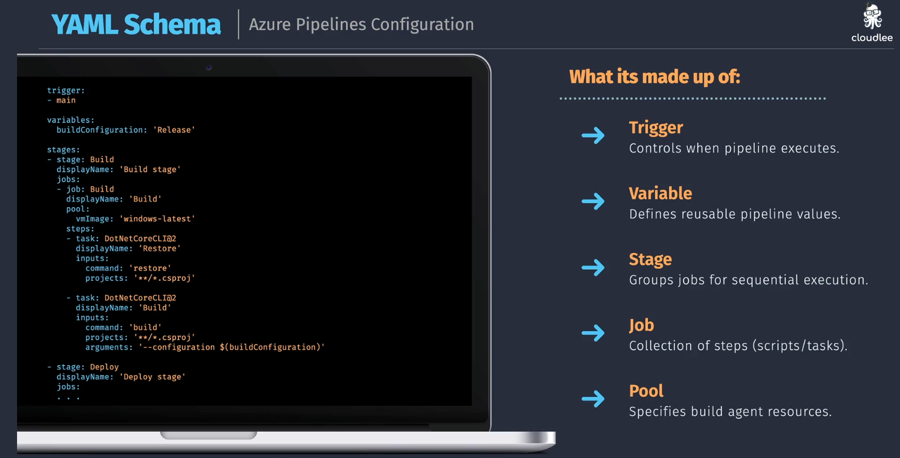

# Azure Pipeline Configuration

## Pipeline Types

1. build pipeline
2. release pipeline

## Pipeline Editors

### 1. Classic UI

  

---

### 2. Yaml Editor

  

  

### Components

1. jobs
2. steps

Two different type of steps

1. task
2. script

## Notes

Classic type used Deployment GROUP

and yaml type used Environment
