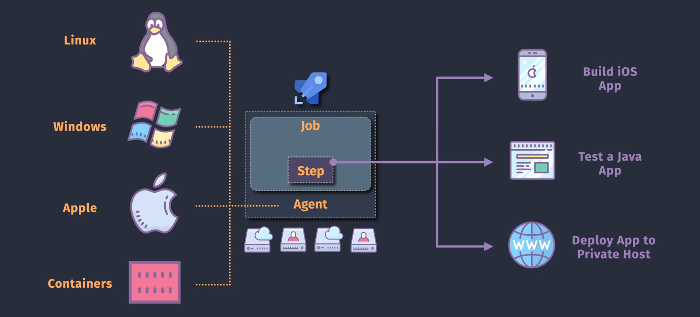
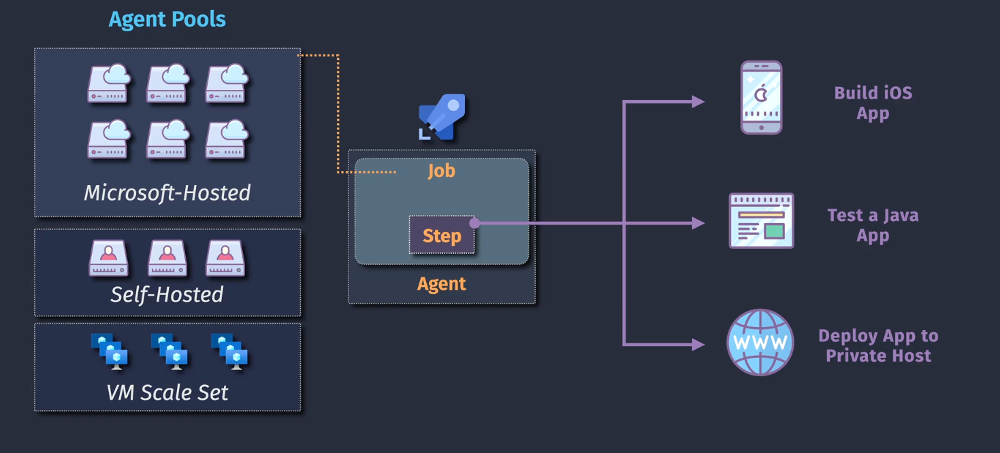
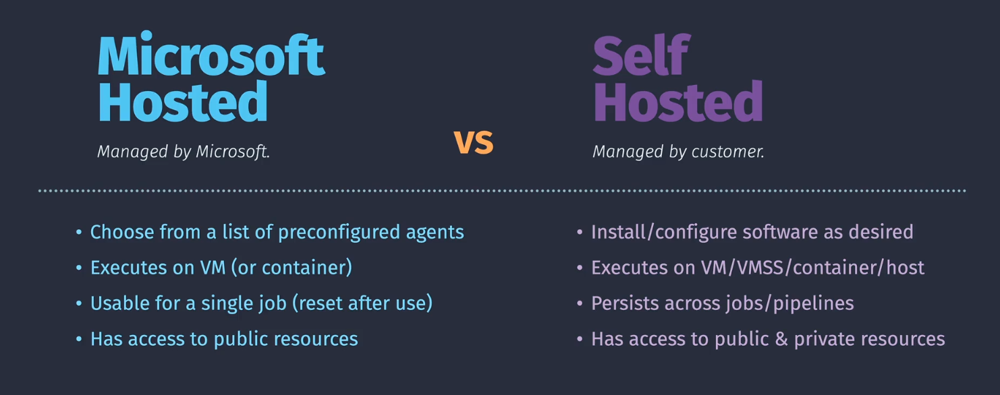
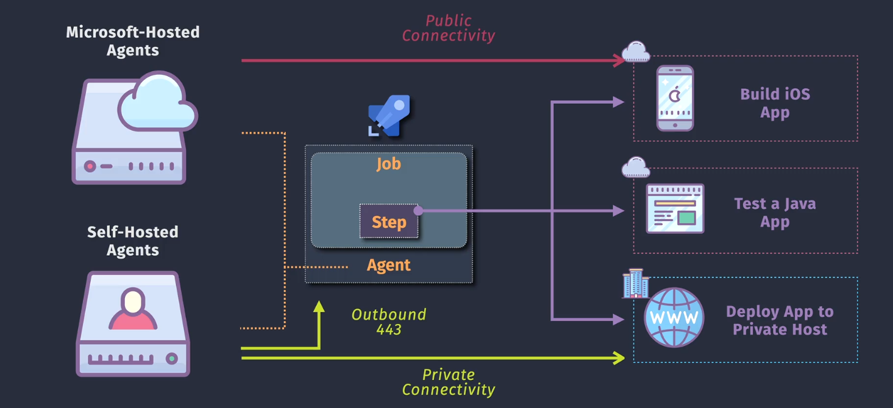
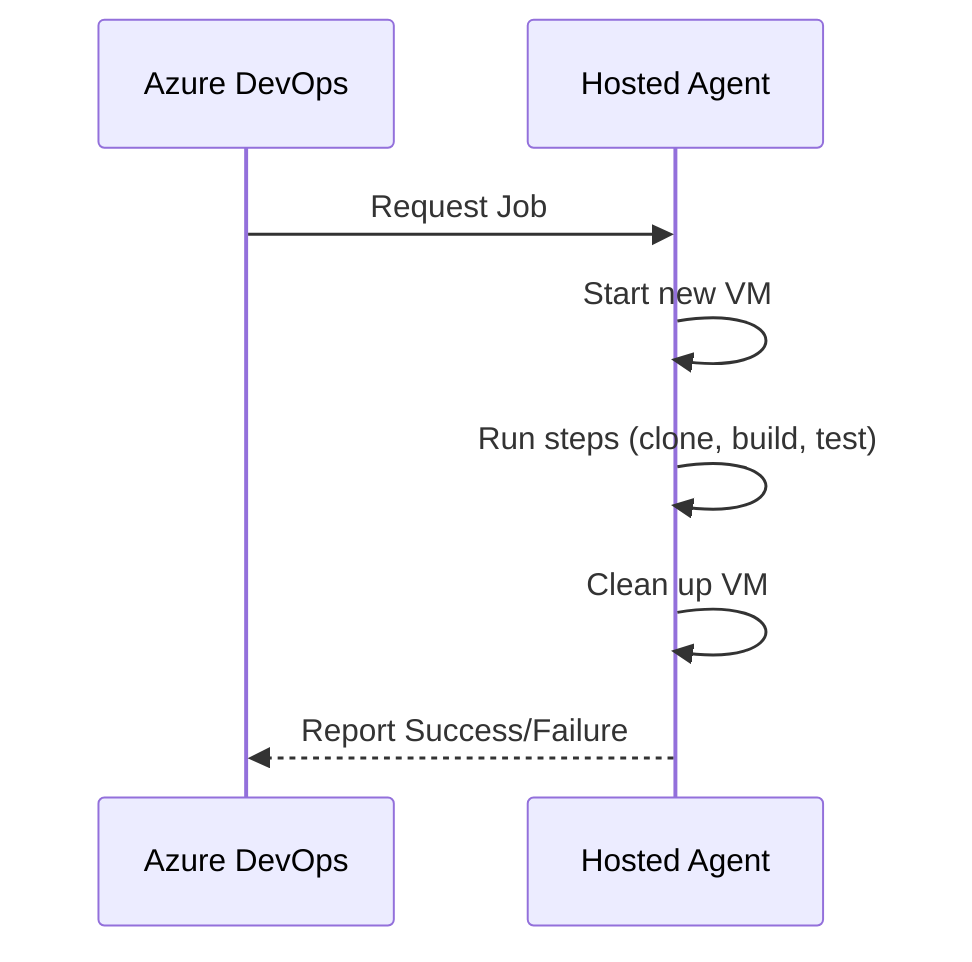

# 🤖 Azure Pipeline Agent & Agent Pools

> In Azure Pipelines, the **agent** is the "worker" that runs your jobs — like building code, running tests, deploying apps.
> The **agent pool** is the "garage" that stores your agents 🚗🚕.

---

<div align="center">
  
</div>

---

## 🔧 What is an Azure Pipeline Agent?

A **pipeline agent** is:

- A **compute resource** (VM or container)
- Executes **jobs** from your pipeline
- Communicates with Azure DevOps via a **pipeline agent listener**
- Can be **Microsoft-hosted** or **Self-hosted**

---

### 💡 Analogy

```text
🔧 Pipeline = Blueprint (YAML)
🤖 Agent = Worker
📦 Job = Task for the Worker
🏭 Pool = Group of Workers
```

---

## 🏊 Agent Pools: What & Why?

An **Agent Pool** is a _logical container_ that holds one or more agents.
When you define a pipeline job, you tell it: “use an agent from this pool.”

<div align="center">
  
</div>

---

**Why Pools?**

- Organize agents by project or department
- Share agents across multiple projects
- Control usage (e.g. limit concurrency)
- Assign permissions (security scoped)

---

## 🧪 Types of Agents

| Agent Type              | Hosted By    | OS Options             | When to Use                                |
| ----------------------- | ------------ | ---------------------- | ------------------------------------------ |
| ✅ **Microsoft-hosted** | Azure DevOps | Windows, Linux, macOS  | Quick setup, no maintenance                |
| 🛠️ **Self-hosted**      | You          | Anything you configure | For custom tools, network, cost efficiency |

---

<div align="center">
  
</div>

---

### ✅ Microsoft-hosted Agent

- Azure DevOps manages the VM
- Pre-installed with tools: .NET, Node, Java, Python, Docker, etc.
- Ephemeral (new VM per job)

```yaml
pool:
  vmImage: "ubuntu-latest"
```

**Options:**

- `ubuntu-latest`
- `windows-latest`
- `macos-latest` (limited free use)

🔗 Full list: [Microsoft-hosted agents tools](https://learn.microsoft.com/en-us/azure/devops/pipelines/agents/hosted)

---

### 🛠️ Self-hosted Agent

- You install the agent on your own machine/VM
- Persistent across jobs
- You control environment/tools/resources

```yaml
pool:
  name: MyCustomPool
```

#### Install Self-Hosted Agent

1. Go to Azure DevOps > Org Settings > Agent Pools
2. Create a pool (if needed)
3. Download the agent
4. Run setup script:

   ```bash
   ./config.sh --url https://dev.azure.com/myorg \
               --auth pat \
               --token <PAT_TOKEN> \
               --pool MyCustomPool
   ```

5. Run the agent:

```bash
./run.sh
```

Now it's online and ready to run jobs! 🟢

---

## ⚙️ YAML Usage

You pick an agent using the `pool` block inside a `job`:

```yaml
jobs:
  - job: BuildApp
    pool:
      vmImage: "ubuntu-latest" # MS-hosted
    steps:
      - script: echo "Building..."
```

Or:

```yaml
pool:
  name: SelfHostedLinuxPool # Self-hosted
```

---

## 🧠 Best Practices

| Practice                          | Why It Matters                             |
| --------------------------------- | ------------------------------------------ |
| Use MS-hosted for simplicity      | No maintenance, good for most CI pipelines |
| Use self-hosted for special tools | When you need legacy SDKs or secure access |
| Limit pool access                 | Use security settings to isolate agents    |
| Monitor agent status              | Azure DevOps shows online/offline status   |
| Scale self-hosted with containers | Use Docker to spin up isolated runners     |

---

## 🔒 Security & Permissions

- You can **control which projects** can use a pool.
- Use **personal access tokens (PAT)** securely during setup.
- Avoid sharing pools across unrelated projects unless isolated.

---

## 🌐 Agent Connectivity: Public vs Private

Understanding how **agents communicate** with Azure DevOps and your infrastructure is critical — especially when deploying to **private networks**, **on-prem servers**, or **cloud VMs without public IPs**.

<div align="center">
  
</div>

---

### 🔌 Connection Flow Overview

| Agent Type          | Connects to                  | Network Type         | Direction                      | Use Cases                              |
| ------------------- | ---------------------------- | -------------------- | ------------------------------ | -------------------------------------- |
| 🟦 Microsoft-hosted | Azure DevOps, Internet       | Public Connectivity  | Azure → Public                 | Building iOS apps, Web apps            |
| 🟩 Self-hosted      | Azure DevOps + Private Infra | Private Connectivity | Agent → Azure (Outbound `443`) | Deploying to VMs, private DBs, on-prem |

---

### 📶 How It Works

#### ✅ Microsoft-hosted Agents

- **Hosted by Microsoft**
- Communicate over public internet
- You CANNOT control their network (no access to your private VNET)
- Good for: **public-facing builds**, simple tests, cloud deploys

#### 🛠️ Self-hosted Agents

- You control their **network and environment**
- Great for **private connectivity**, like:

  - On-prem file shares
  - Databases behind firewalls
  - Internal APIs

- Must allow **outbound HTTPS (port 443)** to Azure DevOps

```plaintext
Agent → dev.azure.com (via port 443)
```

---

### 🧠 Real Scenarios

| Scenario                             | Agent Type       | Why?                               |
| ------------------------------------ | ---------------- | ---------------------------------- |
| 🚀 Build & deploy to Azure Web App   | Microsoft-hosted | No private network needed          |
| 🔐 Deploy to on-prem IIS             | Self-hosted      | Needs access to internal network   |
| 🧪 Run test suite using internal API | Self-hosted      | Cannot expose API to public        |
| 📱 Build iOS app (macOS)             | Microsoft-hosted | Only available in Azure macOS pool |

---

### 🔒 Security Best Practices

- 🧱 **Isolate** self-hosted agents in secure network zones
- 🔐 Use **Private Link** or **Service Tags** to restrict traffic
- 🕵️ Monitor **IP traffic** to/from `dev.azure.com` endpoints
- ⚙️ Consider **Azure DevOps Private Agents on AKS/VMs** for better scale

---

### ⚠️ Key Points to Remember

- Azure DevOps always **initiates communication**, but agents **poll** Azure
- Self-hosted agents **must access Azure DevOps endpoints** over port 443
- Microsoft-hosted agents **cannot access internal systems**

---

## 💡 Agent Lifecycle (MS-hosted)

<div align="center">



</div>

---

## 📋 Summary

| Term        | Description                              |
| ----------- | ---------------------------------------- |
| Agent       | A machine that runs pipeline jobs        |
| Agent Pool  | Group of agents, logical container       |
| MS-hosted   | VMs managed by Azure                     |
| Self-hosted | Your VM/container with custom tools      |
| `vmImage`   | Used to select Microsoft-hosted agent OS |
| `pool.name` | Used to select a self-hosted agent pool  |
