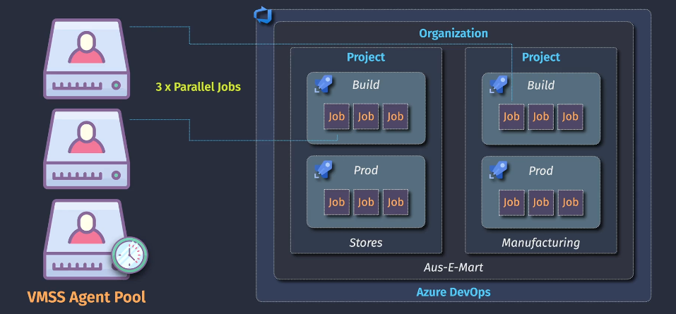
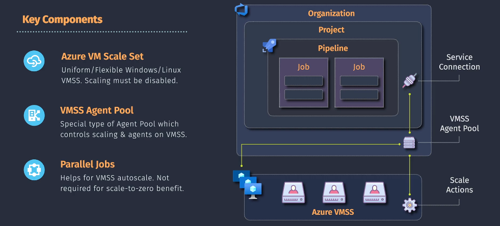
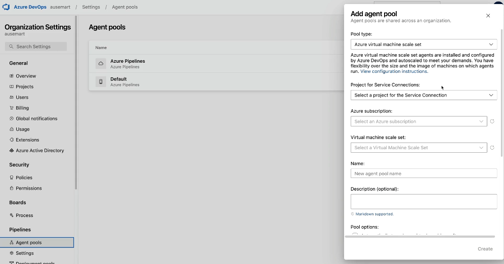

# 🏗️ Azure Pipelines: VMSS Agent Pools Deep Dive

> Use **Virtual Machine Scale Sets (VMSS)** to autoscale self-hosted agents in Azure Pipelines — ideal for scale-to-zero, cost-optimized, and parallel job scenarios.

---

<div align="center">
  
</div>

---

## 🚀 Why VMSS Agent Pools?

- 💸 Traditional self-hosted agents are always running => high cost.
- 💡 Microsoft-hosted agents are ephemeral but limited.
- ✅ VMSS agents give you the best of both worlds:
  - Auto-scale VM agents per demand (scale-out)
  - Scale to zero when idle (scale-in)
  - Use custom VM images (e.g., preinstalled tools)

---

## 🧩 Key Components

<div align="center">
  
</div>

| Component              | Description                                                      |
| ---------------------- | ---------------------------------------------------------------- |
| **Azure VM Scale Set** | Base infrastructure. VM image = Ubuntu/Windows.                  |
| **VMSS Agent Pool**    | Azure DevOps-managed pool mapped to a VMSS.                      |
| **Parallel Jobs**      | Needed to run multiple jobs simultaneously. Affects concurrency. |
| **Scale Actions**      | Auto-create/destroy VMs based on pipeline demand.                |

---

## 🧱 Step 1: Create VMSS via Azure CLI (Infrastructure)

You **can** create a VMSS from the Azure Portal, but CLI gives better control (e.g., disabling load balancer, SSH key auth, placement group settings).

### 🔧 Define Your Variables

```bash
# Variables
location="australiaeast"
rg="vmssagents1-rg"
name="vmssagents1"
size="Standard_B1s"
```

### 🏗️ Create Resource Group

```bash
az group create --name $rg --location $location
```

### 🚀 Create the VM Scale Set

```bash
az vmss create \
  --name $name \
  --resource-group $rg \
  --image UbuntuLTS \
  --vm-sku $size \
  --instance-count 0 \
  --authentication-type SSH \
  --generate-ssh-keys \
  --disable-overprovision \
  --upgrade-policy-mode manual \
  --single-placement-group false \
  --platform-fault-domain-count 1 \
  --load-balancer ""
```

> 🧠 **Why so many flags?**
>
> - `instance-count 0`: for scale-to-zero
> - `load-balancer ""`: avoids default LB
> - `manual upgrade`: for better control
> - `SSH`: needed if you want to inspect VM manually

---

## 🧱 Step 2: Link VMSS as an Agent Pool in Azure DevOps

Navigate to **Org Settings → Agent Pools → Add Agent Pool**.

### 📋 Fill the Form Like This:

<div align="center">
  
</div>

### 💡 Field-by-Field Explanation

| Field                               | What It Means                                                         |
| ----------------------------------- | --------------------------------------------------------------------- |
| **Pool type**                       | Select `Azure virtual machine scale set`                              |
| **Project for Service Connections** | The Azure DevOps project this pool links to                           |
| **Azure subscription**              | Choose a valid ARM service connection (must have Contributor on VMSS) |
| **Virtual machine scale set**       | The VMSS name (`vmssagents1`)                                         |
| **Name**                            | Logical agent pool name inside Azure DevOps                           |
| **Tear down VMs after use**         | ✔️ (saves cost, good for ephemeral builds)                            |
| **Max VMs**                         | Set to `2` or more for parallelism                                    |
| **Standby Agents**                  | Set to `0` to scale from zero                                         |
| **Idle Timeout**                    | Set how long idle VMs wait before deletion                            |
| **Auto-provision**                  | 🔘 Checked = visible across all projects automatically                |
| **Access to pipelines**             | Optional, useful for global usage                                     |

Then hit **Create** 🎉

---

## 🧱 Step 3: Use the VMSS Agent Pool in Pipelines

After the pool is linked, just reference it in your YAML:

```yaml
pool:
  name: vmssagents1 # name of your VMSS you just created
  vmImage: ubuntu-latest # this will be ignored
```

---

## 🧑‍💻 Do I Need to Manually Install Agents on VMSS?

❌ **No** — VMSS agent pools in Azure DevOps auto-install the agents when needed.
The key requirements are:

- ✅ The VMSS must be Linux or Windows with:

  - Network connectivity to `dev.azure.com`
  - `waagent` installed (default on UbuntuLTS)

- ✅ Azure DevOps handles:

  - Bootstrapping
  - Registration
  - Agent lifecycle

---

## ⚠️ Gotchas & Best Practices

| Tip                                | Description                                          |
| ---------------------------------- | ---------------------------------------------------- |
| ⛔ Don’t use default load balancer | Disable it to save cost and simplify setup           |
| 💰 Use `Standard_B1s` or `B2s`     | Cheapest for dev/test builds                         |
| 📦 Use ephemeral OS disks          | Speeds up agent start time                           |
| 🎯 Use `instance-count 0`          | Enables scale-to-zero (auto-spin VMs only on demand) |
| 🧼 Enable auto-teardown            | Avoids VM leaks and unnecessary cost                 |
| 🧪 Test your scale-up              | Submit multiple parallel jobs to see VMs spawn       |

---

## ✅ Final YAML Example Using VMSS Agent

```yaml
trigger:
  - main

pool:
  name: vmssagents1
  vmImage: ubuntu-latest # This is ignored for VMSS agents

jobs:
  - job: Build
    steps:
      - script: echo "Running on VMSS Agent"
      - script: uname -a
```

---

## 📌 Summary

| Feature            | Value                                                  |
| ------------------ | ------------------------------------------------------ |
| Scaling            | 0 to N agents (on demand)                              |
| Billing            | Pay only for VM uptime                                 |
| Control            | Use your own image, size, teardown                     |
| Setup Time         | \~5 minutes (CLI + Portal)                             |
| Manual Agent Setup | ❌ Not needed!                                         |
| Use Case           | Long build/test jobs, large pipelines, cost efficiency |
