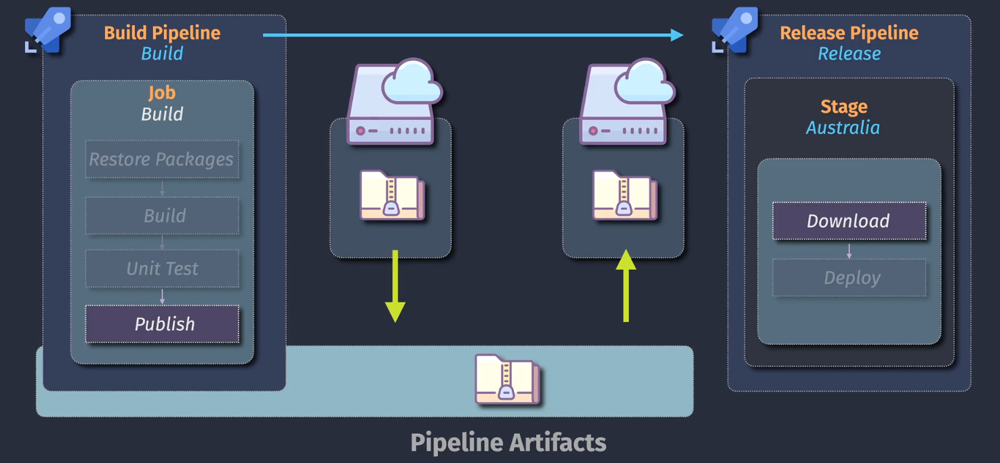
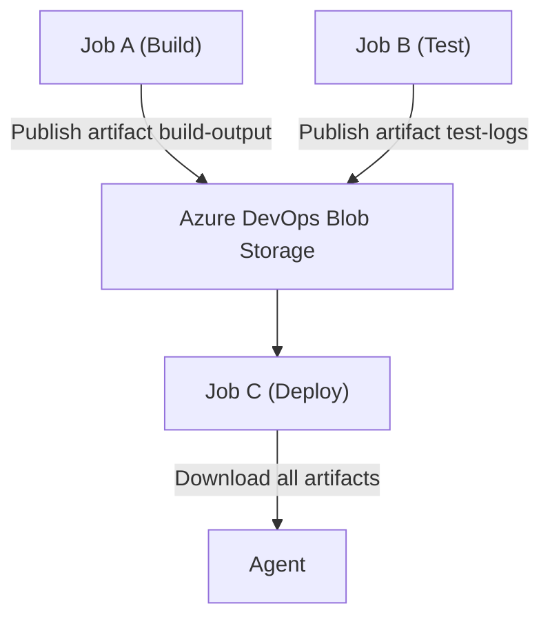

# 📦 Azure DevOps Pipeline Artifacts

Artifacts in Azure Pipelines allow you to **store, share, and consume files between jobs, stages, and pipelines**. Whether you're zipping up a build, passing logs to a test stage, or reusing a release package, artifacts are essential to robust CI/CD.

---

## 🧠 What Are Pipeline Artifacts?

A **pipeline artifact** is a collection of files generated during a pipeline run and stored in Azure DevOps' **cloud-backed blob storage**.

They:

- 📦 Are uploaded with `PublishPipelineArtifact@1`
- 🔽 Are downloaded with `DownloadPipelineArtifact@2`
- 📂 Exist per **pipeline run**
- 💾 Are stored in Azure DevOps' **managed blob storage**
- 💬 Are identified by a **name** (`artifact`)

---

## 🧱 Artifact Types

| Artifact Type | Description                                                             |
| ------------- | ----------------------------------------------------------------------- |
| `pipeline`    | Default artifact type — stored in Azure DevOps itself (secure, managed) |
| `filePath`    | AKA "File Share" artifact — stored in a UNC path (`\\server\folder`)    |

---

<div align="center">
  
</div>

## 🎯 Key Use Cases

| Scenario              | Description                                                    |
| --------------------- | -------------------------------------------------------------- |
| Multi-stage pipelines | Share build outputs between stages (e.g., Build → Deploy)      |
| Parallel jobs         | Each job publishes its own artifact (e.g., logs, test results) |
| External reuse        | Download artifacts from another pipeline                       |
| Debugging             | Upload logs or test results for review                         |
| Retention             | Store zipped apps/configs for auditing                         |

---

## 📐 Architecture Overview

<div align="center">



Artifacts flow from agents → blob storage → downstream agents.

</div>

---

## ⬆️ `PublishPipelineArtifact@1` Task

Used to **upload artifacts**.

```yaml
- task: PublishPipelineArtifact@1
  inputs:
    targetPath: "output"
    artifact: "frontend-build"
```

### 📥 Parameters

| Input             | Required | Description                                            |
| ----------------- | -------- | ------------------------------------------------------ |
| `targetPath`      | ✅ Yes   | Path on the **agent** to the files or folder to upload |
| `artifact`        | ✅ Yes   | Name to store the artifact as (used in download)       |
| `publishLocation` | ❌ No    | Always `'pipeline'` – only valid value                 |

### 💡 Notes:

- Uploads **contents** of the folder (not the folder itself)
- Stored in **Azure-managed blob storage**

---

## 🔽 `DownloadPipelineArtifact@2` Task

Used to **download artifacts** from the same pipeline run or another pipeline.

```yaml
- task: DownloadPipelineArtifact@2
  inputs:
    artifact: "frontend-build"
    targetPath: "myfolder"
```

### 📥 Parameters

| Input                                       | Required                         | Description                                                                   |
| ------------------------------------------- | -------------------------------- | ----------------------------------------------------------------------------- |
| `artifact`                                  | ✅ Yes (if not using `patterns`) | Name of the artifact to download                                              |
| `patterns`                                  | ❌ No                            | Wildcard pattern to match multiple artifacts                                  |
| `targetPath`                                | ❌ No                            | Custom directory to download to (default: `$(Pipeline.Workspace)/<artifact>`) |
| `buildType`, `pipeline`, `runVersion`, etc. | ❌ No                            | Use when downloading from other pipeline runs                                 |
| `allowPartiallySucceededBuilds`             | ❌ No                            | Allow download even if pipeline partially failed                              |

---

## 📂 File Layout

### Example:

```yaml
- task: PublishPipelineArtifact@1
  inputs:
    targetPath: "dist"
    artifact: "app-build"
```

#### Folder Structure Before Upload (on agent):

```ini
dist/
├── index.html
└── css/
    └── styles.css
```

#### After Upload (Blob storage):

```ini
app-build/
├── index.html
└── css/styles.css
```

#### After Download:

```bash
$(Pipeline.Workspace)/app-build/
├── index.html
└── css/styles.css
```

Or to custom path:

```yaml
targetPath: "custom-folder"
```

Then:

```ini
custom-folder/
├── index.html
└── css/styles.css
```

> 📌 Azure uploads the **contents of the folder**, not the folder itself.

---

## 🤝 Sharing Artifacts Between Jobs/Stages

Each job runs on a separate agent by default, meaning **they do not share the same file system**.

To pass files:

1. `PublishPipelineArtifact` in one job
2. `DownloadPipelineArtifact` in another

### Example:

```yaml
- stage: Build
  jobs:
    - job: Compile
      steps:
        - task: PublishPipelineArtifact@1
          inputs:
            targetPath: "output"
            artifact: "compiled-binaries"

- stage: Deploy
  dependsOn: Build
  jobs:
    - job: DeployToTest
      steps:
        - task: DownloadPipelineArtifact@2
          inputs:
            artifact: "compiled-binaries"
```

---

## 🔄 Wildcard Download (All Artifacts)

```yaml
- task: DownloadPipelineArtifact@2
  inputs:
    patterns: "**"
```

This downloads **all artifacts** from the current run into:

```ini
$(Pipeline.Workspace)/<artifact-name>/
```

---

## 🧬 Download from Other Pipelines

To download from **other pipelines**, define a resource:

```yaml
resources:
  pipelines:
    - pipeline: upstream
      source: "MyBuildPipeline"
      trigger: true

steps:
  - download: upstream
    artifact: "drop"
```

---

## 💡 `$(Pipeline.Workspace)` vs `$(Build.ArtifactStagingDirectory)`

| Variable                            | Purpose                                        | Default Path       | Usage                         |
| ----------------------------------- | ---------------------------------------------- | ------------------ | ----------------------------- |
| `$(Pipeline.Workspace)`             | Root shared workspace                          | `/agent/_work/1/`  | Used in all YAML pipelines    |
| `$(Build.ArtifactStagingDirectory)` | Temp folder to prepare files before publishing | `/agent/_work/1/a` | Used in legacy/classic builds |

---

## 🛑 Common Mistakes

| Mistake                           | Why It's Wrong                                           |
| --------------------------------- | -------------------------------------------------------- |
| Using `artifact:` as a path       | It's a **name**, not a folder                            |
| Expecting folder to be wrapped    | Only contents are uploaded, not parent folder            |
| Assuming shared disk across jobs  | Each job runs on **separate agent** — must use artifacts |
| Forgetting to download before use | Artifacts must be **explicitly downloaded**              |

---

## 📌 Best Practices

- ✅ Use `PublishPipelineArtifact@1` for all uploads
- ✅ Use unique `artifact` names per job
- ✅ Download in downstream stages explicitly
- ✅ Use `patterns: '**'` to download all artifacts
- ✅ Avoid `PublishBuildArtifacts@1` unless you're using **classic pipelines**
- ✅ Use `targetPath` on download to control structure
- ✅ Clean up large artifacts by setting pipeline retention policy

---

## ✅ Summary

| Concept                           | Tool/Command                                  |
| --------------------------------- | --------------------------------------------- |
| Upload files to Azure DevOps blob | `PublishPipelineArtifact@1`                   |
| Download from current pipeline    | `DownloadPipelineArtifact@2`                  |
| Download from other pipelines     | `resources.pipelines + download:`             |
| Store in blob storage?            | ✅ Yes (managed by Azure DevOps)              |
| Download structure                | `$(Pipeline.Workspace)/<artifact>` by default |
| Share files across jobs/agents    | ✅ Must use artifacts                         |
| YAML-only?                        | ✅ These are for YAML pipelines               |
