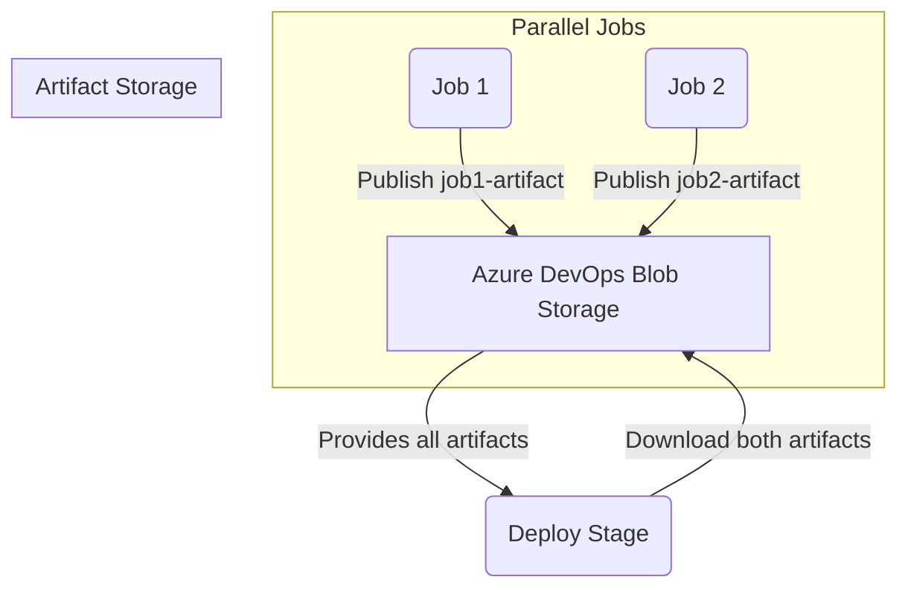

# Azure Artifacts

> 💬 _"If a pipeline has parallel jobs, and each job publishes its own artifact, can the last stage use all of those artifacts — and how are they stored and retrieved?"_

Let’s break this into:

---

## 🧩 Part 1: What happens when multiple parallel jobs publish artifacts?

Suppose you have a pipeline like this:

```yaml
stages:
  - stage: ParallelJobs
    jobs:
      - job: Job1
        steps:
          - script: echo "From Job1" > job1.txt
          - task: PublishPipelineArtifact@1
            inputs:
              targetPath: "job1.txt"
              artifact: "job1-artifact"

      - job: Job2
        steps:
          - script: echo "From Job2" > job2.txt
          - task: PublishPipelineArtifact@1
            inputs:
              targetPath: "job2.txt"
              artifact: "job2-artifact"

  - stage: CollectAndDeploy
    dependsOn: ParallelJobs
    jobs:
      - job: UseAll
        steps:
          - task: DownloadPipelineArtifact@2
            inputs:
              artifact: "job1-artifact"
          - task: DownloadPipelineArtifact@2
            inputs:
              artifact: "job2-artifact"
          - script: |
              cat $(Pipeline.Workspace)/job1-artifact/job1.txt
              cat $(Pipeline.Workspace)/job2-artifact/job2.txt
```

---

## 🗂️ Part 2: Where are these artifacts stored?

Each `PublishPipelineArtifact` call uploads the files to **Azure DevOps-managed blob storage**, and it’s **associated with the pipeline run**, not the agent or job.

💡 This means:

- Even if jobs run in **parallel**, each one can **publish a separate artifact with its own name**.
- These artifacts are **uniquely stored under the run ID**, and accessed by name later.

### 📦 Artifact Storage Endpoint (behind the scenes):

For example:

```ini
GET https://dev.azure.com/{org}/{project}/_apis/pipelines/{pipeline_id}/runs/{run_id}/artifacts?artifactName=job1-artifact
```

🔒 Azure DevOps organizes these under a **single run**, allowing any downstream job in that pipeline to access all uploaded artifacts — even if they came from different jobs or stages.

---

## 🎯 Part 3: Can you use all artifacts in a later stage?

**✅ Yes, absolutely.**

The `DownloadPipelineArtifact` task can:

- Download one specific artifact
- Or download **all** published artifacts at once

### 🔥 Example: Downloading ALL artifacts at once

```yaml
- task: DownloadPipelineArtifact@2
  inputs:
    patterns: "**" # wildcard
```

Or use `download` shortcut:

```yaml
resources:
  pipelines:
    - pipeline: upstream
      source: "MyPipeline"
      trigger: true

steps:
  - download: current
```

> ☑️ Azure downloads each artifact under a separate subfolder inside `$(Pipeline.Workspace)`, like:

```ini
$(Pipeline.Workspace)
├── job1-artifact/
│   └── job1.txt
├── job2-artifact/
│   └── job2.txt
```

---

## 📌 Summary Table

| Action                                             | Result                                                                                |
| -------------------------------------------------- | ------------------------------------------------------------------------------------- |
| Multiple parallel jobs publish different artifacts | ✅ All artifacts are uploaded to Azure DevOps blob, under same pipeline run           |
| Artifacts are identified by name                   | ✅ `job1-artifact`, `job2-artifact`, etc.                                             |
| Can downstream stage access all artifacts?         | ✅ Yes, via multiple `DownloadPipelineArtifact` tasks or wildcard                     |
| Are artifacts stored per job?                      | ❌ No — they are stored per **pipeline run**, regardless of how many agents or jobs   |
| Are parallel jobs isolated in terms of artifacts?  | ✅ During execution yes, but their artifacts are accessible globally after publishing |

---

## 📊 Bonus: Mermaid Diagram



---

## ✅ Final Thoughts

- Think of artifacts as **named bags of files**.
- Once published, **they are globally available** across all agents and jobs in that pipeline run.
- Use `DownloadPipelineArtifact` multiple times — or use `patterns: '**'` to download everything at once.
