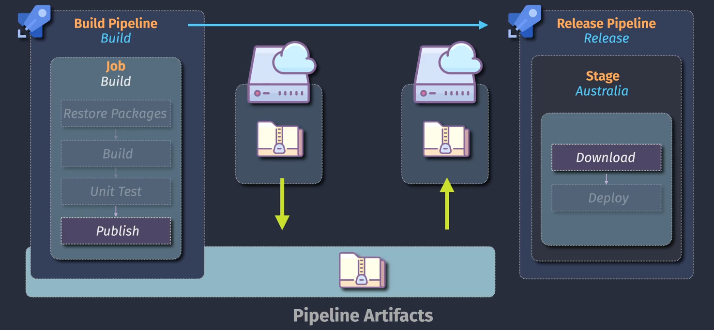

# Azure Pipeline Artifacts

<div align="center">
  
</div>

## Artifact Types

1. pipeline
2. fileshare

## How to Use Artifacts

### `$({build.ArtifactStagingDirectory})`

### Publish Pipeline Artifacts Task

```yml
- task: PublishPipelineArtifacts@1
    inputs:
      targetPath: '$(build.ArtifactStagingDirectory)'
      artifact: '<artifactName>'
      publishLocation: 'pipeline'
```
