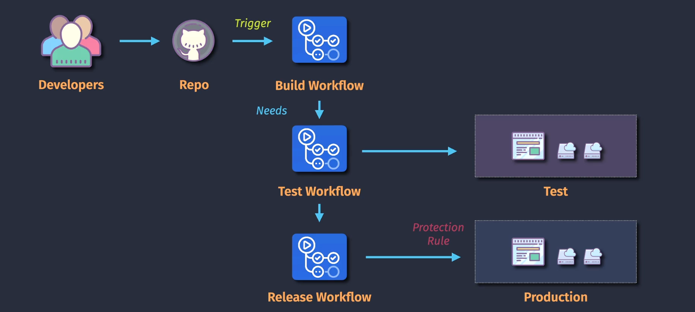
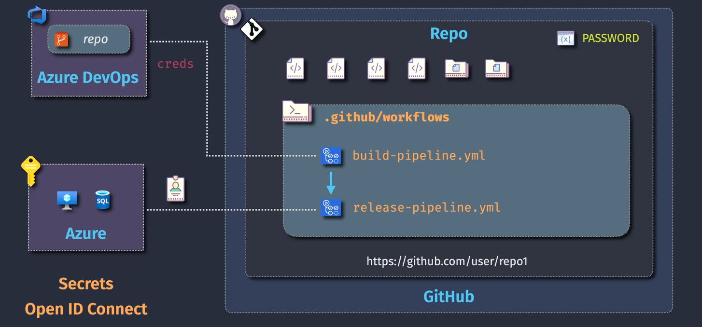
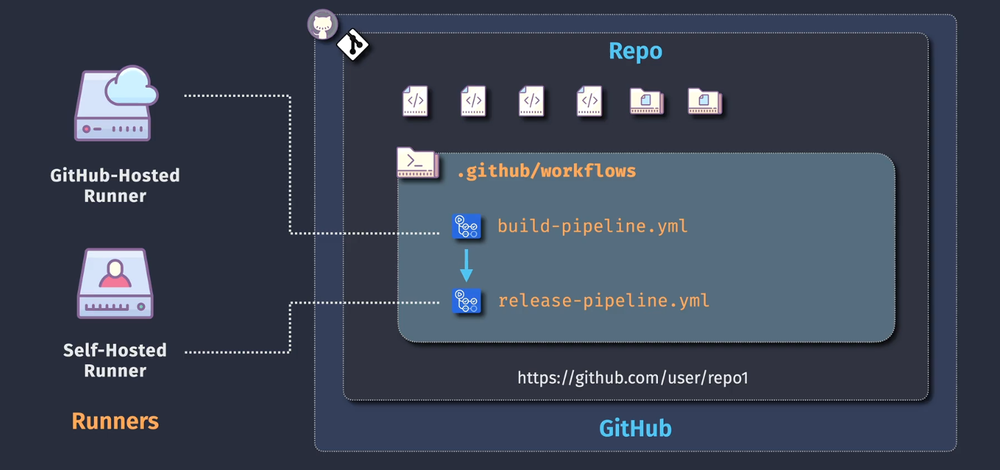
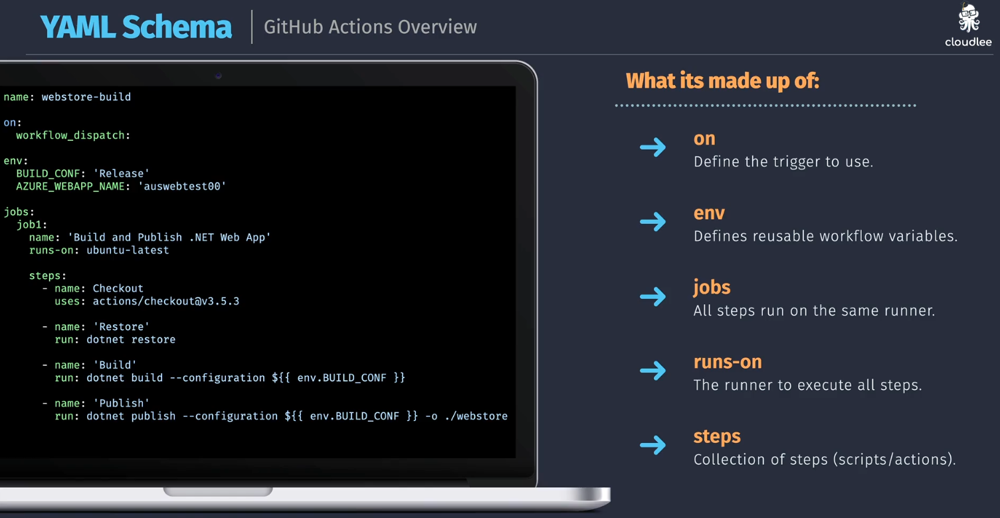

# Github Action Overview

## github-actions-overview

    

## github-actions-architecture

    

## github-actions-integrations

    

## github-actions-components

    

## github-actions-yaml-schema

    

