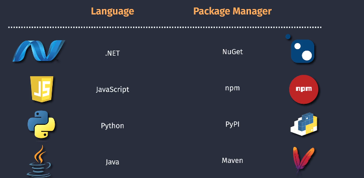

# 📦 **Package Management in DevOps**

## 🧐 **What is Package Management?**

> In simple terms:  
> 👉 **Package Management** is about **storing, sharing, versioning, and consuming software components (packages)** in a controlled, reliable, and repeatable way.

---

> 📖 A **package** is basically a compressed bundle of code + metadata that can be reused in different projects. Instead of reinventing the wheel, you pull pre-built packages (like `Newtonsoft.Json` in .NET, `numpy` in Python, or `Spring Boot Starter` in Java).

_Package management ensures:_

- 📂 **Centralized storage** of artifacts (no more random DLLs floating around).
- 🏷 **Versioning** — you can pin to a specific version (`v1.2.3`) or upgrade safely.
- 🔒 **Security** — only trusted packages are distributed.
- 🔁 **Reusability** — internal teams can share custom libraries across projects.
- ⚡ **Automation** — pipelines can fetch and publish packages seamlessly.

---

## 🔑 **Why DevOps Cares About It**

In DevOps, **CI/CD pipelines** don’t just build and deploy apps — they also:

- **Consume** packages from registries (like pulling `npm install react` or `pip install pandas`).
- **Produce** packages (like internal NuGet libraries or Docker images) that other teams will consume.

Without package management:

- You risk **dependency hell** 😱 (conflicting versions, missing libraries).
- Security issues sneak in (pulling unverified open-source packages).
- Collaboration slows down (each team writes duplicate code).

---

## 🛠 **Common Package Managers & Registries**

Different ecosystems use different package managers:

<div align="left">
  
</div>

---

| Language / Ecosystem | Package Manager | Registry / Feed                       |
| -------------------- | --------------- | ------------------------------------- |
| **.NET**             | NuGet           | nuget.org / Azure Artifacts feed      |
| **Java**             | Maven / Gradle  | Maven Central / Azure Artifacts       |
| **Node.js**          | npm / yarn      | npmjs.com / Azure Artifacts           |
| **Python**           | pip             | PyPI / Azure Artifacts                |
| **C++**              | vcpkg / Conan   | ConanCenter / Azure Artifacts         |
| **Docker**           | docker CLI      | Docker Hub / Azure Container Registry |

👉 In **Azure DevOps**, the service is called **Azure Artifacts**, which supports **NuGet, npm, Maven, Python, Universal Packages, and Containers**.

---

## 💭 **Example** in Real Life

Imagine you’re in a big enterprise:

- Team A builds a **logging library** in C#.
- Instead of copying source code into every project, they **publish it as a NuGet package** to Azure Artifacts.
- Team B’s app just adds:

```xml
<PackageReference Include="Company.Logging" Version="2.0.1" />
```

and boom 💥 — they have the library.  
and When Team A releases **2.1.0**, Team B can choose to upgrade (after testing) or stay on 2.0.1.

---

## ⚠️ **Pitfalls Without Package Management**

- ❌ Pulling from the internet (e.g., npmjs.org) without caching — risk if the package is removed.
- ❌ Using **latest version blindly** → builds break when new version is buggy.
- ❌ Not scanning packages → vulnerable dependencies get into production.

---

## 🏁 **Summary (for exam & real life):**

**Package management = controlling dependencies and artifacts in DevOps pipelines, ensuring security, versioning, and collaboration.**
In AZ-400, expect questions about **Azure Artifacts**, **feeds**, **upstream sources**, and how to integrate package management into CI/CD pipelines.
