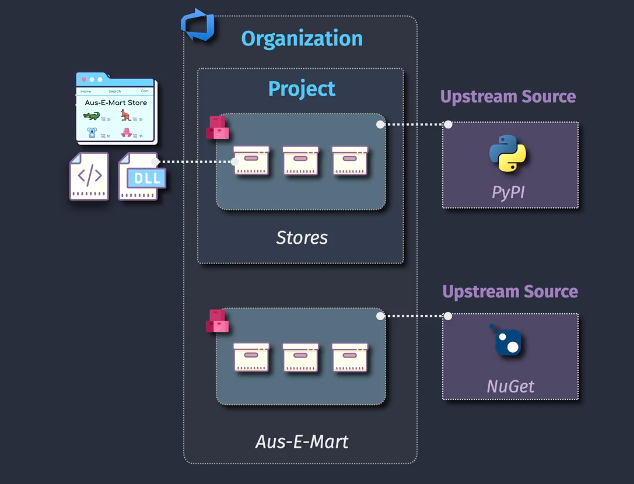
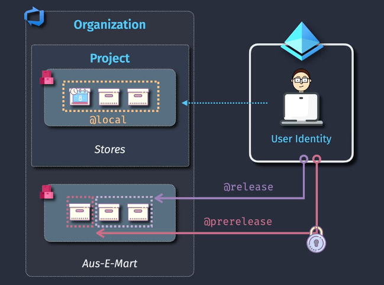
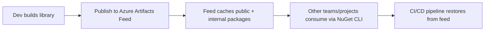

# 📦 Azure Artifacts — The DevOps Package Management Service

## 🌍 What is Azure Artifacts?

Azure Artifacts is **Microsoft’s universal package management service** built right into **Azure DevOps**.
Think of it as your team’s **private NuGet/npm/Maven/Python registry** (and more) with enterprise features like access control, caching, and retention policies.

👉 It solves the problem of:

- Hosting **internal packages** securely.
- **Sharing packages** across teams and projects.
- Acting as a **cache (proxy)** for public package sources (npmjs, NuGet.org, Maven Central, PyPI).
- Integrating **seamlessly into CI/CD pipelines**.

---

<div align="center">
  
</div>

---

## 🛠 Supported Package Types

Azure Artifacts supports:

| Ecosystem          | Package Format     | Example                            |
| ------------------ | ------------------ | ---------------------------------- |
| **.NET**           | NuGet              | `Newtonsoft.Json`                  |
| **Java**           | Maven, Gradle      | `spring-core`                      |
| **Node.js**        | npm                | `react`                            |
| **Python**         | pip                | `pandas`                           |
| **C++ / Anything** | Universal Packages | `.zip`, `.tar.gz`                  |
| **Containers**     | Docker images      | via Azure Container Registry (ACR) |

---

## 🏗 Core Concepts in Azure Artifacts

### 1️⃣ **Feeds**

- A **feed** is basically a **container of packages**.
- Each team or project can create a feed.
- Example: `MyTeam-Utilities` feed might contain:

  - `Company.Logging` (NuGet)
  - `Company.Caching` (npm)
  - `Company.InfraTool` (Universal package)

🔑 **Exam tip**: Feeds are **scoped** to organizations, projects, or individuals.

---

### 2️⃣ **Upstream Sources**

- Feeds can act as a **proxy/cache** for external registries.
- Example: You configure NuGet.org as an upstream.

  - First request for `Newtonsoft.Json` goes to **NuGet.org** and caches it.
  - Next time → pulled directly from your feed (faster + safer).

- Protects you if upstream packages disappear or get compromised.

👉 You can **filter which public feeds** you want (e.g., only allow PyPI and not npmjs).

---

### 3️⃣ **Views**

- Feeds can have **views**:

  - **@local** → packages published by your team.
  - **@prerelease** → test versions.
  - **@release** → stable versions ready for production.

This allows teams to **control what consumers see**.

<div align="left">
  
</div>

---

### 4️⃣ **Permissions**

- Feeds have **fine-grained permissions**:

  - **Owners** → full control (create/delete packages).
  - **Contributors** → publish new versions.
  - **Readers** → consume packages only.

- Integration with **Azure AD groups** for enterprise security.

---

### 5️⃣ **Retention Policies**

- Packages can **eat storage** if not managed.
- Azure Artifacts lets you:

  - Keep only the **latest N versions**.
  - Delete unused packages after X days.
  - Save storage + reduce clutter.

---

## 🔄 Example Workflow (NuGet + Azure Artifacts)



1. Developer builds a **NuGet package** → pushes it to **Azure Artifacts feed**.
2. Feed also has **NuGet.org as upstream**.
3. Other developers reference `Company.Logging` from the feed in `.csproj`.
4. CI/CD pipelines **restore from feed** instead of random internet sources.

---

## ⚡ CLI & YAML Integration

### Restore from feed (NuGet):

```yaml
- task: NuGetAuthenticate@1
- task: NuGetCommand@2
  inputs:
    command: "restore"
    feedsToUse: "select"
    vstsFeed: "my-team-feed"
```

### Publish a package (npm):

```yaml
- task: npm@1
  inputs:
    command: "publish"
    publishRegistry: "useFeed"
    publishFeed: "my-team-feed"
```

---

## 🔒 Security in Azure Artifacts

- **Scoped feeds**: limit visibility (org, project, team).
- **Authentication**: Azure DevOps credentials or PAT tokens.
- **Governance**: only trusted package sources allowed.
- **Auditing**: track who pushed which package version.

---

## ✅ Summary (Exam Gold Nuggets 💡)

- **Azure Artifacts = package registry service in Azure DevOps.**
- Supports **NuGet, npm, Maven, Python, Universal Packages**.
- Key concepts: **Feeds, Upstream Sources, Views, Permissions, Retention Policies**.
- Seamlessly integrates into **Azure Pipelines**.
- Eliminates dependency hell, provides caching, improves security.
