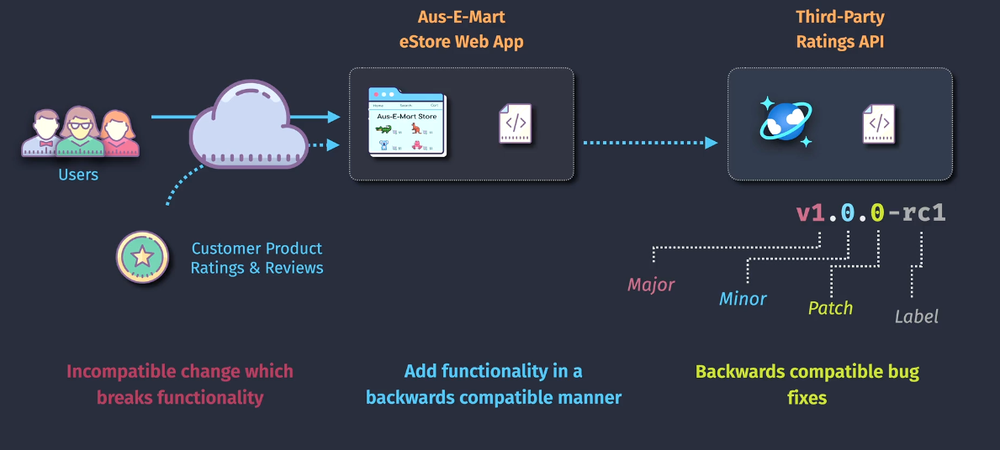
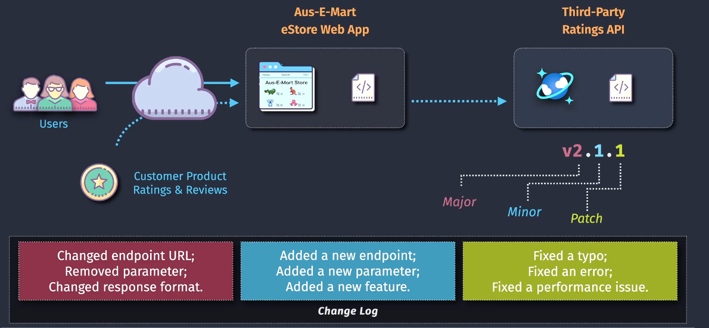
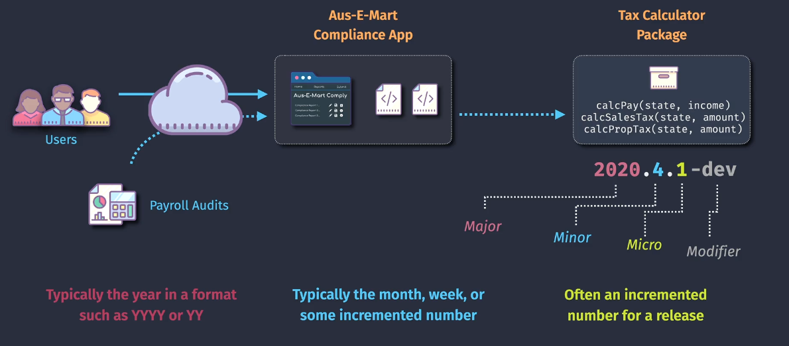

# 🏷️ **Versioning Strategies**

## 🔹 **1. Semantic Versioning (SemVer)**

👉 **Definition**: Semantic Versioning follows the rule:

```ini
MAJOR.MINOR.PATCH
```

- **MAJOR** – Breaking changes 🚨 (things that break backward compatibility)
- **MINOR** – New features ✨ (but backward compatible)
- **PATCH** – Bug fixes 🐞 (backward compatible, no new features)

---

<div align="center">
  
</div>

---

### 🧩 Example: SemVer in .NET or npm

Imagine you maintain a library `my-logger`.

- Start: `1.0.0`
- Fix a bug: `1.0.1`
- Add a new optional parameter (doesn’t break existing users): `1.1.0`
- Change the function signature (breaking): `2.0.0`

👉 Rule of thumb:

- Developers can **trust numbers** to know if upgrading will break their code.
- **MAJOR bump = careful, something broke**
- **MINOR bump = safe new features**
- **PATCH bump = safe bug fixes**

---

<div align="center">
  
</div>

---

### 🔨 Where you see SemVer

- **NuGet packages** (`Newtonsoft.Json 13.0.1`)
- **npm packages** (`angular@16.1.4`)
- **Docker images** (some projects follow SemVer tags: `redis:6.2.8`)

---

## 🔹 **2. Calendar Versioning (CalVer)**

👉 **Definition**: Calendar Versioning uses **dates** (year, month, sometimes day) instead of meaning-based numbers.

Common formats:

- `YYYY.MM.DD` → e.g., `2025.08.27`
- `YY.MM` → e.g., `25.08`
- `YYYY.R` (year + release count) → e.g., `2025.3` (third release in 2025)

---

<div align="center">
  
</div>

---

### 🧩 Example: CalVer in action

- **Ubuntu Linux**:

  - Ubuntu 20.04 (April 2020 release)
  - Ubuntu 22.04 (April 2022 release)

- **Azure DevOps agent images**:

  - `ubuntu-20.04` → based on April 2020 release

- **Python libraries (date-driven)**:

  - `pip 23.2.1` (July 2023, 2nd minor release)

👉 Rule of thumb:

- CalVer is great when **time matters more than backward compatibility**.
- Example: OS releases, cloud platforms, dev tools.

---

## ⚖️ **SemVer vs CalVer**

| Feature     | Semantic Versioning (SemVer)                          | Calendar Versioning (CalVer)                      |
| ----------- | ----------------------------------------------------- | ------------------------------------------------- |
| Format      | MAJOR.MINOR.PATCH (1.4.2)                             | Date-based (2025.08, 2025.08.27)                  |
| Meaning     | Numbers show **compatibility guarantees**             | Numbers show **release date / cycle**             |
| When to use | Libraries, SDKs, APIs (where breaking changes matter) | Products, OS, SaaS (where release timing matters) |
| Example     | Angular 17.2.3                                        | Ubuntu 24.04                                      |

---

## 🙌🏻 **Hybrid Strategies**

Some projects **mix both**:

- **Visual Studio Code**: uses **monthly release numbering** like `1.92` (but incremented monthly).
- **Chrome browser**: increments major numbers fast (`Chrome 128` in 2025) → behaves more like **time-based major bumping**.

---

## ✍🏻 **Super Simple Examples**

### SemVer (Node.js library)

- `1.0.0` → first release
- `1.0.1` → bug fix
- `1.1.0` → added feature (safe)
- `2.0.0` → breaking API

### CalVer (OS / platform)

- `2024.10` → October 2024 release
- `2025.04` → April 2025 release

---

## 🏁 **Easy Takeaway**

- **SemVer** = “Numbers tell you if it’s safe to upgrade.” (compatibility-driven)
- **CalVer** = “Numbers tell you when it was released.” (time-driven)
