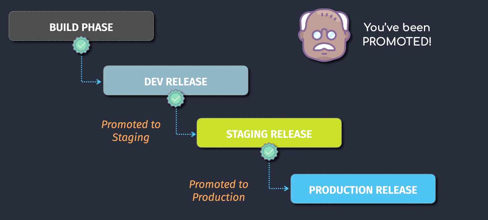
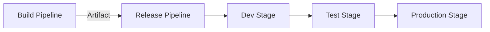

# 🎯 Azure DevOps — Release Pipeline Explained (Classic + YAML)

## 📖 What is a Release Pipeline?

> A **Release Pipeline** automates the process of **deploying built artifacts** to one or more environments (Test, QA, Staging, Production).  
> It picks up **artifacts from a build pipeline**, then runs **deployment jobs**, possibly with approvals, gates, and rollback strategies.

---

<div align="center">
  
</div>

---

## 🧠 Key Concepts

| Concept             | Description                                                        |
| ------------------- | ------------------------------------------------------------------ |
| **Artifact**        | Output from build pipeline (e.g., `.zip`, `.dll`, container image) |
| **Environment**     | Logical target like Dev, Test, Staging, Prod                       |
| **Stage**           | A group of deployment steps for one environment                    |
| **Task**            | A single step (e.g., deploy to Azure App Service)                  |
| **Release**         | An instance of a pipeline run                                      |
| **Approvals/Gates** | Manual or automated checks before/after deployment                 |
| **Variables**       | Runtime or scoped configs for deployments                          |
| **Rollback**        | Strategy if a stage fails                                          |

---

## 🛠️ Types of Release Pipelines

### 1. 🧱 Classic Release Pipeline (GUI-based)

- Drag-and-drop stages
- Manual approvals & gates built-in
- Works well with Build Artifacts from Classic or YAML
- Used mostly in legacy or regulated environments

> File Path: _Azure DevOps Portal → Pipelines → Releases_

### 2. 🧾 YAML Release Pipeline (Multi-Stage YAML)

- Defined as code: single `.yml` file
- Source-controlled with rest of the repo
- Can include CI and CD in same file
- Modern and preferred method

---

## 🧱 Classic Release Pipeline Structure (Visual)



---

### 🎯 Release Pipeline Flow (Step-by-Step)

| Step                              | Description                                            |
| --------------------------------- | ------------------------------------------------------ |
| ✅ **1. Artifact Source**         | Select your build pipeline or external repo            |
| ⚙️ **2. Add Stages**              | Create stages like Dev, QA, Prod                       |
| 🔨 **3. Add Tasks to Each Stage** | Tasks like Azure App Service Deploy, Kubernetes deploy |
| 🔐 **4. Configure Approvals**     | Manual or email-based approvals                        |
| 🎛️ **5. Add Gates**               | Health checks, query Azure Monitor, work item queries  |
| 🚀 **6. Trigger Release**         | Automatically on build success or manually             |
| 📦 **7. Deploy**                  | Executes tasks in stages to environments               |
| 🔁 **8. Rollback on Failure**     | Custom rollback task or re-release previous version    |

---

## 🧾 YAML-Based Release Pipeline Example

```yaml
name: deploy-pipeline

trigger:
  branches:
    include:
      - main

stages:
  - stage: Build
    jobs:
      - job: BuildJob
        pool:
          vmImage: "ubuntu-latest"
        steps:
          - task: DotNetCoreCLI@2
            inputs:
              command: "build"
              projects: "**/*.csproj"

          - task: ArchiveFiles@2
            inputs:
              rootFolderOrFile: "$(Build.SourcesDirectory)"
              includeRootFolder: false
              archiveFile: "$(Build.ArtifactStagingDirectory)/output.zip"
              replaceExistingArchive: true

          - task: PublishPipelineArtifact@1
            inputs:
              targetPath: "$(Build.ArtifactStagingDirectory)"
              artifact: "drop"
              publishLocation: "pipeline"

  - stage: DeployToTest
    dependsOn: Build
    condition: succeeded()
    jobs:
      - job: TestDeploy
        pool:
          vmImage: "ubuntu-latest"
        steps:
          - task: DownloadPipelineArtifact@2
            inputs:
              artifact: "drop"
              path: "$(Pipeline.Workspace)/drop"

          - task: AzureWebApp@1
            inputs:
              azureSubscription: "MyAzureServiceConnection"
              appType: "webApp"
              appName: "mytestapp"
              package: "$(Pipeline.Workspace)/drop/output.zip"

  - stage: DeployToProd
    dependsOn: DeployToTest
    condition: succeeded()
    jobs:
      - deployment: ProdDeployment
        environment: "Production"
        strategy:
          runOnce:
            deploy:
              steps:
                - task: DownloadPipelineArtifact@2
                  inputs:
                    artifact: "drop"
                    path: "$(Pipeline.Workspace)/drop"

                - task: AzureWebApp@1
                  inputs:
                    azureSubscription: "MyAzureServiceConnection"
                    appName: "myprodapp"
                    package: "$(Pipeline.Workspace)/drop/output.zip"
```

---

## 🛡️ Approvals & Gates

### ✅ Approvals (Pre/Post)

- Add **pre-deployment approvals** to pause before deploying.
- Can be **manual (person)** or **group-based**.

### 🚪 Gates

- Auto-checks before proceeding:

  - Azure Monitor query
  - REST API health check
  - Work item queries

---

## 🔐 Secure Secrets for Release

Use **Library Variable Groups** with secret vars and link to release pipeline.

```yaml
variables:
  - group: ProductionSecrets
```

Or use **Azure Key Vault** integration.

---

## 🔁 Rollback Strategies

| Method                  | Description                                        |
| ----------------------- | -------------------------------------------------- |
| Re-run previous release | Manually trigger previous successful release       |
| Scripted rollback       | Write a PowerShell or Bash rollback task           |
| Deployment slots        | Use Azure App Service slot swap to rollback safely |
| Helm                    | Use `helm rollback` for Kubernetes deployments     |

---

## 🔔 Triggers

| Trigger Type    | Where Configured  | Notes                                        |
| --------------- | ----------------- | -------------------------------------------- |
| CI Trigger      | In build pipeline | Runs release when build completes            |
| Schedule        | In release UI     | e.g. nightly                                 |
| Manual          | From UI or API    | For hotfixes                                 |
| Artifact filter | Per artifact      | Only deploy if artifact name/version matches |

---

## 📦 Release Artifact Types Supported

- Build Pipeline (recommended)
- GitHub Repo
- Azure Repo
- Jenkins
- TeamCity
- External packages (NuGet, Maven)

---

## ✅ Use Cases

| Use Case                     | Release Pipeline Feature |
| ---------------------------- | ------------------------ |
| Multi-environment deployment | Separate stages          |
| Manual approval before prod  | Pre-deployment approval  |
| Health-check before prod     | Gates                    |
| Deployment rollback          | Redeploy older release   |
| Artifact reuse               | Build artifacts          |

---

## 💬 Summary

| Feature            | Classic UI Release | YAML Multi-Stage      |
| ------------------ | ------------------ | --------------------- |
| Visual Drag & Drop | ✅ Yes             | ❌ No                 |
| Versioned as Code  | ❌ No              | ✅ Yes                |
| Source Controlled  | ❌ Manual          | ✅ In Git             |
| Manual Approvals   | ✅ Built-in        | ✅ (via Environments) |
| Best for           | Legacy UI users    | Modern DevOps teams   |
