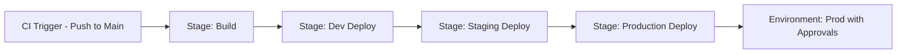

# 🚀 Azure Pipelines: Multi-Stage

Multi-stage pipelines break your CI/CD process into **independent but connected blocks** called `stages`.  
Each stage has its own jobs, agents, steps, and purpose — like Build, Test, Deploy.

---

## 📊 Visual Overview

<div align="center">
  
</div>

---

## 🧱 Anatomy of Multi-Stage Pipeline

| Part           | Description                                                            |
| -------------- | ---------------------------------------------------------------------- |
| `stage:`       | Top-level group for a logical unit (Build, Test, Deploy, etc.)         |
| `jobs:`        | A stage contains one or more jobs, each with its own steps             |
| `steps:`       | A job runs multiple tasks/commands                                     |
| `dependsOn:`   | Controls flow between stages (default is sequential unless overridden) |
| `environment:` | Used for deployment stages to define approval gates, logs, audits      |

---

## 💡 Use Case Example: Dev → Staging → Prod

You build once, publish the artifact, and then promote the same build through environments:

```yaml
stages:
  - stage: Build
    jobs:
      - job: BuildJob
        steps:
          - script: echo "Build App"

  - stage: DeployDev
    dependsOn: Build
    jobs:
      - job: DevJob
        environment: dev
        steps:
          - script: echo "Deploy to Dev"

  - stage: DeployStaging
    dependsOn: DeployDev
    jobs:
      - job: StagingJob
        environment: staging
        steps:
          - script: echo "Deploy to Staging"

  - stage: DeployProd
    dependsOn: DeployStaging
    jobs:
      - deployment: ProdDeployment
        environment: production
        strategy:
          runOnce:
            deploy:
              steps:
                - script: echo "Deploy to Production"
```

---

## 🧠 Multi-Stage Features

| Feature                   | YAML Pipeline (✅ Full Support)           | Classic Release Pipeline (⚠️ Partial)       |
| ------------------------- | ----------------------------------------- | ------------------------------------------- |
| Define build + deploy     | ✅ Inline in same YAML                    | ❌ Separate build + release UI              |
| Environments              | ✅ Uses `environment:` block              | ✅ Uses `Environment` tiles                 |
| Approval Gates            | ✅ On `environment:` w/ deployments       | ✅ Manual + pre/post-deployment approvals   |
| Artifact Sharing          | ✅ Use `Publish/DownloadPipelineArtifact` | ✅ Built-in between build/release           |
| Triggers (CI/PR/schedule) | ✅ On each stage or full pipeline         | ❌ Trigger only on build; release is manual |

---

## 📎 Notes

> ⚠️ **Classic pipelines** support multiple stages only in **Release Pipelines**, not in classic build pipelines.  
> ✅ **YAML pipelines** support **true multi-stage workflows** — CI + CD together, versioned in source control.

---

## 🧪 Real-World Tip

Use multi-stage pipelines when:

- You want clear separation (Build, Dev Deploy, QA, Prod)
- You need approvals (e.g. manager approves promotion to Prod)
- You’re targeting multiple environments with **one unified pipeline**

---

## 🧭 Mermaid Flow Example


